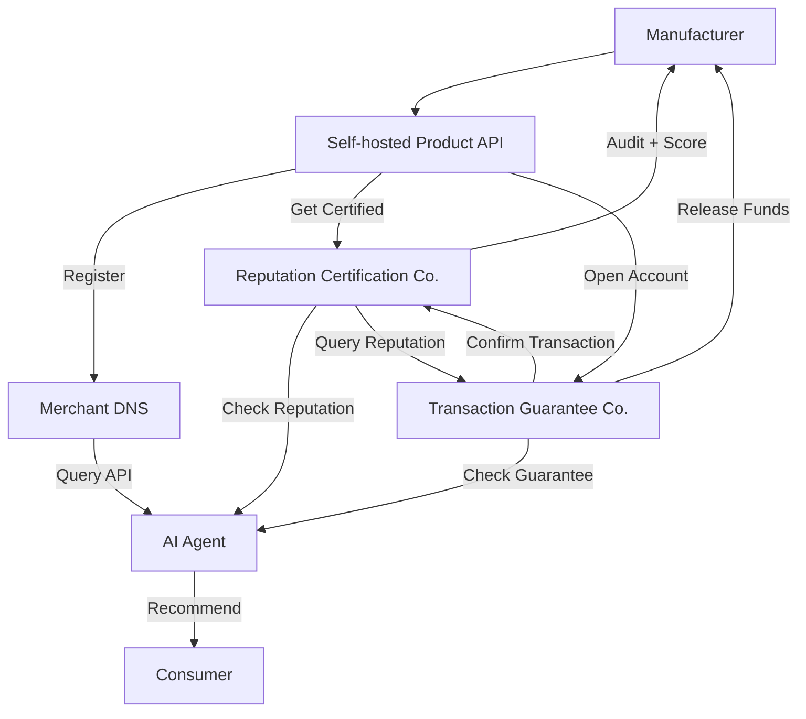

# 01 — Overview & Vision

## The Problem: Centralized E-Commerce Is Broken

Today's dominant e-commerce model is controlled by large centralized platforms whose core mechanism is **"centralized traffic distribution + pay-to-rank advertising."** This creates three structural crises:

### For Consumers

- Search results are polluted by ads and bidding — what you see is not the best product, but the highest bidder
- Fake reviews and review-farming are rampant because the evaluation system is monopolized by a single platform with no counterbalance
- User data is owned by the platform; cross-platform price comparison is hopelessly inefficient

### For Manufacturers

- Forced to pay high commissions (5–15% of GMV) and traffic promotion fees (up to 20–40% of sales)
- Pricing power is constrained and coerced by platform rules (mandatory promotions, price wars)
- Accumulated reputation is tied to the platform and non-portable — leaving the platform means losing all historical reviews
- Small and mid-sized brands and white-label factories suffer the most, with margins shrinking year after year

### For the Trust System

- The platform acts simultaneously as matchmaker, transaction processor, and dispute arbiter — a fundamental conflict of interest
- Fake reviews, malicious negative reviews, and review-suppression rackets cannot be eradicated because the platform lacks countervailing incentives
- There is no **independent, competitive, market-based** trust and guarantee layer between consumers and manufacturers

## Our Solution: Decentralized Intelligent Transaction Protocol

We propose an entirely new shopping paradigm: with **client-side AI Agents** as the entry point, **standardized product APIs** as the data source, and **Reputation Certification Companies + Transaction Guarantee Companies** as a separated trust infrastructure — building a decentralized, ad-free, purely algorithm-driven product transaction network.

### The Three Substitutions

| Old Paradigm Element | Replaced By | How |
|---------------------|-------------|-----|
| E-commerce platform (traffic gateway) | Client-side AI Agent | Natural language interaction, semantic-level shopping decisions |
| Centralized product shelves | Open API network | Manufacturer self-hosted APIs, indexed by Merchant DNS |
| Platform-monopolized trust & reviews | Market-based trust competition | Reputation certification (never touches money) + Transaction guarantee (never evaluates) — separated and competitive |

### Core Roles

## Vision

Let **consumers** find the genuinely best products, not the highest bidders. Let **quality manufacturers** escape platform exploitation and own portable reputation assets. Let **trust** become a tradeable, competitive, **market-based service**.

This is not a refinement of existing e-commerce. It is a ground-up rebuild of the operating system of commercial transactions.

## Why Now

Three converging trends make this paradigm shift irreversible:

1. **AI Maturity**: Large language models can now understand complex shopping needs, query multiple sources in parallel, and rank by personalized preferences — "buy it for me" is replacing "let me browse"
2. **API Economy Ubiquity**: Standardized APIs and low-code deployment tools have matured; the cost for a small factory to deploy a product API is approaching zero
3. **Blockchain Reduces Trust Costs**: Immutable reputation data anchoring is now affordable, making decentralized trust viable

---

[← Back to Main File](./README.md)
