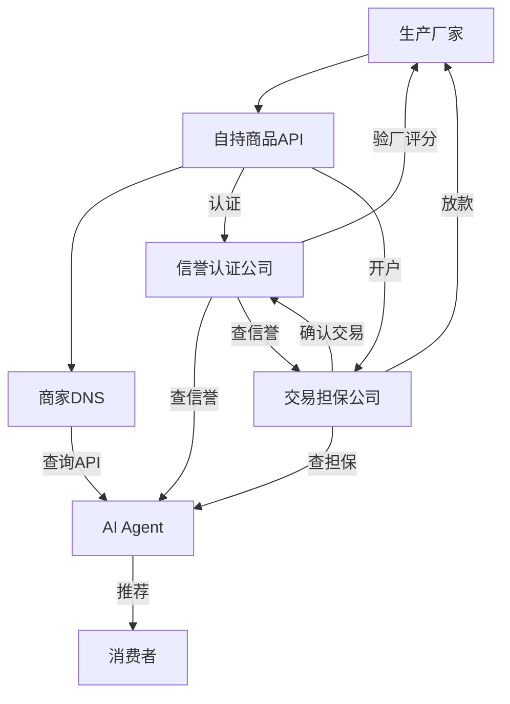

# 01 — 概述与愿景

## 现状：中心化电商的困局

当前全球主流电商模式由大型综合购物平台主导，本质是 **"中心化流量分配 + 广告竞价排名"**。这导致三大结构性问题：

### 消费者端

- 搜索结果被广告、竞价排名污染，看到的不是最优商品而是付费最多的商品
- 刷单、虚假评价泛滥，因为评价体系由平台单方控制且缺乏制衡
- 用户数据被平台占有，跨平台比价效率极低

### 生产厂家端

- 被迫缴纳高额佣金（GMV 的 5-15%）和流量推广费（可达销售额的 20-40%）
- 定价权被平台规则限制和裹挟（强制参与促销、价格战）
- 积累的信誉依附于平台，不可迁移——离开平台就失去一切历史评价
- 中小品牌和白牌工厂受挤压最严重，利润日益稀薄

### 信任体系

- 平台既是交易撮合方又是纠纷裁决方，缺乏中立性
- 刷单、恶意差评、删评产业链无法根除，因为平台缺乏对抗激励
- 消费者与厂家之间没有一个 **独立、可竞争、市场化** 的信任担保层

## 我们的方案：去中心化智能交易协议

我们提出一个全新的购物范式：以 **客户端AI Agent** 为入口，以 **标准化商品API** 为数据源，以 **信誉认证公司 + 交易担保公司** 为分离式信任基础设施，构建一个去中心化、无广告、纯算法驱动的商品交易网络。

### 三维替代

| 旧范式的要素 | 被谁替代 | 替代方式 |
|-------------|---------|---------|
| 电商平台（流量入口） | 客户端AI Agent | 自然语言交互，语义级购物决策 |
| 中心化商品货架 | 开放API网络 | 厂家自持API，商家DNS索引 |
| 平台垄断的信任评价 | 市场化信任竞争 | 信誉认证（评价不碰钱）+ 交易担保（碰钱不评价）分离制衡 |

### 核心角色

## 愿景

让 **消费者** 获得真实最优商品，不被广告和虚假评价误导；让 **优质厂家** 摆脱平台盘剥，拥有可迁移的信誉资产；让 **信任** 成为可交易、可竞争的 **市场化服务**。

这不是对现有电商的改良，而是从底层协议重构商业交易的操作系统。

## 为什么是现在

三个趋势的交汇使这一范式变得不可逆转：

1. **AI大模型成熟**：AI已能理解复杂购物需求、并行查询多源数据、按个性化权重排序——"帮我买"正在替代"我去逛"
2. **API经济普及**：标准化API、低代码部署工具已成熟，中小工厂部署商品API的成本趋近于零
3. **区块链降低信任成本**：信誉数据的不可篡改存证成本已大幅下降，使去中心化信任成为可能

---

[← 返回主文件](./AI购物新范式.md)
