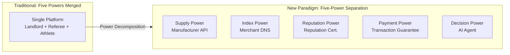
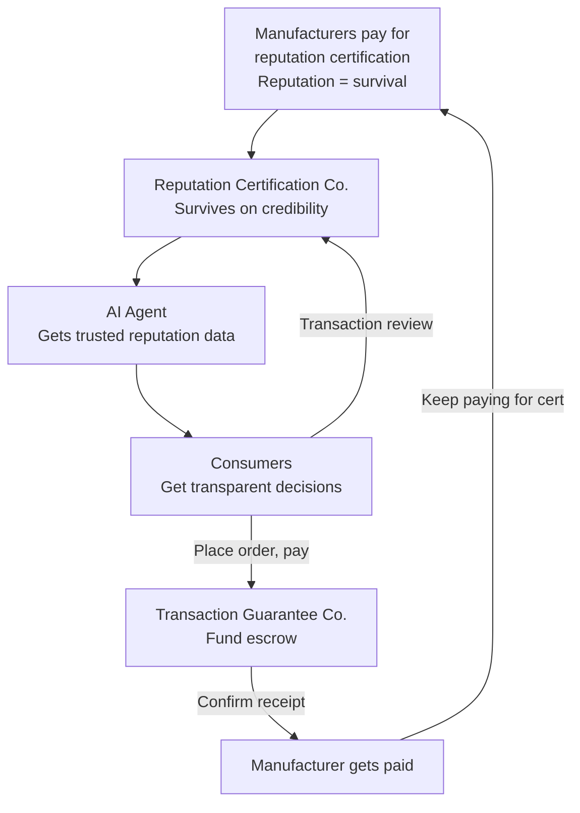
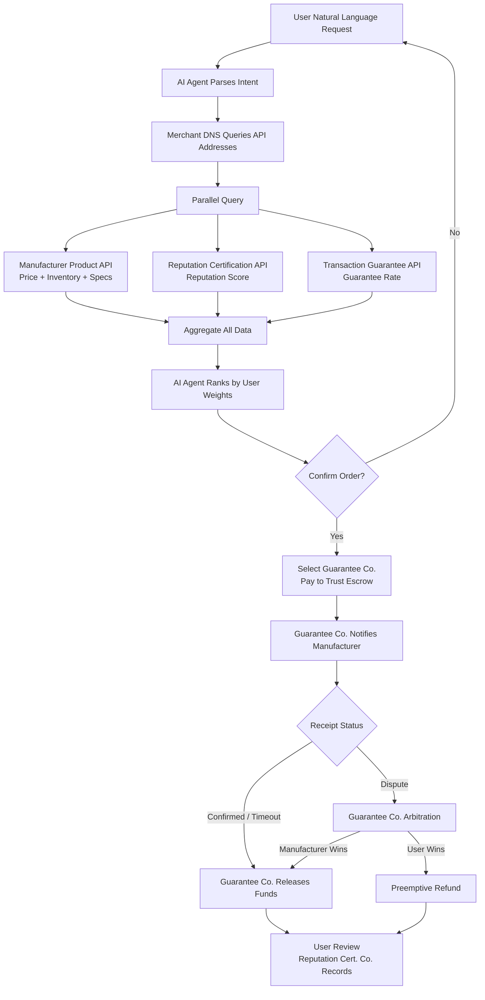
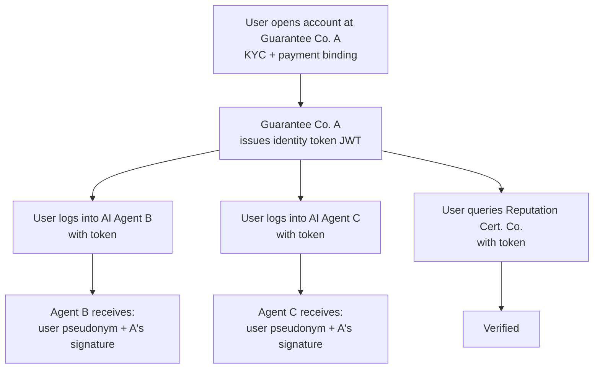

# 02 — Core Architecture & Role Definitions

## Architecture Overview

| Manufacturer (Supply) | Merchant DNS (Index) | Reputation Cert. (Reputation) | Transaction Guarantee (Payment) | AI Agent (Decision) | Consumer (Demand) |
|----------------------|---------------------|------------------------------|--------------------------------|--------------------|-------------------|
| Self-hosted API | Metadata Indexing | Factory Certification | Trust Escrow | Semantic Parsing | Preference Settings |
| Real-time Inventory | Unified Search | Reputation Scoring | Payment & Release | Parallel Comparison | Confirm Order |
| Auto-pricing | No Product Data | Review Management | Dispute Arbitration | Ranked Sort | Review |
| | No Transactions | Data On-chain | Preemptive Payout | Order Tracking | |

> Five-Power Separation: Supply, Index, Reputation, Payment, and Decision are independent competitive layers that check and balance each other. Every layer allows multiple competing providers.

---

## Power Separation Architecture

| Power Type | Traditional Platform (Merged) | New Paradigm (Separated) |
|-----------|------------------------------|--------------------------|
| **Supply** | Manufacturer constrained by platform rules | Manufacturer self-hosts API, autonomous pricing, 100% control |
| **Index** | Platform built-in search, bidding determines exposure | Merchant DNS, yellow-pages index only, no ads |
| **Reputation** | Platform self-evaluation, fake reviews, non-portable | Reputation Certification Co., on-chain, migratable |
| **Payment** | Platform manages own funds, referee and athlete in one | Transaction Guarantee Co., independent custody, no evaluation |
| **Decision** | Platform monopolizes shopping entry and recommendation | AI Agent, pure algorithm, multi-provider, no transaction cut |
| **Power Relation** | Five powers merged: Landlord + Referee + Athlete (platform controls all) | Five-Power Separation: checks and balances, closed loop |



**Essential Difference**: Traditional platforms profit by **selling trust** (bidding ads, paid promotion, black-box reviews). This architecture profits by **verifying trust** (power separation, on-chain anchoring, open competition). No single entity can hold two types of power simultaneously — because wherever power merges, integrity gets corrupted. **Integrity is not a slogan; it is architected into the system.**

---

## Closed Loop Logic



---

## 2.1 Manufacturer — Product Listing API

### Definition

Manufacturers deploy a lightweight, standardized HTTP API to expose product data. The API is fully autonomous and controlled by the manufacturer.

### Technical Specification

| Element | Specification |
|---------|--------------|
| Data Format | Standardized JSON Schema |
| Required Fields | Product ID, name, specifications, price, inventory, multiple images, shipping options, after-sales terms |
| Optional Fields | Video, 3D models, VR showcases, production certifications, raw material traceability |
| API Capabilities | Query on demand, pagination, real-time inventory sync |
| Security | OAuth2 authorization; AI Agents must carry user identity tokens |
| Rate Limiting | Manufacturer can set API call frequency limits independently |

### Deployment Options

- **Open-source SDK**: One-click installation generates a standard API
- **SaaS Hosting**: Non-technical manufacturers can use third-party SaaS for zero-code deployment
- **Self-built**: Large brands build on their own under the protocol spec with full autonomy

### Core Principles

- Complete ownership belongs to the manufacturer
- Pricing, inventory, and listing status are determined entirely by the manufacturer without third-party approval
- The manufacturer owns its API call data and shares it with no unauthorized party

---

## 2.2 Merchant DNS — Product API Registry

### Why "Merchant DNS"

Just as internet DNS resolves domain names to IP addresses, Merchant DNS resolves **product search terms** to **manufacturer API address lists**. It only performs index resolution — it stores no product data and participates in no transactions.

### Functionality

| Function | Description |
|----------|-------------|
| API Registration | Indexes API root addresses of certified manufacturers |
| Metadata Indexing | Stores metadata such as factory categories, primary product lines, geographic location |
| Unified Search | Provides product search / filter / aggregation interfaces for AI Agent calls |
| Real-time Passthrough | Queries forwarded in real-time to manufacturer APIs; no persistent product data stored |
| Short-term Caching | High-frequency query results cached briefly to reduce latency |

### What It Does NOT Do

- Does not store detailed product data
- Does not influence search ranking
- Does not accept advertising
- Does not participate in transaction guarantees or dispute arbitration
- Does not display anything directly to consumers

### Registration Rule: One Manufacturer, One Registration

Each manufacturer **can only register one API with one DNS center** at a time. Registration requires two core pieces of information:

1. **API Server Address**: The root URL of the product API — essentially exposing the server address to the DNS, which queries product data from it in real-time
2. **Product Category Declaration**: The manufacturer declares its primary product categories (e.g., "outdoor gear," "baby products"), which the DNS uses to build category indexes

Once registered, the DNS broadcasts the manufacturer's information to other DNS centers via the **synchronization protocol**. If a manufacturer wants to switch DNS providers (e.g., move to one with better service), it must first apply for deregistration from the current DNS, then register with the new one. During the switch, the API address and category declaration remain unchanged — AI Agents are unaffected.

### Competition & Governance

- Multiple Merchant DNS providers can coexist and compete; AI Agents can query multiple DNS providers simultaneously
- Synchronization protocol ensures manufacturer index consistency across providers — once registered with one DNS, all DNS providers can query it
- Manufacturers can switch DNS registration at any time (apply deregister → re-register), forcing DNS providers to continuously improve
- Initially maintained by the open-source community or industry alliance; can transition to DAO governance when mature

### Operating Cost

Extremely low: only needs to maintain API metadata indexing and search services. No need to store massive product data, images, or transaction records. A single DNS operator's running cost is a fraction of a traditional e-commerce platform's.

---

## 2.3 Reputation Certification Company — Reputation Layer

### Definition

An independent **fourth-party neutral evaluation institution**, separate from manufacturers, AI Agents, and Transaction Guarantee Companies. Handles everything related to "reputation": factory certification, dynamic reputation scoring, review data management. **Never touches funds.**

### Core Principle: Power Separation

Reputation Certification Companies and Transaction Guarantee Companies **must be separated** — the evaluator never touches money, the money handler never evaluates. This is the cornerstone of checks and balances in the entire architecture.

### Core Services

#### Factory Certification
- On-site or remote audit of factory qualifications, production capacity, and quality systems
- Tiered certification: Basic / Deep / Real-time Monitoring
- Certification results written to reputation ledger and are tamper-proof

#### Dynamic Reputation Scoring
- Inputs: historical transaction data, return rates, delivery timeliness, encrypted consumer review signatures
- Algorithm is transparent, publicly documented, and auditable
- Manufacturer violations (false descriptions, delayed shipping, material mismatch) trigger score deductions
- Malicious returns / negative reviews by consumers are also flagged to protect manufacturers

#### Review Management
- Collects and verifies encrypted, signed consumer reviews
- Supports follow-up reviews: consumers can submit one follow-up review within 90 days of initial review, bound to same transaction hash, scoring weight 1.5x
- Anti-fraud: each review is bound to a unique transaction hash; follow-up reviews must verify the initial review exists and is not expired
- Provides real-time reputation query APIs — free for consumers and AI Agents

#### Product Snapshot Version Chain: Preventing "Same ID, Swapped Product"

Manufacturers may swap the actual product behind the same `product_id` (e.g., accumulating good reviews then switching to inferior goods). Solved via product content hashing:

- Every time a manufacturer updates core product fields (name, specs, images, materials), the `content_hash` must be updated
- Transaction snapshots and reviews both record the `product_content_hash` at time of order
- Different `content_hash` values = different versions, scores calculated independently
- AI Agents display: "Current version score 4.8 (320 reviews), previous version score 2.1 (45 reviews)"

> Manufacturer swaps product → content_hash changes → new version score starts from zero. Old version reviews stay with the old version. History is fully transparent and auditable.

#### Data Storage Architecture
- **Raw data on-chain**: reputation score hashes, certification records, transaction review hashes — immutable
- **Detailed data local storage**: specific review content, factory audit report details — privacy-protected, cost-effective
- **Manufacturer data migration**: manufacturers can migrate their reputation profile to another certification company at any time, **migration is charged**
- Migration fees paid by the receiving company (new certifier) or manufacturer, creating competitive pricing

#### Certification Sharing, Scoring Independent

Certification (factory audit) is an objective assessment of manufacturer qualifications — this fact should not require every certification company to repeat the work. Certification companies share basic certification data, but each maintains fully independent scoring and review datasets.

```
Manufacturer gets DEEP audit at A → audit report hash written to chain
                                 → B reads from chain and recognizes the audit
                                 → B marks manufacturer as "Certified (audited by A)"
                                 → B does not need to send auditors again
```

- **Audit sharing**: On-chain certification records are visible to all. Manufacturers only need one audit.
- **Trust revocation**: If A's credibility collapses (e.g., proven to have falsified audits), all certification companies referencing A's audit results must update affected manufacturers' certification status to "Uncertified". B cannot continue marking "Certified" — B trusted A's audit; if A is untrustworthy, the certification mark is automatically void. Manufacturers must reapply for audit with another certification company.
- **Scoring independent**: Each certification company independently calculates scores based on reviews it receives. Same manufacturer scoring 4.8 at A and 4.2 at B is completely normal.
- **User free choice**: Users pre-set their trusted certification company in AI Agent. Reviews and score queries all go through that company.
- **Search independent of certification**: DNS search does not filter by certification company. Even if a manufacturer is only certified by A and the user only trusts B, the manufacturer is still discoverable — B simply shows "No rating yet."

#### Anti-Fraud: Preventing Fake On-Chain Reviews

The reputation certification company itself could act maliciously — generating fake positive or negative reviews and writing them on-chain. Multiple layers of defense close off this attack vector:

| Defense | Mechanism | Why It Works |
|---------|-----------|--------------|
| **1. Review tied to transaction hash** | Every review must be linked to a unique transaction hash generated by the guarantee company, which the certification company cannot forge | No real transaction = no valid review can be generated |
| **2. Cross-verification by guarantee company** | When a user submits a review, the certification company queries the guarantee company to verify the transaction hash — order must exist and be completed | The guarantee company holds the transaction snapshot; the certification company cannot unilaterally write to chain |
| **3. Consumer private key signature** | Review content is signed by the consumer's private key; the certification company is merely the relay to on-chain | The certification company cannot forge consumer signatures; tampering instantly invalidates the review |
| **4. On-chain public auditability** | All review hashes are public; anyone can cross-reference guarantee company transaction records against certification company review records | Data inconsistency is instantly exposed; the cost of public auditing is near zero |
| **5. Multi-provider competition + credibility as survival** | One proven falsification → AI Agent marks company as untrusted → all manufacturers migrate out → company dies | One fraud = permanent exit. Economic incentives are more fundamental than technical defenses |
| **6. Anomaly detection** | AI Agents automatically monitor score distributions across certification companies — abnormal spikes/drops trigger alerts | Mass fake reviews cannot hide from statistical analysis |

> How the six layers relate: 1-2-3 make fabricating fake reviews technically near-impossible; 4-5-6 ensure that even if successful, the cost is immediate death. The defense is not against technology — it's against human nature. As long as the cost of cheating far exceeds the benefit, no one will cheat.

### Revenue Model

| Revenue Source | Description |
|---------------|-------------|
| Manufacturer Annual Certification Fee | Tiered by certification level |
| Reputation Query Call Fee | Charged only to Transaction Guarantee Companies, extremely low pricing; free for consumers and AI Agents |
| Data Migration Fee | Charged when manufacturer moves reputation profile to another certifier (paid by receiver or manufacturer) |

### Competition Mechanism

- Multiple reputation certification companies can coexist and compete
- AI Agents can compare reputation scores across multiple certifiers
- Credibility is the core asset — one falsified score, permanent market exit
- Manufacturers can migrate with their reputation data, forcing certifiers to continuously improve service quality

---

## 2.4 Transaction Guarantee Company — Payment Layer

### Definition

An independent **fourth-party fund custodian**, separate from manufacturers, AI Agents, and Reputation Certification Companies. **Only handles fund-related operations**: user account management, trust escrow, payment collection and release, dispute arbitration, preemptive payout. **Never participates in evaluation.**

### Core Principle: Power Separation

Transaction Guarantee Companies can only view reputation scores provided by Reputation Certification Companies, with no authority to modify them. Dispute arbitration is based on transaction facts (logistics records, chat records) with reputation as a reference — never on the guarantee company's own subjective judgment.

### Why User Accounts Live Here

All user funds are held in the Transaction Guarantee Company's trust accounts, so user accounts (identity verification, payment methods, balance) naturally belong with the guarantee company. This is the most practical arrangement:

- Guarantee companies already need KYC/AML compliance — user identity verification is a legal obligation
- Users can open accounts with multiple guarantee companies and switch freely
- Accounts only manage fund-related information; shopping preferences and history are not tied here

### Core Services

#### User Account Management
- Users open accounts with a transaction guarantee company (real-name verification + payment method binding)
- Account records: balance, transaction history, refund records
- Users can hold accounts with multiple guarantee companies; AI Agent lets user choose which to use at checkout
- Account data belongs to the user, supports export and migration

#### Trust Escrow
- Upon order, funds move from user account to trust escrow (frozen, not directly to manufacturer)
- Funds released to the manufacturer upon user receipt confirmation
- Auto-release after timeout to protect manufacturers from malicious delays
- Transaction Guarantee Company bears the legal liability for fund custody

#### Dispute Arbitration & Preemptive Payout
- User or manufacturer files a complaint with the guarantee company
- Ruling based on transaction facts (logistics delivery records, product description matching)
- References reputation scores from certification companies for both parties
- User wins: preemptive payout to user, then recovery from manufacturer
- Manufacturer wins: complaint dismissed, funds released

#### Quality Insurance
- Authenticity insurance and quality insurance for high-value goods
- Premium paid by manufacturer; payout executed by underwriter

### Revenue Model

| Revenue Source | Rate |
|---------------|------|
| Transaction Guarantee Fee | 0.5% – 2% of transaction value (includes dispute arbitration) |
| Escrow Interest | Interest income from funds held in trust accounts |

### Manufacturer Multi-Account Strategy

No complex cross-guarantor clearing system. **Manufacturers simply open accounts with all major guarantee companies.** The buyer pays via Guarantee Co. A — the funds land in the manufacturer's account at Guarantee Co. A. Account opening is low-cost (online application, no fee); manufacturers have every incentive to be everywhere.

```
Buyer pays via Guarantee Co. A → Funds go to manufacturer's account at A
Buyer pays via Guarantee Co. B → Funds go to manufacturer's account at B
```

The AI Agent checks whether the manufacturer has an account at the buyer's chosen guarantee company before placing the order — if not, the user switches to another guarantee company.

> No clearing layer = simpler, safer, more decentralized. Each guarantee company operates independently. No counterparty trust needed, no net settlement agreements.

### Competition Mechanism

- Multiple transaction guarantee companies can coexist and compete
- AI Agents recommend based on guarantee fee rates, payout speed, and dispute fairness history
- Manufacturers need accounts at major guarantee companies to reach all buyers — guarantee companies compete on service quality, not clearing barriers

---

## 2.5 Client-Side AI Agent — Decision Layer

### Forms

- Mobile App (iOS / Android)
- Desktop Software (Windows / macOS / Linux)
- Browser Extension
- Smart Speaker Skill
- Instant Messaging Bot (integrated with popular messaging tools)

### Core Capabilities

#### Semantic Understanding
User inputs natural language: "Find me a waterproof, breathable hiking jacket under 300, rated 4+ stars" — the AI Agent extracts category, budget, functional requirements, and trust thresholds.

#### Parallel Query
- Queries Merchant DNS for matching manufacturer API lists
- Parallel requests to all qualifying manufacturer product APIs
- Simultaneously queries Reputation Certification APIs for reputation scores
- Simultaneously queries Transaction Guarantee APIs for guarantee rates and eligibility
- Completes cross-network comparison in seconds

#### Weighted Ranking
Consumer pre-sets preference weights:
- Price-first: lowest price ranks highest
- Performance-first: best key specs rank highest
- Reputation-first: highest trust scores rank highest
- Guarantee-first: fastest payout, lowest fees rank highest
- Comprehensive: AI auto-learns from user history

#### One-Click Ordering
- Confirms product and generates order
- User selects transaction guarantee company, pays into trust escrow
- Notifies manufacturer to prepare and ship
- Auto-tracks logistics status
- Records shopping preferences for future optimization
- Order summaries stored in cloud, multi-device sync, compliant with unified import/export interface

### Business Model

| Plan | Description |
|------|-------------|
| Free for Consumers | Basic features free |
| Premium Subscription | Personalized recommendations, multi-guarantor comparison, auto-ordering and other advanced features |

### Competition

Multiple AI Agent developers coexist and compete; users can switch freely. The competitive moat is recommendation accuracy, interaction fluency, and the ability to learn user preferences — not capital-burning user acquisition.

---

## Transaction Flow (End-to-End)



### Flow Highlights

1. **Users never face any manufacturer directly** — the AI Agent is the sole interactive interface
2. **Product, reputation, and guarantee data are fetched in parallel** — no mutual dependency, ensuring query speed
3. **Reputation and payment are completely separated**: Certification Co. manages reputation, Guarantee Co. manages funds
4. **Funds remain in the trust escrow throughout** — manufacturers never touch the money before receipt confirmation
5. **Disputes are adjudicated by independent guarantee companies**, referencing reputation scores from certification companies
6. **Reviews are encrypted and signed**, bound to a certification company, on-chain anchored, immutable, and traceable

---

## Order Records & User Data Ownership

| Data | Held By | Content | Purpose |
|------|---------|---------|---------|
| **User Account** | Transaction Guarantee Co. | Identity, payment methods, balance, transaction history | KYC compliance, fund management; users can open accounts with multiple guarantee companies |
| **Transaction Snapshot** | Transaction Guarantee Co. | Locked-at-order: product description, specs, price, logistics promise, both party IDs | Sole factual basis for dispute rulings — the commitment frozen at time of order |
| **Payment Records** | Transaction Guarantee Co. | Payment amounts, escrow flow, release/refund status | Fund reconciliation |
| **Fulfillment Records** | Manufacturer | Product details, shipping address, tracking number | Order fulfillment |
| **Order Summary** | AI Agent (cloud) | Product name, price, time, status | Order history lookup, preference learning |
| **Transaction Hash + Review** | Reputation Certification Co. (on-chain) | Order hash, review content hash | Immutable, reputation scoring basis |

> No central order database. Each party holds only the minimum fields needed for its role. Order hashes are anchored on-chain for verifiability. Detailed data is stored by whoever needs it.

---

## Federated Identity & Data Portability

### Identity Anchor: Transaction Guarantee Company

Users complete KYC verification with a Transaction Guarantee Company, which then serves as the user's **Identity Provider (IdP)**. Users log into any AI Agent, Reputation Certification Company, or Merchant DNS using their guarantee company account — no repeated registration needed.



### Mutual Recognition System

| Mechanism | Description |
|-----------|-------------|
| **Identity Token** | JWT issued by guarantee company, containing user pseudonym, guarantee company ID, expiry |
| **Cross-guarantor Recognition** | User can open accounts with Guarantee Co. A and Guarantee Co. B; each issues its own tokens; AI Agents trust any legitimate guarantee company |
| **Single Sign-on** | After logging in via guarantee company, user accesses all ecosystem services with the token — no per-service registration |
| **Permission Control** | Each node receives only the minimum fields needed for its role: Agent gets user pseudonym and preference authorization, but cannot access internal guarantee company accounts; Certification Co. gets user pseudonym and review hash only, not shopping history |

### Unified Order Export/Import Interface

AI Agents store user order summaries in the cloud (for multi-device sync), but must comply with a unified import/export standard:

| Spec | Details |
|------|---------|
| **Data Format** | Standard JSON Schema: product ID, name, price, timestamp, guarantee company ID, transaction hash |
| **Export API** | `GET /orders/export` — user can export all order summaries anytime |
| **Import API** | `POST /orders/import` — one-click migration when switching Agents |
| **Delete API** | `DELETE /orders` — user has the right to permanently delete |
| **Privacy Red Line** | No node may access user data on another node without explicit user authorization; after user switches Agents, the old Agent must delete or anonymize user data |

> One account at a guarantee company opens the entire ecosystem. Data follows the person, permissions are user-controlled — federated identity + standard interfaces = convenience without lock-in.

---

## Role Revenue & Expense Analysis

| Role | Revenue Sources | Expenses | Notes |
|------|----------------|----------|-------|
| **Consumer** | — | Product cost + guarantee fee | Expenses only; enjoys free comparison and transparent decisions |
| **AI Agent** | Premium subscriptions | R&D and operations | No transaction fees from any party; profits only from premium services |
| **Reputation Certification Co.** | Annual certification fees + reputation query fees (from guarantee companies) + data migration fees | Audit costs + data anchoring costs | Never touches transaction funds; queries free for consumers and AI Agents |
| **Transaction Guarantee Co.** | Guarantee fees (includes arbitration) + escrow interest | Payout reserves + compliance costs | Only handles transaction funds, nothing else |
| **Manufacturer** | Product sales profit | DNS registration + certification + guarantee fees | Total expenses < 3% of GMV |
| **Merchant DNS** | Registration fees + premium features | Index server operations | Asset-light, extremely low operating costs |

> Every layer allows multiple competing providers. Fund flows are transparent and traceable: Consumer → Guarantee Co. (escrow) → Manufacturer; Manufacturer → DNS (registration) + Certification Co. (certification) + Guarantee Co. (guarantee fees); Consumer → AI Agent (subscription, optional).

---

[← Back to Main File](./README.md)
