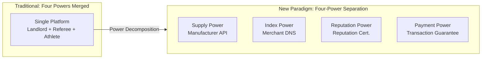
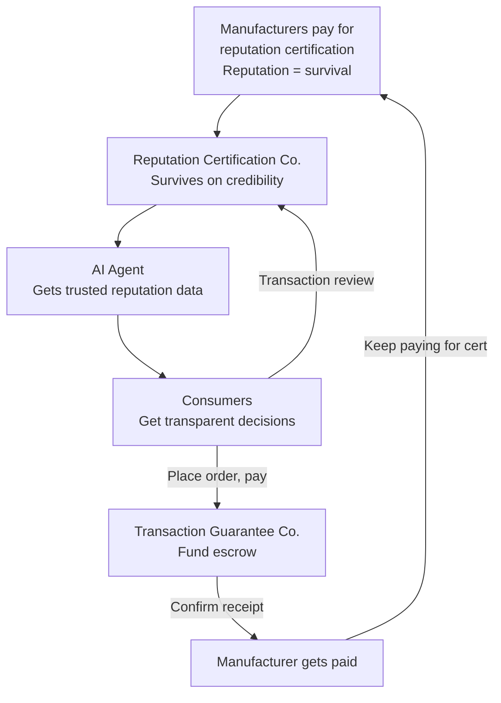
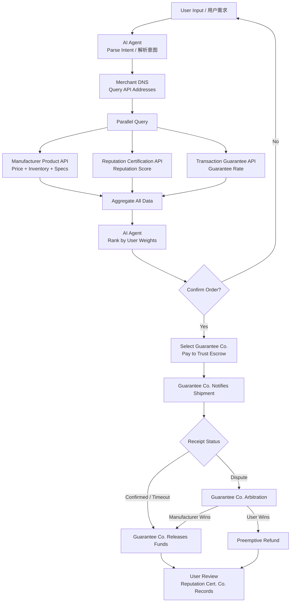

# 02 — Core Architecture & Role Definitions

## Architecture Overview

| Manufacturer (Supply) | Merchant DNS (Index) | Reputation Cert. (Reputation) | Transaction Guarantee (Payment) | AI Agent (Decision) | Consumer (Demand)   |
| --------------------- | -------------------- | ----------------------------- | ------------------------------- | ------------------- | ------------------- |
| Self-hosted API       | Metadata Indexing    | Factory Certification         | Trust Escrow                    | Semantic Parsing    | Preference Settings |
| Real-time Inventory   | Unified Search       | Reputation Scoring            | Payment & Release               | Parallel Comparison | Confirm Order       |
| Auto-pricing          | No Product Data      | Review Management             | Dispute Arbitration             | Ranked Sort         | Review              |
|                       |                      | Data On-chain                 |                                 | Order Tracking      |                     |

> Four-Power Separation: Supply, Index, Reputation, and Payment are independent competitive layers that check and balance each other. Every layer allows multiple competing providers.

---

## Power Separation Architecture

| Power Type         | Traditional Platform (Merged)                          | New Paradigm (Separated)                                      |
| ------------------ | ------------------------------------------------------ | ------------------------------------------------------------- |
| **Supply**         | Manufacturer constrained by platform rules             | Manufacturer self-hosts API, autonomous pricing               |
| **Index**          | Platform built-in search, bidding determines exposure  | Merchant DNS, yellow-pages index only, no ads                 |
| **Reputation**     | Platform self-evaluation, fake reviews, non-portable   | Reputation Certification Co., on-chain, migratable            |
| **Payment**        | Platform manages own funds, referee and athlete in one | Transaction Guarantee Co., independent custody, no evaluation |
| **Power Relation** | Four powers merged: Landlord + Referee + Athlete       | Four-Power Separation: checks and balances, closed loop       |

**Essential Difference**: Traditional platforms are "rent-collecting landlords + referee + athlete." This architecture is **open infrastructure** — every layer is a competitive market service; no single entity holds two types of power simultaneously.

---

## Closed Loop Logic

---

## 2.1 Manufacturer — Product Listing API

### Definition

Manufacturers deploy a lightweight, standardized HTTP API to expose product data. The API is fully autonomous and controlled by the manufacturer.

### Technical Specification

| Element          | Specification                                                                                            |
| ---------------- | -------------------------------------------------------------------------------------------------------- |
| Data Format      | Standardized JSON Schema                                                                                 |
| Required Fields  | Product ID, name, specifications, price, inventory, multiple images, shipping options, after-sales terms |
| Optional Fields  | Video, 3D models, VR showcases, production certifications, raw material traceability                     |
| API Capabilities | Query on demand, pagination, real-time inventory sync                                                    |
| Security         | OAuth2 authorization; AI Agents must carry user identity tokens                                          |
| Rate Limiting    | Manufacturer can set API call frequency limits independently                                             |

### Deployment Options

- **Open-source SDK**: One-click installation generates a standard API
- **SaaS Hosting**: Non-technical manufacturers can use third-party SaaS for zero-code deployment
- **Self-built**: Large brands build on their own under the protocol spec with full autonomy

### Core Principles

- Complete ownership belongs to the manufacturer
- Pricing, inventory, and listing status are determined entirely by the manufacturer without third-party approval
- The manufacturer owns its API call data and shares it with no unauthorized party

---

## 2.2 Merchant DNS — Product API Registry

### Why "Merchant DNS"

Just as internet DNS resolves domain names to IP addresses, Merchant DNS resolves **product search terms** to **manufacturer API address lists**. It only performs index resolution — it stores no product data and participates in no transactions.

### Functionality

| Function              | Description                                                                            |
| --------------------- | -------------------------------------------------------------------------------------- |
| API Registration      | Indexes API root addresses of certified manufacturers                                  |
| Metadata Indexing     | Stores metadata such as factory categories, primary product lines, geographic location |
| Unified Search        | Provides product search / filter / aggregation interfaces for AI Agent calls           |
| Real-time Passthrough | Queries forwarded in real-time to manufacturer APIs; no persistent product data stored |
| Short-term Caching    | High-frequency query results cached briefly to reduce latency                          |

### What It Does NOT Do

- Does not store detailed product data
- Does not influence search ranking
- Does not accept advertising
- Does not participate in transaction guarantees or dispute arbitration
- Does not display anything directly to consumers

### Registration Rule: One Manufacturer, One Registration

Each manufacturer **can only register one API with one DNS center** at a time. Registration requires two core pieces of information:

1. **API Server Address**: The root URL of the product API — essentially exposing the server address to the DNS, which queries product data from it in real-time
2. **Product Category Declaration**: The manufacturer declares its primary product categories (e.g., "outdoor gear," "baby products"), which the DNS uses to build category indexes

Once registered, the DNS broadcasts the manufacturer's information to other DNS centers via the **synchronization protocol**. If a manufacturer wants to switch DNS providers (e.g., move to one with better service), it must first deregister from the current DNS, then register with the new one. During the switch, the API address and category declaration remain unchanged — AI Agents are unaffected.

### Competition & Governance

- Multiple Merchant DNS providers can coexist and compete; AI Agents can query multiple DNS providers simultaneously
- Synchronization protocol ensures index consistency — once a manufacturer registers with one DNS, all DNS providers can query it
- Manufacturers can switch DNS registration at any time (deregister → re-register), forcing DNS providers to continuously improve
- Initially maintained by the open-source community or industry alliance; can transition to DAO governance when mature

### Operating Cost

Extremely low: only needs to maintain API metadata indexing and search services. No need to store massive product data, images, or transaction records.

---

## 2.3 Reputation Certification Company — Reputation Layer

### Definition

An independent **fourth-party neutral evaluation institution**, separate from manufacturers, AI Agents, and Transaction Guarantee Companies. Handles everything related to "reputation": factory certification, dynamic reputation scoring, review data management. **Never touches funds.**

### Core Principle: Power Separation

Reputation Certification Companies and Transaction Guarantee Companies **must be separated** — the evaluator never touches money, the money handler never evaluates. This is the cornerstone of checks and balances in the entire architecture.

### Core Services

#### Factory Certification

- On-site or remote audit of factory qualifications, production capacity, and quality systems
- Tiered certification: Basic / Deep / Real-time Monitoring
- Certification results written to reputation ledger and are tamper-proof

#### Dynamic Reputation Scoring

- Inputs: historical transaction data, return rates, delivery timeliness, encrypted consumer review signatures
- Algorithm is transparent, publicly documented, and auditable
- Manufacturer violations (false descriptions, delayed shipping, material mismatch) trigger score deductions
- Malicious returns / negative reviews by consumers are also flagged to protect manufacturers

#### Review Management

- Collects and verifies encrypted, signed consumer reviews
- Anti-fraud: each review is bound to a unique transaction hash
- Provides real-time reputation query APIs for AI Agents

#### Data Storage Architecture

- **Raw data on-chain**: reputation score hashes, certification records, transaction review hashes — immutable
- **Detailed data local storage**: specific review content, factory audit report details — privacy-protected, cost-effective
- **Manufacturer data migration**: manufacturers can migrate their reputation profile to another certification company at any time, **migration is charged**
- Migration fees paid by the receiving company (new certifier) or manufacturer, creating competitive pricing

### Revenue Model

| Revenue Source                        | Description                                                             |
| ------------------------------------- | ----------------------------------------------------------------------- |
| Manufacturer Annual Certification Fee | Tiered by certification level                                           |
| Reputation Query API Call Fee         | Per-query charge to AI Agents or Guarantee Companies                    |
| Data Migration Fee                    | Charged when manufacturer moves reputation profile to another certifier |

### Competition Mechanism

- Multiple reputation certification companies can coexist and compete
- AI Agents can compare reputation scores across multiple certifiers
- Credibility is the core asset — one falsified score, permanent market exit
- Manufacturers can migrate with their reputation data, forcing certifiers to continuously improve service quality

---

## 2.4 Transaction Guarantee Company — Payment Layer

### Definition

An independent **fourth-party fund custodian**, separate from manufacturers, AI Agents, and Reputation Certification Companies. **Only handles fund-related operations**: trust escrow, payment collection and release, dispute arbitration, preemptive payout. **Never participates in evaluation.**

### Core Principle: Power Separation

Transaction Guarantee Companies can only view reputation scores provided by Reputation Certification Companies, with no authority to modify them. Dispute arbitration is based on transaction facts (logistics records, chat records) with reputation as a reference — never on the guarantee company's own subjective judgment.

### Core Services

#### Trust Escrow

- User payment enters a trust escrow account (not directly to the manufacturer)
- Funds released to the manufacturer upon user receipt confirmation
- Auto-release after timeout to protect manufacturers from malicious delays
- Transaction Guarantee Company bears the legal liability for fund custody

#### Dispute Arbitration & Preemptive Payout

- User or manufacturer files a complaint with the guarantee company
- Ruling based on transaction facts (logistics delivery records, product description matching)
- References reputation scores from certification companies for both parties
- User wins: preemptive payout to user, then recovery from manufacturer
- Manufacturer wins: complaint dismissed, funds released

#### Quality Insurance

- Authenticity insurance and quality insurance for high-value goods
- Premium paid by manufacturer; payout executed by underwriter

### Revenue Model

| Revenue Source            | Rate                                              |
| ------------------------- | ------------------------------------------------- |
| Transaction Guarantee Fee | 0.5% – 2% of transaction value                    |
| Dispute Processing Fee    | Prepaid by complainant; loser pays                |
| Escrow Interest           | Interest income from funds held in trust accounts |

### Competition Mechanism

- Multiple transaction guarantee companies can coexist and compete
- AI Agents recommend based on guarantee fee rates, payout speed, and dispute fairness history
- Guarantee companies themselves never evaluate reputation — eliminating conflict of interest

---

## 2.5 Client-Side AI Agent — Decision Layer

### Forms

- Mobile App (iOS / Android)
- Desktop Software (Windows / macOS / Linux)
- Browser Extension
- Smart Speaker Skill
- Instant Messaging Bot (integrated with popular messaging tools)

### Core Capabilities

#### Semantic Understanding

User inputs natural language: "Find me a waterproof, breathable hiking jacket under 300, rated 4+ stars" — the AI Agent extracts category, budget, functional requirements, and trust thresholds.

#### Parallel Query

- Queries Merchant DNS for matching manufacturer API lists
- Parallel requests to all qualifying manufacturer product APIs
- Simultaneously queries Reputation Certification APIs for reputation scores
- Simultaneously queries Transaction Guarantee APIs for guarantee rates and eligibility
- Completes cross-network comparison in seconds

#### Weighted Ranking

Consumer pre-sets preference weights:

- Price-first: lowest price ranks highest
- Performance-first: best key specs rank highest
- Reputation-first: highest trust scores rank highest
- Guarantee-first: fastest payout, lowest fees rank highest
- Comprehensive: AI auto-learns from user history

#### One-Click Ordering

- Confirms product and generates order
- User selects transaction guarantee company, pays into trust escrow
- Notifies manufacturer to prepare and ship
- Auto-tracks logistics status
- Records shopping preferences for future optimization

### Business Model

| Plan                      | Description                                                     |
| ------------------------- | --------------------------------------------------------------- |
| Free for Consumers        | Basic features free; premium features via subscription          |
| Manufacturer API Call Fee | Minimal per-transaction charge (far below traditional ad costs) |
| Referral Commission       | Optional: small referral fee per completed transaction          |

### Competition

Multiple AI Agent developers coexist and compete; users can switch freely. The competitive moat is recommendation accuracy, interaction fluency, and the ability to learn user preferences — not capital-burning user acquisition.

---

## End-to-End Transaction Flow

### Flow Highlights

1. **Users never face any manufacturer directly** — the AI Agent is the sole interactive interface
2. **Product, reputation, and guarantee data are fetched in parallel** — no mutual dependency, ensuring query speed
3. **Reputation and payment are completely separated**: Certification Co. manages reputation, Guarantee Co. manages funds
4. **Funds remain in the trust escrow throughout** — manufacturers never touch the money before receipt confirmation
5. **Disputes are adjudicated by independent guarantee companies**, referencing reputation scores from certification companies
6. **Reviews are encrypted and signed**, bound to a certification company, on-chain anchored, immutable, and traceable

---

[← Back to Main File](./AI-Shopping-Paradigm.md)
