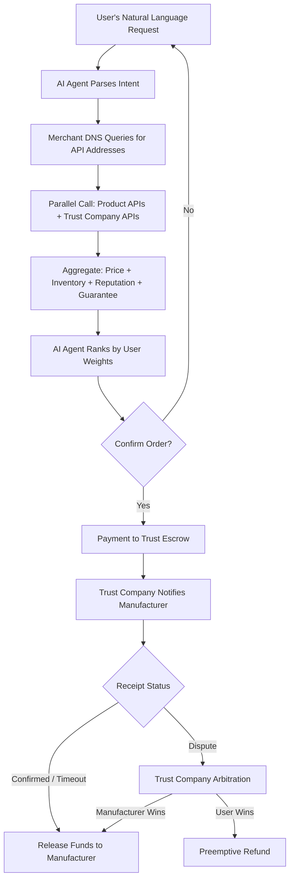

# 02 — Core Architecture & Role Definitions

## Architecture Overview

| Manufacturer (Supply) | Merchant DNS (Index) | Trust & Guarantee (Guarantee) | AI Agent (Decision) | Consumer (Demand) |
|----------------------|---------------------|------------------------------|--------------------|-------------------|
| Self-hosted API | Metadata Indexing | Factory Certification | Semantic Parsing | Preference Settings |
| Real-time Inventory | Unified Search | Reputation Scoring | Parallel Comparison | Confirm Order |
| Auto-pricing | No Product Data Stored | Trust Escrow | Ranked Sort | Review |
| | | Dispute Arbitration | Order Tracking | |

> Every layer allows multiple competing providers

---

## 2.1 Manufacturer — Product Listing API

### Definition

Manufacturers deploy a lightweight, standardized HTTP API to expose product data. The API is fully autonomous and controlled by the manufacturer.

### Technical Specification

| Element | Specification |
|---------|--------------|
| Data Format | Standardized JSON Schema |
| Required Fields | Product ID, name, specifications, price, inventory, multiple images, shipping options, after-sales terms |
| Optional Fields | Video, 3D models, VR showcases, production certifications, raw material traceability |
| API Capabilities | Query on demand, pagination, real-time inventory sync |
| Security | OAuth2 authorization; AI Agents must carry user identity tokens |
| Rate Limiting | Manufacturer can set API call frequency limits independently |

### Deployment Options

- **Open-source SDK**: One-click installation generates a standard API
- **SaaS Hosting**: Non-technical manufacturers can use third-party SaaS for zero-code deployment
- **Self-built**: Large brands build on their own under the protocol spec with full autonomy

### Core Principles

- Complete ownership belongs to the manufacturer
- Pricing, inventory, and listing status are determined entirely by the manufacturer without third-party approval
- The manufacturer owns its API call data and shares it with no unauthorized party

---

## 2.2 Merchant DNS — Product API Registry

### Why "Merchant DNS"

Just as internet DNS resolves domain names to IP addresses, Merchant DNS resolves **product search terms** to **manufacturer API address lists**. It only performs index resolution — it stores no product data and participates in no transactions.

### Functionality

| Function | Description |
|----------|-------------|
| API Registration | Indexes API root addresses of certified manufacturers |
| Metadata Indexing | Stores metadata such as factory categories, primary product lines, geographic location |
| Unified Search | Provides product search / filter / aggregation interfaces for AI Agent calls |
| Real-time Passthrough | Queries forwarded in real-time to manufacturer APIs; no persistent product data stored |
| Short-term Caching | High-frequency query results cached briefly to reduce latency |

### What It Does NOT Do

- ❌ Does not store detailed product data
- ❌ Does not influence search ranking
- ❌ Does not accept advertising
- ❌ Does not participate in transaction guarantees or dispute arbitration
- ❌ Does not display anything directly to consumers

### Competition & Governance

- Multiple Merchant DNS providers can coexist and compete; AI Agents can query multiple DNS providers simultaneously
- A synchronization protocol ensures manufacturer index consistency across providers
- Initially maintained by the open-source community or industry alliance; can transition to DAO governance when mature

### Operating Cost

Extremely low: only needs to maintain API metadata indexing and search services. No need to store massive product data, images, or transaction records. A single DNS operator's running cost is a fraction of a traditional e-commerce platform's.

---

## 2.3 Trust & Guarantee Companies — Trust Provider

### Definition

An independent **fourth-party neutral institution**, separate from manufacturers, AI Agents, and Merchant DNS, providing factory certification, reputation scoring, transaction guarantee, and dispute arbitration.

### Core Services

#### Factory Certification
- On-site or remote audit of factory qualifications, production capacity, and quality systems
- Tiered certification: Basic / Deep / Real-time Monitoring
- Certification results written to reputation ledger and are tamper-proof

#### Dynamic Reputation Scoring
- Inputs: historical transaction data, return rates, delivery timeliness, encrypted consumer review signatures
- Algorithm is transparent, publicly documented, and auditable
- Manufacturer violations (false descriptions, delayed shipping, material mismatch) trigger score deductions
- Malicious returns / negative reviews by consumers are also flagged to protect manufacturers

#### Trust Escrow Guarantee
- User payment enters a trust escrow account (not directly to the manufacturer)
- Funds released to the manufacturer upon user receipt confirmation
- Auto-release after timeout to protect manufacturers from malicious delays
- Trust company bears the legal liability for fund custody

#### Dispute Arbitration & Preemptive Payout
- User or manufacturer files a complaint with the trust company
- Trust company adjudicates liability
- User wins: preemptive payout to user, then recovery from manufacturer
- Manufacturer wins: complaint dismissed, funds released

#### Quality Insurance
- Authenticity insurance and quality insurance for high-value goods
- Premium paid by manufacturer; payout executed by underwriter

### Competition Mechanism

- Multiple trust companies can coexist; users or AI Agents can choose among them
- AI Agents can evaluate trust companies based on historical arbitration fairness rates, payout speed, etc.
- Trust companies face **reputation competition** — a company that favors manufacturers loses consumers; one that favors consumers loses manufacturers
- Market-driven competitive pressure forces trust companies to remain neutral

### Revenue Model

| Revenue Source | Rate |
|---------------|------|
| Manufacturer annual certification fee | Tiered by certification level |
| Transaction guarantee fee | 0.5% – 2% of transaction value |
| Dispute processing fee | Prepaid by complainant; loser pays |
| Quality insurance commission | Premium share |

---

## 2.4 Client-Side AI Agent

### Forms

- Mobile App (iOS / Android)
- Desktop Software (Windows / macOS / Linux)
- Browser Extension
- Smart Speaker Skill
- Instant Messaging Bot (integrated with popular messaging tools)

### Core Capabilities

#### Semantic Understanding
User inputs natural language: "Find me a waterproof, breathable hiking jacket under 300, rated 4+ stars" — the AI Agent extracts category, budget, functional requirements, and trust thresholds.

#### Parallel Price Comparison
- Queries Merchant DNS for matching manufacturer API lists
- Parallel requests to all qualifying manufacturer product APIs
- Simultaneously queries trust company APIs for reputation scores and guarantee eligibility
- Completes cross-network price comparison in seconds

#### Weighted Ranking
Consumer pre-sets preference weights:
- Price-first: lowest price ranks highest
- Performance-first: best key specs rank highest
- Reputation-first: highest trust scores rank highest
- Comprehensive: AI auto-learns from user history

#### One-Click Ordering
- Confirms product and generates order
- User pays into trust company's escrow account
- Notifies manufacturer to prepare and ship
- Auto-tracks logistics status
- Records shopping preferences for future optimization

### Business Model

| Plan | Description |
|------|-------------|
| Free for Consumers | Basic features free; premium features (multi-trust comparison, auto-ordering) via subscription |
| Manufacturer API Call Fee | Minimal per-transaction charge to manufacturer (far below traditional ad costs) |
| Referral Commission | Optional: small referral fee per completed transaction |

### Competition

Multiple AI Agent developers coexist and compete; users can switch freely. The competitive moat is no longer capital-burning user acquisition but recommendation accuracy, interaction fluency, and the ability to learn user preferences.

---

## End-to-End Transaction Flow

### Flow Highlights

1. **Users never face any manufacturer directly** — the AI Agent is the sole interactive interface
2. **Product data and trust data are fetched in parallel** — no mutual dependency, ensuring query speed
3. **Funds remain in the trust escrow throughout** — manufacturers never touch the money before receipt confirmation
4. **Disputes are adjudicated by independent third parties** — the platform is never its own judge
5. **Reviews are encrypted and signed**, bound to a trust company, tamper-proof, and traceable

---

[← Back to Main File](./AI-Shopping-Paradigm.md)
