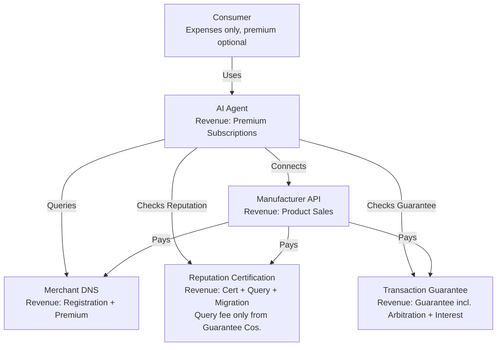

# 03 — Business Value & Business Model

## 1. Value for Each Stakeholder

> The business value of this paradigm does not come from selling traffic — it comes from **verifiable integrity**. Quality manufacturers are seen not because they bid higher, but because their products are good and provably so. Consumer trust comes not from platform endorsement, but from on-chain data, immutable reviews, and mutual checks between separated powers.

### For Consumers

| Value Point | Details |
|-------------|---------|
| **True Price Comparison** | AI queries all manufacturers in parallel, zero bidding pollution, results ranked purely by user preferences |
| **Lower Prices** | Savings from commissions (15%) and ad fees (20–40%) translate directly into price reductions |
| **Real Reviews** | Reputation scores backed by competing certification companies, encrypted and signed, tamper-proof |
| **Time Saved** | From "spend 30 minutes manually comparing across platforms" to "say one sentence, AI completes it in 10 seconds" |
| **Full Protection** | Trust escrow + preemptive payout; an independent third party underwrites disputes |

### For Manufacturers

| Value Point | Old E-Commerce | New Paradigm |
|-------------|---------------|--------------|
| Platform Commission | 5–15% of GMV | 0% (no platform) |
| Ad / Traffic Fees | 20–40% of sales | 0 (no bidding ads) |
| API Registration Fee | — | Minimal (e.g., ~$15/year) |
| Trust Guarantee Fee | — | 0.5–2% of transaction value |
| **Total Cost** | **15–30% of GMV** | **< 3% of GMV** |

- **Pricing Autonomy**: No platform promotion rules to coerce; free to set prices and inventory independently
- **Portable Reputation**: Reputation scores bound to certification companies, not a single platform; on-chain and migratable across certifiers
- **Data Ownership**: Manufacturer owns its API call data and gains clear customer insights

### For Reputation Certification Companies

- **Credibility is the Asset**: Build brand through fair scoring; one falsification means permanent market exit
- **Asset-light Operations**: No product handling, no fund handling — just reputation data and certification systems
- **Migration Revenue**: Charging migration fees when manufacturers move their reputation profiles creates ongoing revenue

### For Transaction Guarantee Companies

- **Blue Ocean Market**: Independent third-party fund custody service, completely empty market
- **Funds Only**: Trust escrow, payment release, dispute arbitration — never evaluates reputation, conflict of interest minimized
- **Historical Parallel**: Analogous to early escrow payment tools, but with evaluation and payment fully separated

### For AI Agent Developers

- **New Traffic Gateway**: Shopping traffic shifts from "open the app" to "tell the AI"; AI Agents become the first touchpoint for purchase decisions
- **Full Competition**: Users can freely switch Agents; winners determined by service quality, not capital-burning user acquisition
- **Asset-light, No Transaction Cut**: Agents hold no inventory, process no payments, take no transaction fees — profits only from premium subscriptions

### For Merchant DNS Operators

- **Asset-light Infrastructure**: No product data storage, no fund processing, no logistics involvement — purely API index maintenance
- **Naturally Supports Multiple Operators**: Like internet DNS root server architecture, Merchant DNS inherently supports mutual backup and competition
- **Near-zero Operating Cost**: Compared to traditional e-commerce server and bandwidth costs, DNS operating cost approaches zero

---

## 2. Business Model Panorama

---

## 3. Revenue Sources by Role

| Role | Revenue Source | Pricing Guidance | Notes |
|------|---------------|-----------------|-------|
| **Merchant DNS** | API Registration Fee | ~$15-75/year | Just enough to sustain operations |
| | Premium Features | On-demand | Real-time inventory index, analytics dashboards |
| **Reputation Certification** | Annual Certification Fee | Tiered by certification level | Basic → Deep → Real-time |
| | Reputation Query Fee | Charged only to Guarantee Companies | Extremely low; free for consumers and AI Agents |
| | Data Migration Fee | On manufacturer exit | Paid by receiving certifier or manufacturer, competitive pricing |
| **Transaction Guarantee** | Transaction Guarantee Fee | 0.5%–2% of transaction | Includes dispute arbitration; higher for high-value goods |
| | Escrow Interest | Interest on trust deposits | Interest income |
| **AI Agent** | Premium Subscription | Monthly / Annual | Basic features free; advanced features via subscription |
| **Manufacturer** | Product Sales Profit | Autonomous pricing | Profit margin expands significantly with cost reduction |

---

## 4. Economics: Paradigm vs. Traditional Platform

| Metric | Traditional Platforms | AI Shopping Paradigm |
|--------|----------------------|---------------------|
| Platform Commission | 5–15% of GMV | 0 |
| Ad / Promotion Fees | 20–40% of GMV | 0 |
| Trust Guarantee Fee | No independent service | 0.5–2% of GMV |
| Registration / Certification | Store setup + deposit | ~$15-75/year |
| **Total Manufacturer Burden** | **15–30% of GMV** | **< 3% of GMV** |
| Consumer Experience | Ad interference, fake reviews | Pure algorithm, real reviews |

Traditional platforms extract 15–30% of GMV as a combined "traffic tax + trust tax." The new paradigm addresses these two taxes separately: the former through free AI algorithms (protocol layer), the latter through competitively priced trust services (< 3%).

---

[← Back to Main File](./README.md)
