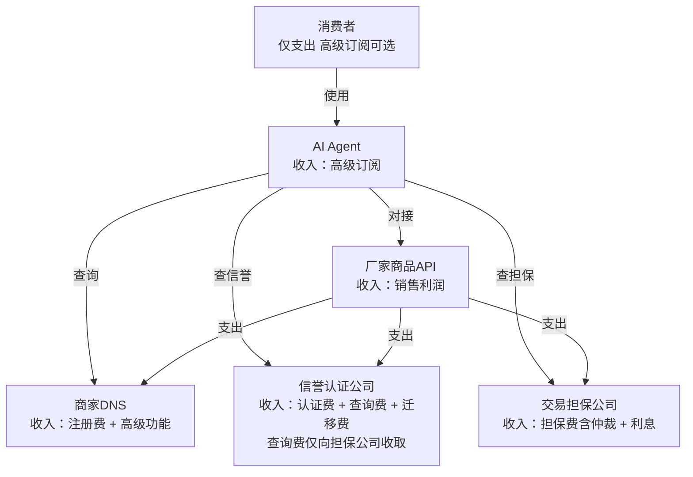

# 03 — 商业价值与商业模式

## 一、各方商业价值

> 本范式的商业价值不来自流量贩卖，而来自**诚信的可验证性**。优质厂家被看见不是因为出价高，而是因为产品好且可被证实；消费者的信任不是因为平台背书，而是因为数据在链上、评价不可篡改、权力互相制衡。

### 对消费者

| 价值点     | 具体表现                                                         |
| ---------- | ---------------------------------------------------------------- |
| **真比价** | AI并行查询全网厂商，无竞价排名污染，结果完全由算法按用户偏好排序 |
| **低价格** | 厂家省下的佣金（15%）+广告费（20-40%）转化为商品降价空间         |
| **真评价** | 信誉分由竞争性信誉认证公司背书，加密签名存证，不可刷单篡改           |
| **省时间** | 从"花30分钟在多平台手动比价"到"说一句话，AI在10秒内完成"         |
| **有保障** | 信托账户+先行赔付机制，纠纷时有独立第三方兜底                    |

### 对生产厂家

| 价值点      | 旧电商          | 新范式             |
| ----------- | --------------- | ------------------ |
| 平台佣金    | GMV的5-15%      | 0%（无平台）       |
| 广告/流量费 | 销售额的20-40%  | 0（无广告竞价）    |
| API注册费   | —               | 极低（如100元/年） |
| 信任担保费  | —               | 交易额的0.5-2%     |
| **总成本**  | **GMV的15-30%** | **GMV的 < 3%**     |

- **定价自主权**：不受平台促销规则裹挟，自由决定价格和库存
- **可迁移信誉**：信誉评分绑定于信誉认证公司而非单一平台，链上存证，跨认证公司可迁移
- **数据所有权**：拥有自己的API调用数据，清晰了解客户画像

### 对信誉认证公司

- **公信力即资产**：靠公正评分建立品牌，一次造假永久出局
- **轻资产运营**：不碰商品、不碰资金，仅维护信誉数据和认证体系
- **数据迁移收入**：厂家跨公司迁移信誉档案时收取迁移费，形成持续性收入

### 对交易担保公司

- **蓝海市场**：独立于电商平台的第三方资金托管服务，目前完全空白
- **仅处理资金**：信托账户、收款放款、纠纷仲裁——不参与评价，利益冲突最小化
- **类比空间**：相当于早期担保支付工具填补的空白，但评价与资金分离，更中立

### 对AI Agent开发者

- **新流量入口**：购物流量从"打开App"变为"对AI说话"，AI Agent成为购物决策的第一触点
- **充分竞争**：用户可自由切换Agent，赢家由服务质量决定而非烧钱获客
- **轻资产**：Agent不持有库存、不处理支付、不向交易抽成，仅在个性化服务上盈利

### 对商家DNS运营方

- **轻资产基础设施**：不存储商品数据、不处理资金、不涉及物流——仅维护API索引
- **天然支持多运营方**：如同互联网DNS的根服务器机制，商家DNS可多运营方互备互竞
- **极低运营成本**：相对于传统电商平台的服务器和带宽成本，DNS运营成本趋近于零

---

## 二、商业模式全景图

## 三、各角色收入来源明细

| 角色             | 收入来源       | 定价建议             | 说明                                                 |
| ---------------- | -------------- | -------------------- | ---------------------------------------------------- |
| **商家DNS**      | 厂家API注册费  | 100-500元/年         | 极低基础费用，维持运营                               |
|                  | 高级功能       | 按需定价             | 实时库存索引、分析仪表板等增值服务                   |
| **信誉认证公司** | 厂家认证年费   | 按认证级别阶梯定价   | 基础认证→深度认证→实时监控                           |
|                  | 信誉查询调用费 | 仅向交易担保公司收取 | 极低定价；消费者和AI Agent免费                       |
|                  | 数据迁移费     | 厂家迁出时收取       | 接收方或厂家支付，竞争性定价                         |
| **交易担保公司** | 交易担保费     | 交易额的0.5%-2%      | 已含纠纷仲裁；高价值商品费率可上调                   |
|                  | 资金托管利息   | 信托账户沉淀资金     | 利息收入                                             |
| **AI Agent**     | 高级版订阅     | 月费/年费            | 基础功能免费，高级功能（个性化推荐、自动下单等）付费 |
| **厂家**         | 商品销售利润   | 自主定价             | 成本降低后利润空间大幅释放                           |

## 四、与传统平台的经济学对比

| 指标           | 传统电商平台       | AI购物新范式    |
| -------------- | ------------------ | --------------- |
| 平台抽佣       | GMV 的 5-15%       | 0               |
| 广告/推广费    | GMV 的 20-40%      | 0               |
| 信任担保费     | 无独立服务         | GMV 的 0.5-2%   |
| 注册/认证费    | 开店费+保证金      | 100-500元/年    |
| **厂家总负担** | **GMV 的 15-30%**  | **GMV 的 < 3%** |
| 消费者体验     | 广告干扰、虚假评价 | 纯算法、真评价  |

传统平台提取了GMV的15-30%作为"流量税+信任税"，而新范式将这两个税种分别交给AI算法和市场化信任竞争来解决——前者免费（协议层），后者竞争性定价（< 3%）。

---

[← 返回主文件](./AI购物新范式.md)
