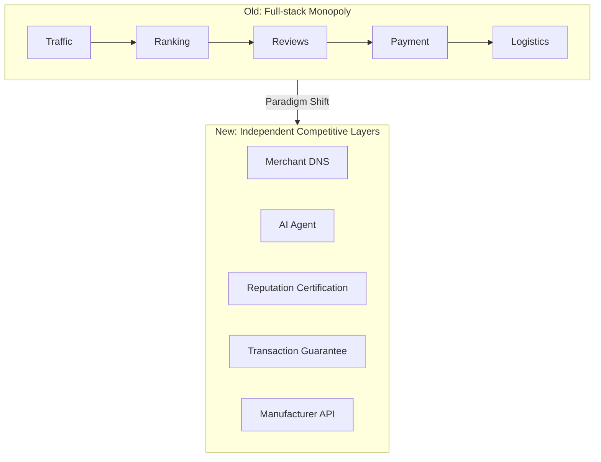
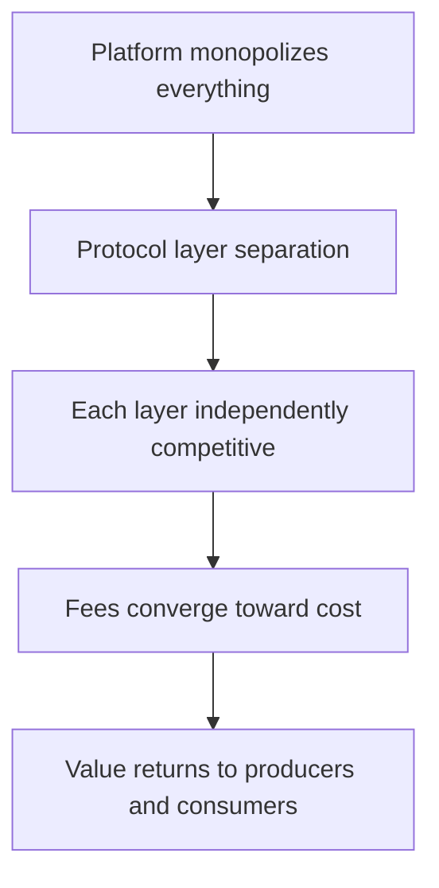
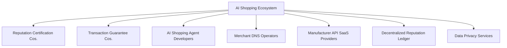

# 04 — Commerce Transformation & New Industries

## 1. Fundamental Changes to World Commerce

### From "Platform Tax" to "Protocol Layer"

The power structure of traditional e-commerce is a **vertically integrated monolith**: the platform controls traffic distribution, search ranking, review systems, payment guarantees, and logistics tracking — all within a single business entity. This allows the platform to levy an implicit tax on both sides of every transaction.

The new paradigm breaks this monolith into **independently competitive layers**:

### Old vs. New Comparison

| Dimension | Old World | New World |
|-----------|-----------|-----------|
| **Power Center** | Large centralized shopping platforms | User + AI Agent |
| **Trust Source** | Platform self-evaluation (rife with fake reviews) | Reputation certification companies competing, on-chain; Transaction guarantee companies independent custody |
| **DNS / Index** | Platform's built-in search engine | Multiple Merchant DNS providers competing under protocol |
| **Shopping Entry** | Must open platform app/website | Multiple AI Agents competing; users choose freely |
| **Pricing Power** | Platform imposes restrictions / coercion | Manufacturer's autonomous pricing |
| **Traffic Distribution** | Bidding (pay for exposure) | Algorithm ranks by user preferences |
| **Data Ownership** | Platform owns all data | User's private data; manufacturer's own data |
| **Competitive Moat** | Network effect + data monopoly | Open-source protocol; service competition |
| **Trust Portability** | Non-portable (locked to platform) | Fully portable (bound to reputation certifier, migratable across companies) |
| **Fee Transparency** | Black-box pricing (hidden ad costs) | Transparent fees (registration + certification + guarantee) |

### Core Transformation Logic

---

## 2. Seven New Industries Spawned

### 2.1 Reputation Certification Companies — $100B+ Market

Credibility-driven independent evaluation market, analogous to credit rating agencies but for e-commerce. Provides neutral evaluation and certification independent of any platform.

Service scope:
- Factory certification (tiered: Basic / Deep / Real-time Monitoring)
- Dynamic reputation scoring (transparent algorithm, auditable)
- Review management (encrypted signatures, bound to transaction hash)
- Reputation data on-chain anchoring

Competitive moat:
- Credibility is the core asset — one falsification means permanent market exit
- First-mover advantage: companies that build a broad manufacturer certification network first benefit from a data flywheel
- Manufacturers can migrate with their reputation data, forcing certifiers to continuously improve

### 2.2 Transaction Guarantee Companies — $100B+ Market

Analogous to early escrow payment tools, but with evaluation and payment fully separated. Only handles transaction funds — trust escrow, payment release, dispute arbitration.

Service scope:
- Trust escrow fund custody
- Payment collection and release (released upon buyer confirmation)
- Dispute arbitration & preemptive payout
- Cross-guarantor clearing

Competitive moat:
- Payout speed and fairness rate are the strongest consumer trust signals
- Multiple guarantee companies hold mutual clearing accounts, creating clearing network effects
- Re-insurance mechanisms distribute large payout risk

### 2.3 AI Shopping Agent Developers — $10B+ Market

Shopping traffic shifts from "open the app and search" to "tell the AI what you need." AI Agents become the new user traffic distribution layer — analogous to the paradigm shift from web portals to search engines.

Product forms:
- Standalone App (mobile / desktop)
- Browser Extension (one-click cross-platform price comparison on any product page)
- Smart Speaker / Home Skill (voice shopping)
- Instant Messaging Bot

Competition dimensions:
- Semantic understanding accuracy (better understanding = stronger user stickiness)
- Personalization quality (learns user preferences)
- Interaction experience (the smoother it is, the more it feels like a "real personal shopper")
- Cross-trust-company comparison capability

### 2.4 Merchant DNS Operators — Billions Market

A "yellow pages for product APIs" is needed, but without storing product data. Operating costs are extremely low; multiple operators can naturally coexist.

Core capabilities:
- API standard formulation and maintenance (open-source protocol)
- Manufacturer API indexing and listing
- High-performance search and aggregation
- Cross-DNS data synchronization

Governance evolution:
- Phase 1: Single operator (project team or industry alliance)
- Phase 2: Foundation governance, process transparency
- Phase 3: DAO governance, full decentralization

### 2.5 Manufacturer API SaaS Providers — $10B+ Market

Just as independent storefront tools enabled non-technical people to build websites, this service enables small and mid-sized factories to **deploy standardized product APIs with zero code**.

Feature matrix:
- One-click deployment: open-source SDK and Docker image
- SaaS hosting: no need to maintain own servers
- Inventory sync: auto-integration with ERP / inventory systems
- Order management: receiving AI Agent-generated orders
- Logistics integration: courier / shipping API integration
- Data dashboard: API call analytics and visualization

### 2.6 Decentralized Reputation Ledger Services — Billions Market

Reputation data needs immutable anchoring, but not all data needs to be on-chain (cost + privacy). A hybrid approach: transaction hashes on-chain, detailed data stored off-chain.

Service scope:
- Reputation score hash anchoring (tamper-proof)
- Key transaction fields on-chain
- Cross-trust-company reputation data interoperability protocol
- Aggregated reputation queries for AI Agents across trust companies

### 2.7 Shopping Data Privacy Services — Billions Market

In the new paradigm, users own their shopping data. Tools are needed to securely store, manage, and selectively use this data.

Service scope:
- Zero-knowledge proof shopping (prove reputation without revealing what was purchased)
- Personal AI training data privatization (preferences train only the user's own AI Agent)
- Selective data authorization (grant a trust company partial data access in exchange for lower premiums)
- GDPR compliance by design

---

## 3. Total Ecosystem Market Size Estimates

| Industry | 5-Year Scale | 10-Year Scale | Certainty |
|----------|-------------|--------------|-----------|
| Reputation Certification | ~$10B | ~$100B+ | High |
| Transaction Guarantee | ~$10B | ~$100B+ | High |
| AI Shopping Agent | ~$1B | ~$10B+ | High |
| Manufacturer API SaaS | ~$1B | ~$10B+ | Med-High |
| Merchant DNS | ~$100M | ~$1B+ | Medium |
| Reputation Ledger | ~$100M | ~$1B+ | Medium |
| Data Privacy | ~$100M | ~$1B+ | Med-Low |

---

[← Back to Main File](./README.md)
