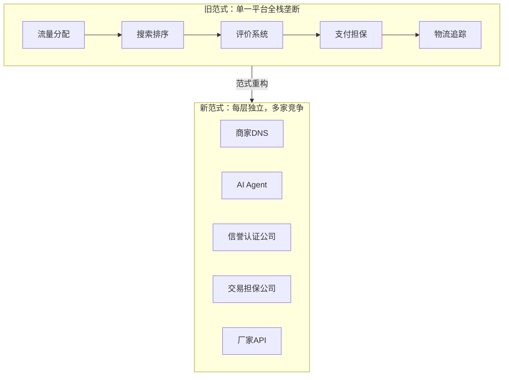
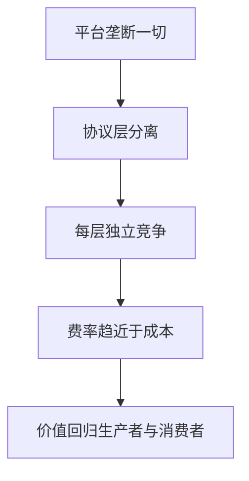
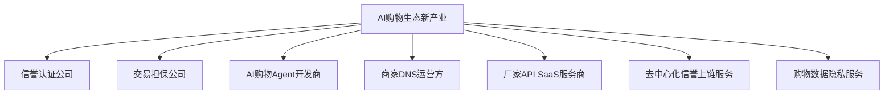

# 04 — 商业变革与新产业

## 一、对世界商业形式的根本性改变

### 从"平台税"到"协议层"

传统电商的权力结构是一块 **垂直整合的巨石**：平台掌握流量分配、搜索排序、评价系统、支付担保、物流追踪——所有环节都在同一个商业实体内。这使平台可以对交易双方征收隐性税收。

新范式将这块巨石拆解为 **可竞争的独立层**：

### 新旧对比

| 维度 | 旧世界 | 新世界 |
|------|--------|--------|
| **权力中心** | 大型综合购物平台 | 用户 + AI Agent |
| **信任来源** | 平台自评（刷单泛滥） | 信誉认证公司竞争，链上存证；交易担保公司独立托管 |
| **DNS/索引** | 平台内嵌搜索引擎 | 多家商家DNS竞争，按协议互备 |
| **购物入口** | 必须打开平台App/网站 | 多家AI Agent竞争，用户自由选择 |
| **定价权** | 平台施加限制/裹挟 | 厂家自主定价 |
| **流量分配** | 竞价排名（付费即曝光） | 算法按用户偏好排序 |
| **数据归属** | 平台拥有全部数据 | 用户私有，厂家自有 |
| **竞争壁垒** | 网络效应+数据垄断 | 协议开源，服务竞争 |
| **信任可迁移性** | 不可迁移（锁定于平台） | 完全可迁移（绑定于信誉认证公司，可跨公司迁移） |
| **费率透明度** | 黑盒定价（隐藏广告成本） | 透明费率（注册费+认证费+担保费） |

### 核心转变逻辑

---

## 二、催生的六大新产业

### 2.1 信誉认证公司 — 千亿级市场

市场逻辑：公信力驱动的独立评价市场，类比信用评级机构但面向电商。在网络交易信任缺失时，提供一个中立的评价和认证第三方，与任何平台无关。

服务范围：
- 验厂认证（分级制：基础/深度/实时监控）
- 动态信誉评分（算法透明、可审计）
- 评价管理（加密签名，绑定交易哈希）
- 信誉数据上链存证

竞争壁垒：
- 公信力是核心资产——一次造假，永久失去市场
- 率先建立广泛厂家认证网络的公司拥有数据飞轮
- 厂家可带着信誉数据迁移，倒逼认证公司持续提升服务质量

### 2.2 交易担保公司 — 千亿级市场

市场逻辑：类比早期担保支付工具的创新，但评价与资金完全分离。只处理交易链路上的资金——信托账户、收放款、纠纷仲裁。

服务范围：
- 信托账户资金托管
- 收款放款（买家确认后释放）
- 纠纷仲裁与先行赔付
- 跨担保公司清算

竞争壁垒：
- 赔付速度和公正率是最强的消费者信任信号
- 多家担保公司互持清算账户，形成清算网络效应
- 再保险机制分散大额赔付风险

### 2.3 AI购物Agent开发商 — 百亿级市场

市场逻辑：购物流量入口从"打开App搜"变为"对AI说需求"。AI Agent成为新的用户流量分发层——类似于搜索引擎取代门户网站的范式转移。

产品形态：
- 独立App（手机/桌面）
- 浏览器插件（用户在任何网页看到商品可一键比价）
- 智能音箱/家居技能（语音购物）
- 即时通讯机器人

竞争维度：
- 语义理解的精准度（越理解用户越有黏性）
- 个性化推荐的质量（学习用户偏好）
- 交互体验（越流畅越像"真人买手"）
- 跨信任公司比价能力

### 2.4 商家DNS运营方 — 数十亿级市场

市场逻辑：需要一个"商品API的黄页"，但不需要存储商品数据。运营成本极低，天然支持多运营方并存。

核心能力：
- API标准的制定与维护（开源协议）
- 厂商API的收录与索引
- 高性能搜索与聚合
- 与多个商家DNS之间的数据同步

治理演进：
- 阶段1：单一方运营（项目方或行业联盟）
- 阶段2：基金会管理，治理透明化
- 阶段3：DAO治理，完全去中心化

### 2.5 厂家API SaaS服务商 — 百亿级市场

市场逻辑：类比独立建站工具让非技术人员也能建网站，本服务让中小工厂 **零代码部署标准化商品API**。

功能矩阵：
- 一键部署：提供开源SDK和Docker镜像
- SaaS托管：不需要自行维护服务器
- 库存同步：ERP/进销存系统自动对接
- 订单管理：接收AI Agent生成的订单
- 物流对接：快递/物流API集成
- 数据面板：API调用数据分析和可视化

### 2.6 去中心化信誉上链服务 — 数十亿级市场

市场逻辑：信誉数据需要不可篡改的存证，但不需要全部上链（成本+隐私）。提供混合方案：交易哈希上链，详细数据链下存储。

服务内容：
- 信誉评分哈希存证（防篡改）
- 交易记录的关键字段上链
- 信任公司之间的信誉数据互通协议
- 为AI Agent提供跨信任公司的聚合信誉查询

### 2.7 购物数据隐私服务 — 数十亿级市场

市场逻辑：在新范式中，用户拥有自己的购物数据。需要工具来安全存储、管理和选择性使用这些数据。

服务内容：
- 零知识证明购物（不泄露具体买了什么但能证明信誉）
- 个人AI训练数据私有化（购物偏好只训练自己的AI Agent）
- 选择性数据授权（同意某信任公司使用部分数据换取更低保费）
- GDPR天然合规

## 三、生态总市场规模预估

| 产业 | 5年规模 | 10年规模 | 确定性 |
|------|---------|---------|--------|
| 信誉认证 | 百亿级 | 千亿级 | 高 |
| 交易担保 | 百亿级 | 千亿级 | 高 |
| AI购物Agent | 十亿级 | 百亿级 | 高 |
| 厂家API SaaS | 十亿级 | 百亿级 | 中高 |
| 商家DNS | 数亿级 | 数十亿级 | 中 |
| 信誉上链 | 数亿级 | 数十亿级 | 中 |
| 数据隐私 | 数亿级 | 数十亿级 | 中低 |

---

[← 返回主文件](./AI购物新范式.md)
