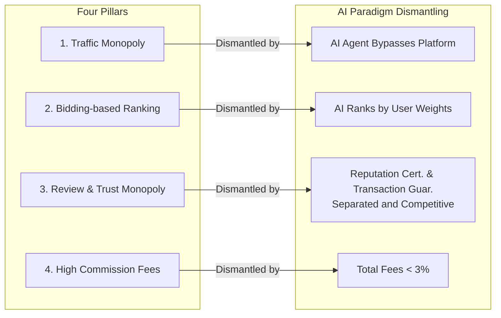
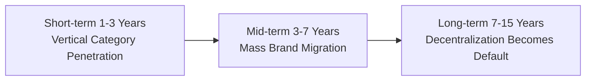

# 05 — Disruption Path & Cold Start Strategy

## 1. Dismantling the Four Pillars of Traditional E-Commerce

### Pillar 1 — Traffic Monopoly

**Old Model**: Users must open the platform app/website to shop. The platform controls the first touchpoint and can therefore auction traffic.

**Dismantled**: When AI Agents become the shopping entry point, users no longer open the platform app — they talk to their AI. The AI directly interfaces with manufacturer APIs, bypassing the platform entirely.

### Pillar 2 — Bidding-based Ranking

**Old Model**: Search result ranking depends on who pays the most, not who has the best product. This is the platform's core profit engine.

**Dismantled**: AI Agents rank by user-preset weights (price / performance / reputation). The concept of an "ad slot" simply does not exist. The bidding-based ranking business model has no place in an AI shopping world.

### Pillar 3 — Review & Trust Monopoly

**Old Model**: The platform's review system is the sole source of trust. Fake reviews, review deletion, and manipulation are rampant.

**Dismantled**: Reputation certification companies compete to provide evaluation; transaction guarantee companies compete to provide fund custody. Review data is encrypted, signed, and anchored — tamper-proof. Certification companies compete against each other; favoring either side leads to elimination in the marketplace.

### Pillar 4 — High Commission Fees

**Old Model**: Platforms take 5–15% commission from every transaction, plus manufacturers spend 20–40% on advertising.

**Dismantled**: No platform = no commission. Total cost drops to registration + certification + guarantee fees < 3%. Manufacturer profit margins expand dramatically; room for consumer price reduction opens wide.

---

## 2. Disruption Timeline

### Short-term (1–3 Years) — Cracks Appear

- Select 1–2 vertical categories as breakthrough: **high transaction value, weak brand recognition, high platform commissions, many counterfeits**
- Typical categories: outdoor gear, pet supplies, niche baby products, industrial tools
- 50–100 quality factories and SME brands join first
- Seed users recruited from vertical communities (outdoor forums, pet owner groups)
- **Platform reaction**: "Niche market; not worth worrying about"

### Mid-term (3–7 Years) — Cracks Widen

- Mid-tier brands observe early adopters' margin improvements and begin migrating at scale
- 2–3 reputation certification companies and guarantee companies enter the market; ecosystem competition begins
- Top brands still resist, but consumers increasingly discover alternatives through AI Agents
- AI Agent user base crosses the critical threshold (10M+ daily active users)
- **Platform reaction**: "Forced to open APIs; trying to become 'the biggest Merchant DNS'"

### Long-term (7–15 Years) — Paradigm Settles

- Top brands fully waver and are forced to join the new protocol
- Traditional platforms transition into infrastructure — their warehousing and logistics retain value
- Decentralized shopping becomes the default
- A new generation of consumers has never shopped on a "traditional e-commerce platform"
- **Platform reaction**: "Reduced to backend warehouses and fulfillment networks for AI Agents"

---

## 3. Cold Start Strategy

**Core problem**: No manufacturers → no products → no users come; no users → no transactions → no manufacturers join.

**Solution**: **Vertical breakthrough + strong trust backing + seed user subsidies.** Do not pursue rapid scale; first validate the closed loop.

### Phase 1: Vertical Category Breakthrough (0 → $1M GMV)

| Dimension | Strategy |
|-----------|----------|
| **Category Selection** | Outdoor gear (high transaction value, weak brand recognition, high commissions) |
| **Supply Side** | Contact 50–100 quality factories; provide free open-source API plugins and hosting |
| **Trust Side** | Establish first reputation certification company and transaction guarantee company in-house; provide 100% preemptive payout backing |
| **Client Side** | Develop MVP AI Agent (IM bot); manually tune recommendation algorithms |
| **User Acquisition** | Beta test in vertical communities; invite seed users for free trials; first-order 100% guaranteed |
| **Validation Metric** | 100 real closed-loop transactions; user repurchase rate > 30% |

### Phase 2: Category Expansion & Trust Competition ($1M → $10M GMV)

| Dimension | Strategy |
|-----------|----------|
| **Category Expansion** | From outdoor gear to pet supplies and niche baby products |
| **Trust Side** | Open reputation certification and guarantee company onboarding; bring in 2–3 independent agencies |
| **Client Side** | Launch independent AI Agent App; add personalized learning |
| **Marketing** | Partner with vertical media / KOLs; emphasize "ad-free, real price comparison" differentiation |
| **Manufacturer Incentives** | Showcase cost savings data from early adopters (15–30% → < 3%) |
| **Validation Metric** | GMV exceeds $10M; 3+ certification and guarantee companies competing; monthly active users > 1M |

### Phase 3: Scale & Self-Sustaining Ecosystem ($10M+ GMV)

| Dimension | Strategy |
|-----------|----------|
| **Brand Breakthrough** | Top brands begin to join passively (or supplemented via legal public-data crawling) |
| **Governance** | Registry transitions to foundation or DAO management; transparent protocol governance |
| **Competitive Ecosystem** | Multiple third-party AI Agent competitors emerge on the same protocol |
| **Standardization** | Government / industry associations begin setting trust rating standards |
| **Self-Sustaining** | New manufacturers join proactively due to ecosystem scale; no promotion needed |

---

## 4. Risks & Mitigations

| Risk | Probability | Impact | Mitigation |
|------|------------|--------|------------|
| Manufacturer Data Security | Medium | High | OAuth2 auth; manufacturer-set rate limits; security audits |
| Certification Co. Fraud / Guarantee Co. Bankruptcy | Low | Critical | Industry reserve pool; user compensation fund; mandatory re-insurance |
| Top Brand Resistance | High | Medium | AI Agent legally crawls public data as supplement; wait for SME brands to force the issue |
| Regulatory Uncertainty | Medium | High | Proactive government engagement; pitch as "new e-commerce infrastructure pilot" |
| Cold Start Death Spiral | High | Critical | Vertical category + strong trust backing + seed user subsidies; don't chase rapid scale |
| Certification & Guarantee Co. Collusion | Low | High | Multi-provider competition + public arbitration records + AI Agent auto-monitoring for abnormal pricing |

---

## 5. Action Roadmap (0–18 Months)

| Time | Milestone | Key Deliverables |
|------|-----------|-----------------|
| Months 1–3 | Protocol Design & Development | API specification document; open-source SDK; Merchant DNS MVP; certification and guarantee company registration |
| Months 4–6 | Supply Recruitment + Seed Testing | 50 manufacturers onboarded in first vertical; Web-based AI Agent live; 100 real transactions |
| Months 7–12 | App Launch + Second Trust Providers | App client live; second certification and guarantee companies onboarded; GMV exceeds $1M |
| Months 13–18 | Category Expansion + Ecosystem Initiation | Expand to 3–5 categories; registry open-sourced; GMV exceeds $10M; Series A |

---

[← Back to Main File](./AI-Shopping-Paradigm.md)
