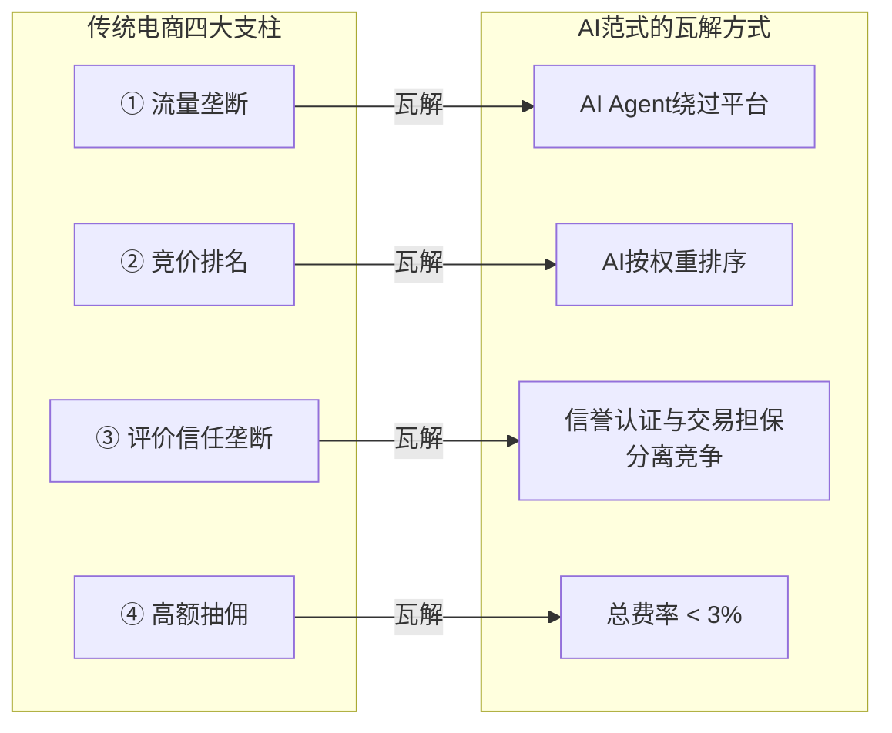
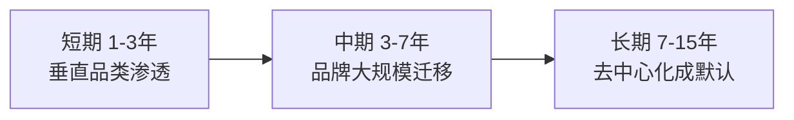

# 05 — 颠覆路径与冷启动策略

## 一、对传统电商四大支柱的瓦解

### 支柱① — 流量垄断 **旧模式**：用户必须打开平台App/网站才能购物。平台控制第一触点，因而可以拍卖流量。 **瓦解**：当AI Agent成为用户的购物入口，用户不再打开平台App，而是对AI说话。AI直接对接厂家API，绕过平台。

### 支柱② — 竞价排名 **旧模式**：搜索结果排序取决于谁付费最多，而非谁产品最好。这是平台最核心的利润引擎。 **瓦解**：AI Agent按用户预设权重排序（价格/性能/信誉），不存在"广告位"概念。竞价排名这个商业模式在AI购物的世界里根本不存在。

### 支柱③ — 评价信任垄断 **旧模式**：平台的评价系统是唯一的信任来源，刷单、删评、虚假评价泛滥。 **瓦解**：信誉认证公司竞争提供评价，交易担保公司竞争提供资金托管。评价数据加密签名存证，不可篡改。信任公司之间互相竞争——偏袒任一方都会在竞争中被淘汰。

### 支柱④ — 高额抽佣 **旧模式**：平台从每笔交易抽佣5-15%，此外厂家还需支付20-40%的广告费。 **瓦解**：无平台=无佣金。总成本降至注册费+担保费 < 3%。厂家利润大幅释放，商品价格下降空间巨大。

---

## 二、颠覆时间线

### 短期（1-3年）— 裂缝出现

- 选择1-2个垂直品类作为突破口： **高客单价、品牌认知弱、平台佣金高、假货多** - 典型品类：户外装备、宠物用品、母婴非标品、工业工具
- 50-100家优质工厂/中小品牌率先接入
- 种子用户在垂直社区获取（户外论坛、宠物群）
- 平台反应："小众市场，不足为惧"

### 中期（3-7年）— 裂缝扩大

- 中长尾品牌看到先行者的利润改善，开始大规模迁移
- 2-3家信誉认证公司和交易担保公司入场，生态竞争开始
- 头部品牌仍然抵制，但消费者开始通过AI Agent发现更多选择
- AI Agent用户量突破临界点（1000万+日活）
- 平台反应："被迫开放API，试图成为'最大的商家DNS'"

### 长期（7-15年）— 范式定型

- 头部品牌彻底动摇，被动接入新协议
- 传统平台转型为基础设施——它们的仓储和物流仍有价值
- 去中心化购物成为默认方式
- 新的消费者一代从未在"传统电商平台"上购物过
- 平台反应："沦为AI Agent的后端仓库和履约网络"

---

## 三、冷启动策略

核心问题：没有厂家→没有商品→用户不来；没有用户→没有交易→厂家不来

解法： **垂直突破 + 强信任背书 + 种子用户补贴**，不追求快速规模，先验证闭环。

### 阶段1：垂直品类突破（0 → 1000万 GMV）

| 维度 | 策略 |
|------|------|
| **品类选择** | 户外装备（高客单、品牌认知弱、佣金高） |
| **供应端** | 联系50-100家优质工厂，免费提供开源API插件和托管服务 |
| **信任端** | 自建第一家信誉认证公司和交易担保公司，提供100%先行赔付背书 |
| **客户端** | 开发MVP版AI Agent（即时通讯机器人），手工调优推荐 |
| **用户获取** | 在垂直社区内测，邀请种子用户免费试用，首单全额保障 |
| **验证指标** | 100笔真实交易闭环，用户复购率 > 30% |

### 阶段2：品类扩展与信任竞争（1000万 → 1亿 GMV）

| 维度 | 策略 |
|------|------|
| **品类扩展** | 从户外装备延伸至宠物用品、母婴非标品 |
| **信任端** | 开放信誉认证公司和交易担保公司入驻，引入2-3家独立认证机构 |
| **客户端** | AI Agent独立App上线，增加个性化学习能力 |
| **营销** | 与垂直媒体/网红合作，强调"无广告、真比价" |
| **厂家激励** | 展示先行厂家的成本节约数据（15-30% → < 3%） |
| **验证指标** | GMV突破1亿，3家以上信誉认证和担保公司竞争，用户月活突破100万 |

### 阶段3：规模效应与生态自循环（1亿+ GMV）

| 维度 | 策略 |
|------|------|
| **品牌突破** | 头部品牌开始被动接入（或通过合法爬虫补充数据） |
| **治理** | 注册中心移交基金会或DAO管理，协议治理透明化 |
| **竞争生态** | AI Agent市场涌现多个第三方竞争者 |
| **标准化** | 政府/行业协会开始制定信任评级标准 |
| **自循环** | 新厂家因生态规模主动接入，不需推广 |

---

## 四、风险与应对

| 风险 | 概率 | 影响 | 应对措施 |
|------|------|------|---------|
| 厂家数据安全 | 中 | 高 | OAuth2授权；厂家自主设置频率限制；安全审计 |
| 信誉认证公司欺诈 / 担保公司破产 | 低 | 极高 | 行业保证金池；用户赔付基金；强制再保险 |
| 头部品牌抵制 | 高 | 中 | AI Agent合法爬取公开数据作为补充；等待中小品牌倒逼 |
| 监管不确定性 | 中 | 高 | 主动沟通，争取"新型电商基础设施"试点定位 |
| 冷启动死亡螺旋 | 高 | 极高 | 垂直品类+强信任背书+种子用户补贴，不追求快速规模 |
| 认证公司与担保公司串谋 | 低 | 高 | 多家竞争+仲裁记录公开+AI Agent自动监控异常定价 |

---

## 五、行动路线图（0-18个月）

| 时间 | 里程碑 | 关键产出 |
|------|--------|---------|
| 第1-3月 | 协议设计与开发 | API规范文档；开源SDK；商家DNS MVP；信誉认证公司和担保公司注册 |
| 第4-6月 | 供应端招募+种子测试 | 首个垂直品类50家厂家接入；Web版AI Agent上线；100笔真实交易 |
| 第7-12月 | 客户端发布+第二家信誉认证公司和担保公司 | App客户端上线；第二家信誉认证公司和担保公司入驻；GMV突破1000万 |
| 第13-18月 | 品类扩展+生态启动 | 扩展至3-5个品类；注册中心开源化；GMV突破1亿；A轮融资 |

---

[← 返回主文件](./AI购物新范式.md)
