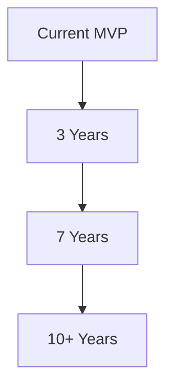
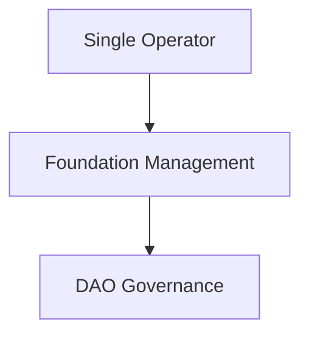

# 06 — Future Evolution

## 1. Technology Evolution Path



### 1.1 Smart Contract Guarantees

**Now**: Guarantee companies adjudicate disputes manually, subject to subjectivity and delay.

**Future**: Embed guarantee logic and payout conditions into smart contracts:

- Logistics signature confirmation → auto-trigger fund release
- Package lost detection → auto-trigger claim payout
- Return receipt confirmation → auto-trigger refund

Human adjudication reserved only for complex disputes (e.g., "material does not match description" requiring physical inspection).

### 1.2 Fully Decentralized Merchant DNS

**Now**: Merchant DNS operated by a limited number of operators or a foundation.

**Future**: DHT-based (Distributed Hash Table) fully decentralized API indexing, similar to internet DNS but more extreme:
- Any node can join the indexing network
- Manufacturer API address changes auto-sync across the entire network
- No single controlling entity; censorship-resistant

### 1.3 AI-Agent-to-AI-Agent Autonomous Transactions

**Now**: Consumers place orders with manufacturers through AI Agents.

**Future**:
- Smart fridge detects low milk → auto-queries multiple dairy APIs → auto-orders → next-day cold-chain delivery
- Factory raw material inventory below threshold → AI Agent auto-initiates tender → multiple supplier AI Agents bid competitively → auto-contracting
- Device-to-device negotiation: your AI Agent and the manufacturer's AI Agent autonomously complete price negotiation, contract signing, and payment

The scenario shifts from **"human-driven transactions"** to **"need-driven transactions."** The human role changes from operator to rule-setter.

### 1.4 Personal Data Sovereignty

**Now**: Shopping records reside across various platforms and AI Agents.

**Future**:
- Shopping history stored entirely privately (local device or personal data vault)
- Used only to train the user's personal AI; never leaked to any third party
- Selective data authorization: users can grant anonymized shopping data to research institutions in exchange for discounts
- "Take your data with you": one-click migration of all preferences and shopping history when switching AI Agents

---

## 2. Governance Evolution



- **Phase 1**: Project team operates Merchant DNS and protocol standards for rapid iteration
- **Phase 2**: Governance transferred to independent foundation with representation from all stakeholders (manufacturers, certification companies, guarantee companies, AI Agent developers, consumers)
- **Phase 3**: Full DAO decentralized governance; protocol upgrades via on-chain voting; fee parameters decided through public decision-making

Protocol-layer governance must be **separated from commercial-layer competition** — those who govern cannot simultaneously be competitors.

---

## 3. The Future Commerce Landscape

### 3.1 The End State of Traditional Platforms

Traditional e-commerce platforms will not "die," but will **devolve into infrastructure layers**:

- **Warehousing and logistics** remain the platform's core assets (global fulfillment networks are irreplaceable)
- **Platforms transition to "super-manufacturers"**: their first-party products join the new paradigm through APIs
- **Platforms become backend fulfillment networks for AI Agents**: Agents decide at the frontend; platforms fulfill at the backend

Analogy: telecom carriers didn't disappear, but devolved from "communication service providers" to "pipe providers."

### 3.2 A Consumer's Daily Life

```
Morning: AI Agent reminds you — "Your running shoes have 8 months of wear;
         time to replace based on degradation estimate."

During commute: Speak to your phone — "Find me an alternative, budget 80, 4+ stars only."

3 seconds later: AI Agent recommends Top 3, showing each one's trust score,
                 price, and how much cheaper than your last purchase.

One tap: Confirm → Payment to escrow → Await delivery.

The entire process: zero ads, zero searching, zero platform. Just an AI that knows you.
```

### 3.3 The Ultimate Form: GaaS

**Goods as a Service** — consumers no longer "buy products" but "subscribe to outcomes":

- Don't buy a washing machine; subscribe to "clothing cleaning service" → AI Agent manages equipment procurement, maintenance, and replacement
- Don't buy light bulbs; subscribe to "lighting service" → AI Agent auto-orders replacements before bulbs burn out
- Don't buy groceries; subscribe to "family meal service" → AI Agent auto-procures based on health data and taste preferences

Manufacturing shifts from **"selling products"** to **"selling outcomes"** — the ultimate reversal of commercial logic.

---

## 4. Key Uncertainties

| Uncertainty | Impact | Monitoring Signal |
|-------------|--------|-------------------|
| Major Platform Countermeasures | High | Platforms launch "free API programs" or "AI shopping assistants" |
| Regulatory Stance | High | Legal positioning of "new e-commerce infrastructure" across jurisdictions |
| User Behavior Migration Speed | Medium | Growth rate of "AI-first" shopping habit adoption |
| AI Capability Ceiling | Medium | Whether AI accuracy on complex purchase decisions continues to improve |
| Certification/Guarantee Over-competition | Low | Declining service quality due to predatory pricing |

---

[← Back to Main File](./AI-Shopping-Paradigm.md)
