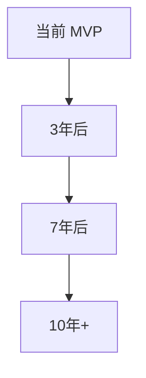
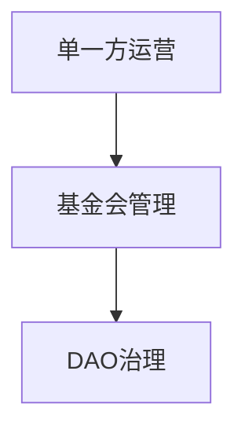

# 06 — 未来演进方向

## 一、技术演进路线



### 1.1 智能合约化担保 **现状**：信任公司人工裁定纠纷，存在主观性和延迟。 **演进**：将担保逻辑、赔付条件写入智能合约——

- 物流信息签收 → 自动触发放款
- 检测到快递丢件 → 自动触发理赔
- 退货签收 → 自动触发退款

人工裁定仅保留给复杂纠纷（如"材质与描述不符"需实物鉴定）。

### 1.2 完全去中心化商家DNS **现状**：商家DNS由有限几家运营方或基金会管理。 **演进**：基于DHT（分布式哈希表）实现完全去中心化的API索引，与互联网DNS类似但更极致——
- 任何节点可加入索引网络
- 厂家API地址变更自动全网同步
- 不存在单一控制方，抗审查

### 1.3 AI Agent间的自主交易 **现状**：消费者通过AI Agent向厂家下单。 **演进**：
- 智能冰箱检测牛奶不足 → 自动向多家奶制品厂API询价 → 自动下单 → 次日冷链送达
- 工厂原材料库存低于阈值 → AI Agent自动招标 → 多家供应商AI Agent报价竞争 → 自动签约
- 设备-设备谈判：你的AI Agent与厂家的AI Agent自动完成议价、签约、付款

场景从"人驱动交易"变为"需求驱动交易"，人的角色从操作者变为规则的设定者。

### 1.4 个人数据主权 **现状**：购物记录存在于各平台和AI Agent中。 **演进**：
- 用户购物记录完全私有化存储（本地设备或个人数据舱）
- 仅用于训练个人AI，不泄露给任何第三方
- 选择性数据授权：用户可授权匿名购物数据给研究机构换取折扣
- "带着数据走"：换AI Agent时一键迁移全部偏好和购物历史

---

## 二、治理演进路线



- **阶段1**：项目方运营商家DNS和协议标准，快速迭代
- **阶段2**：治理移交给独立基金会，各方代表参与（厂家、信任公司、AI Agent开发者、消费者）
- **阶段3**：DAO完全去中心化治理，协议升级通过链上投票，费用参数公开决策

协议层的治理必须与商业层的竞争分离——治理者不能同时是竞争者。

---

## 三、未来的商业图景

### 3.1 传统平台的终局

传统电商平台不会"死亡"，但会 **退化为基础设施层**：

- **仓储和物流** 仍是平台的核心资产（全球仓配网络不可替代）
- **平台转型为"超级厂家"**：自营商品通过API接入新范式
- **平台成为AI Agent的后端履约网络**：Agent在前端决策，平台在后端发货

类比：电信运营商没有消亡，但从"通信服务商"退化为"管道提供商"。

### 3.2 消费者的日常

```
早上：AI Agent提醒"你的跑鞋已穿8个月，根据磨损估算该更换了"

通勤途中：对着手机说"帮我找替代款，预算800，只要4星以上"

3秒后：AI Agent推荐Top 3，标注每款的信任评分、价格、比上次购买便宜多少

点击确认：付款→信托账户→等待收货

全程无广告、无搜索、无平台——只有一个懂你的AI
```

### 3.3 终极形态：GaaS **Goods as a Service（商品即服务）** ——消费者不再"买商品"，而是"订阅结果"：

- 不买洗衣机，订阅"衣物清洁服务"→ AI Agent管理设备采购、维护、更换
- 不买灯泡，订阅"照明服务"→ AI Agent在灯泡坏掉前自动订购更换
- 不买食材，订阅"家庭餐饮服务"→ AI Agent根据健康数据、口味偏好自动采购

制造业从"卖产品"变为"卖结果"，这是商业逻辑的终极逆转。

---

## 四、关键不确定性

| 不确定因素 | 影响 | 监测信号 |
|-----------|------|---------|
| 大平台反制 | 高 | 平台推出"免费API计划"或"AI购物助手" |
| 监管立场 | 高 | 各国对"新型电商基础设施"的法律定位 |
| 用户行为迁移速度 | 中 | "AI优先"购物习惯的人群比例增速 |
| AI能力天花板 | 中 | AI对复杂购物决策的准确率是否持续提升 |
| 信任公司竞争过度 | 低 | 恶性价格战导致的担保质量下降 |

---

[← 返回主文件](./AI购物新范式.md)
