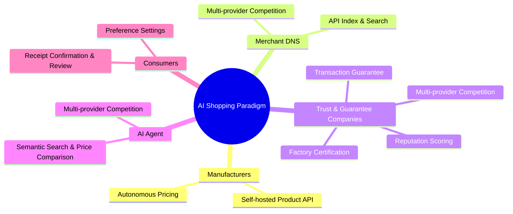
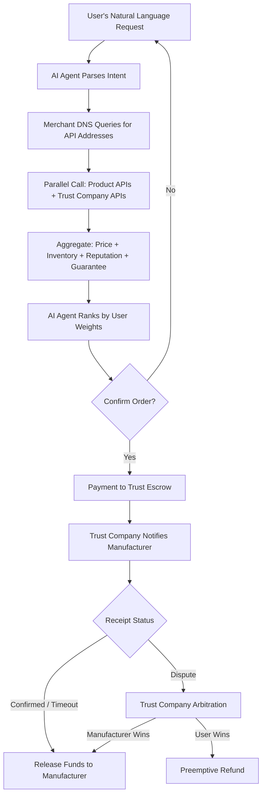
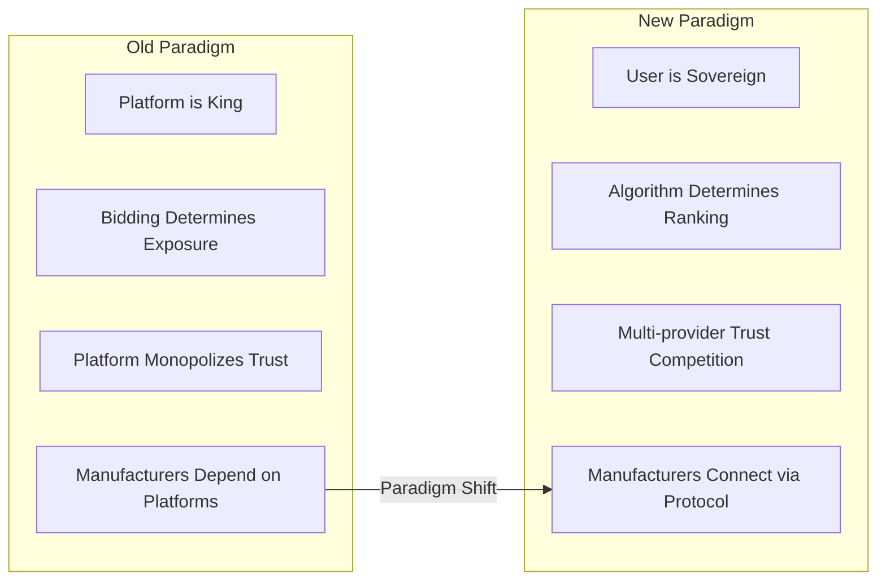
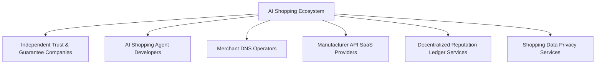
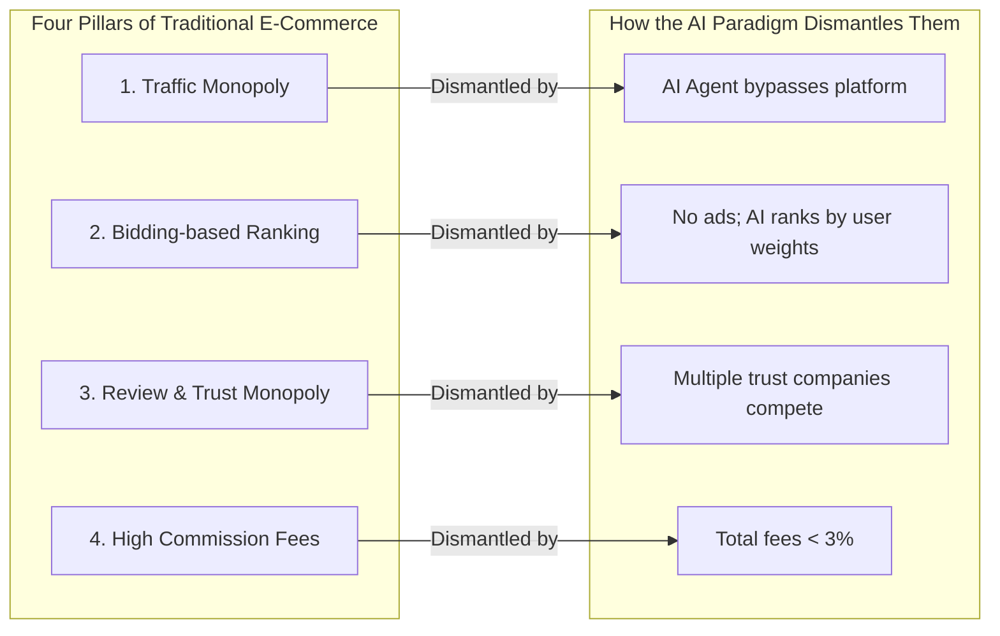
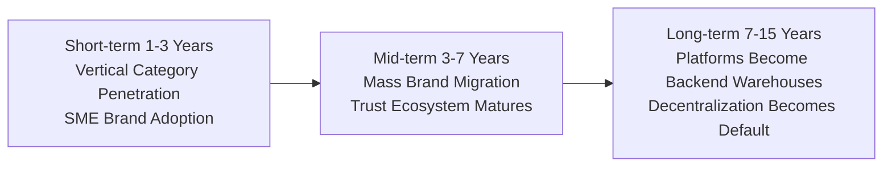
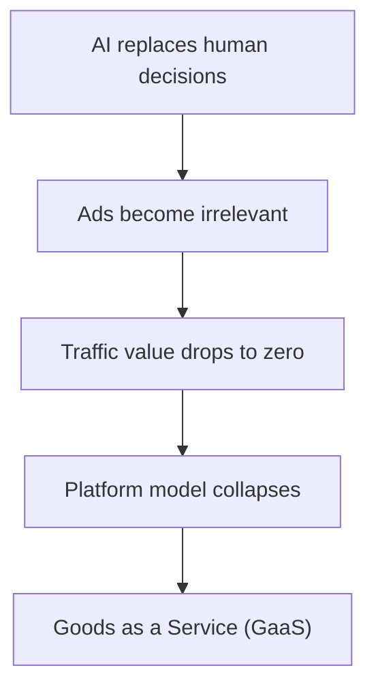

# AI Shopping Paradigm — The Decentralized Intelligent Transaction Protocol

## Overview

This is a **transaction revolution** that rebuilds global commerce from the **protocol layer** up. We dismantle platform monopolies with **AI Agents**, liberate the captive supply side with **open APIs**, and end platform-dominated trust evaluation through **market-based trust competition** — transforming shopping from a **traffic black box** of "who pays the most gets seen, who controls reviews defines trust" into a **transparent market** where "the best product and the strongest reputation win." This is not a patch on old e-commerce; it is a rewrite of the **operating system of human commercial civilization**.

> 📄 [Detailed Plan →](./01-overview-and-vision.md)

---

## Mind Map

> 📄 [Core Architecture Details →](./02-core-architecture-and-roles.md)

---

## Transaction Flow

---

## Key Nodes

| Node | Layer | Core Value |
|------|-------|-------------|
| **Manufacturer Self-hosted API** | Supply | Free from platform pricing control; 100% inventory/price autonomy |
| **Merchant DNS** | Index | A simple "yellow pages" index; multi-provider competition; no product data, no ads |
| **Trust Companies** | Guarantee | Factory certification + reputation scoring + fund escrow; multi-provider competition breaks monopoly |
| **AI Agent** | User | Pure algorithmic recommendation, zero ad interference; multi-provider competition lets users choose freely |
| **Trust Escrow** | Payment | Collect → Confirm receipt → Release; trust company underwrites |

> 📄 [Core Architecture Details →](./02-core-architecture-and-roles.md)

---

## Business Value

### For Consumers
- **True Price Comparison**: AI queries all manufacturers in parallel, no bidding pollution
- **Lower Prices**: Savings on platform commissions and ad fees (15-30% of GMV) → room for price reduction
- **Real Reviews**: Reputation scores backed by competing trust companies, tamper-proof

### For Manufacturers
- **Dramatic Cost Reduction**: From platform commissions of 15% + ad fees of 20-40% → registration + guarantee fees < 3%
- **Autonomy**: Pricing not artificially constrained; inventory not artificially interfered with
- **Portable Reputation**: Trust scores not tied to any single platform; they remain valid when switching AI Agents

### For Trust Companies
- **Blue Ocean**: The third-party transaction guarantee market independent of platforms is currently entirely empty
- **High Margin, Low Risk**: Guarantee fees + certification fees + insurance commissions; no need to build a platform or buy traffic

### For AI Agent Developers
- **New Entry Dividend**: Shopping traffic shifts from "open the app and search" to "tell the AI what you need"; AI Agents become the new traffic distribution layer
- **Full Competition**: Users can freely switch Agents; winners are determined by service quality, not capital burn for user acquisition

### For Merchant DNS Operators
- **Asset-light Infrastructure**: No handling of products, money, or logistics — just API index resolution
- **Multi-provider Coexistence**: Like internet DNS with multiple root servers and recursive resolvers, Merchant DNS naturally supports mutual backup and competition

> 📄 [Business Value & Model Details →](./03-business-value-and-model.md)

---

## Reshaping Global Commerce

| Dimension | Old World | New World |
|-----------|-----------|-----------|
| Power Center | Large centralized shopping platforms | User + AI Agent |
| Trust Source | Platform self-evaluation (rife with fake reviews) | Multiple independent trust companies competing |
| DNS / Index | Platform's built-in search engine | Multiple Merchant DNS providers competing under protocol |
| Shopping Entry | Must open platform app/website | Multiple AI Agents competing; users choose freely |
| Pricing Power | Platform imposes restrictions / coercion | Manufacturer's autonomous pricing |
| Traffic Distribution | Bidding (pay for exposure) | Algorithm ranks by user preference |
| Data Ownership | Platform owns all data | User's private data; manufacturer's own data |
| Competitive Moat | Network effect + data monopoly | Open-source protocol; service competition |

> 📄 [Commerce Transformation & New Industries →](./04-commerce-transformation-and-new-industries.md)

---

## New Industries Spawned

### New Industry Details

| New Industry | Scale Estimate | Description |
|-------------|---------------|-------------|
| **Independent Trust & Guarantee** | 100B+ | Analogous to the gap filled by early escrow payment tools, but more neutral and competitive |
| **Manufacturer API SaaS** | 10B+ | Helping small and mid-sized factories deploy APIs with one click — like independent storefront tools, but protocol-oriented |
| **AI Shopping Agent** | 10B+ | New entry point; first movers capture user habits |
| **Decentralized Reputation Ledger** | Billions | Blockchain-anchored reputation scores, cross-platform portable |
| **Shopping Data Privacy** | Billions | Private user data hosting + AI training; GDPR-compliant by design |

> 📄 [Commerce Transformation & New Industries →](./04-commerce-transformation-and-new-industries.md)

---

## Disruption of Traditional E-Commerce

### Disruption Timeline

### Irreversible Driving Forces

1. **AI Capability Growth**: The smarter AI gets, the less users need to open apps themselves — "buy it for me" replaces "let me browse"
2. **Manufacturer Awakening**: 20-40% advertising cost ratios are unsustainable; profit must return to producers
3. **Three-layer Competition**: Merchant DNS, AI Agents, and Trust Companies all allow multiple competing providers — no one can recreate platform monopoly
4. **Open-source Protocol**: Once API standards and registration protocols mature, network effects will irreversibly tilt toward decentralization

> 📄 [Disruption Path & Cold Start Strategy →](./05-disruption-path-and-cold-start.md)

---

---

## Next Steps

📄 [Future Evolution →](./06-future-evolution.md) — Smart contracts, decentralized DNS, autonomous AI-to-AI transactions, personal data sovereignty
