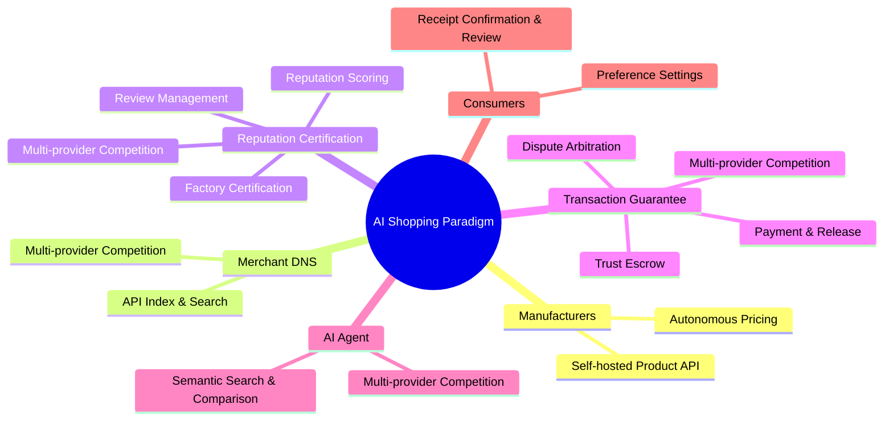
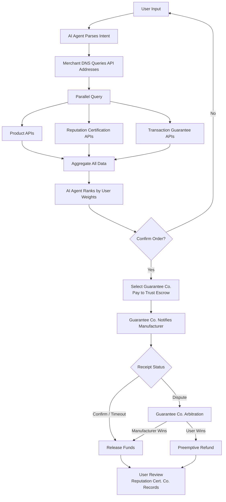
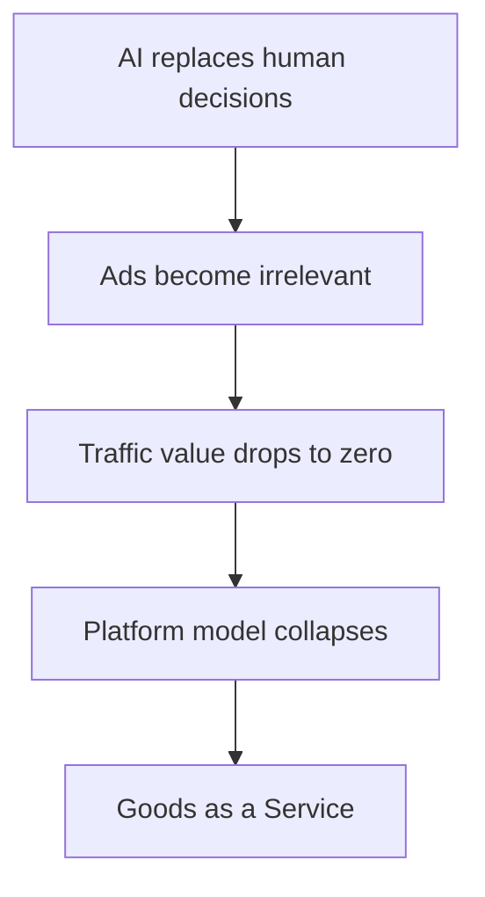

# AI Shopping Paradigm

## Overview

**Integrity and quality run through every link.**

This is a transaction revolution that rebuilds commercial trust from the protocol layer up. The flaw in traditional platforms is not technology — it is the conflict of interest: the platform acts as landlord, referee, and athlete simultaneously, profiting by selling trust. We dismantle this with **Five-Power Separation** (Supply, Index, Reputation, Payment, Decision): the evaluator never touches money, the money-handler never evaluates, supply doesn't index, index doesn't advertise, and decision doesn't take a cut. Shopping transforms from a traffic black box of "who pays the most gets seen" into a transparent market where "the best product and strongest reputation win" — **integrity becomes a tradeable, competitive, verifiable market service.**

---

## Mind Map

---

## Transaction Flow

---

## Key Roles

| Role | Layer | Core Principle |
|------|-------|----------------|
| **Manufacturer** | Supply | Self-hosted API, autonomous pricing, 100% ownership |
| **Merchant DNS** | Index | Yellow-pages only, no product data, no ads, no transactions |
| **Reputation Certification** | Reputation | Certification + scoring + reviews, on-chain data, NEVER touches funds |
| **Transaction Guarantee** | Payment | Escrow + payment + arbitration, NEVER evaluates reputation |
| **AI Agent** | Decision | Pure algorithm, no ads, no transaction fees — subscription only |

> Five-Power Separation: Evaluation never touches money. Money never evaluates. Supply doesn't index. Index doesn't advertise. Decision doesn't take a cut.

---

## Core Logic

---

## Document Navigation

| Chapter | 中文简体 | English |
|---------|----------|---------|
| Overview / 概述与愿景 | [01-概述与愿景](../中文简体/01-概述与愿景.md) | [01-overview-and-vision](01-overview-and-vision.md) |
| Core Architecture / 核心架构 | [02-核心架构与角色](../中文简体/02-核心架构与角色.md) | [02-core-architecture](02-core-architecture-and-roles.md) |
| Business Value / 商业价值 | [03-商业价值与商业模式](../中文简体/03-商业价值与商业模式.md) | [03-business-value](03-business-value-and-model.md) |
| Commerce Transformation / 商业变革 | [04-商业变革与新产业](../中文简体/04-商业变革与新产业.md) | [04-commerce-transformation](04-commerce-transformation-and-new-industries.md) |
| Disruption Path / 颠覆路径 | [05-颠覆路径与冷启动](../中文简体/05-颠覆路径与冷启动.md) | [05-disruption-path](05-disruption-path-and-cold-start.md) |
| Future Evolution / 未来演进 | [06-未来演进方向](../中文简体/06-未来演进方向.md) | [06-future-evolution](06-future-evolution.md) |
| REST API / 接口定义 | [API接口定义](../中文简体/api/API接口定义.md) | [API Definitions](api/API-definitions.md) |
