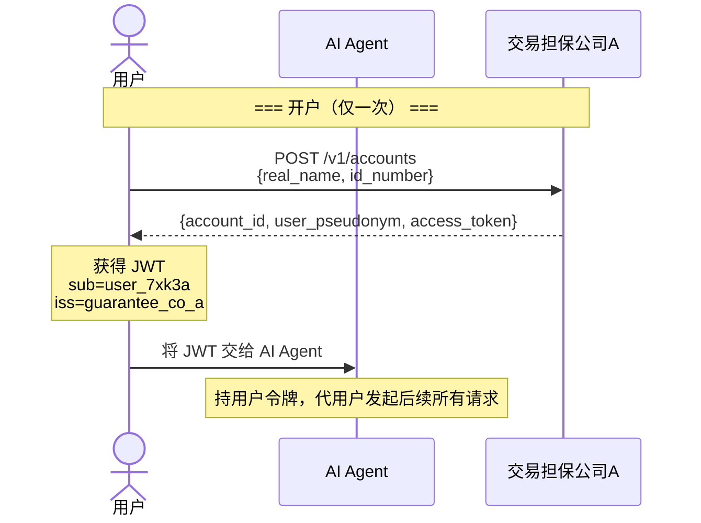
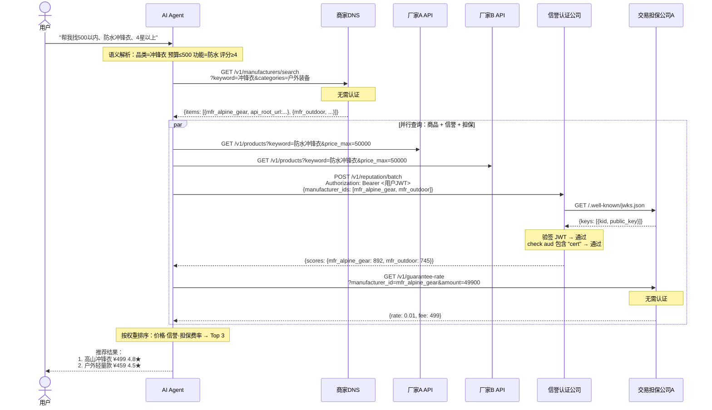
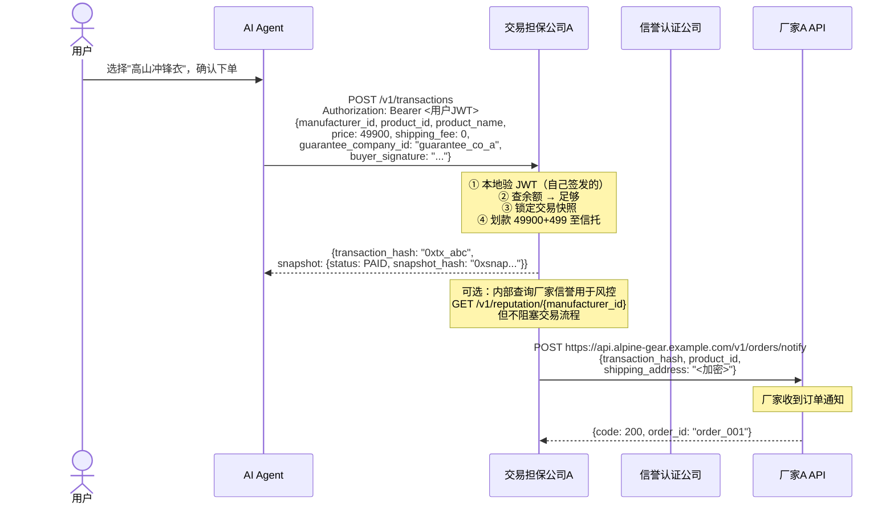
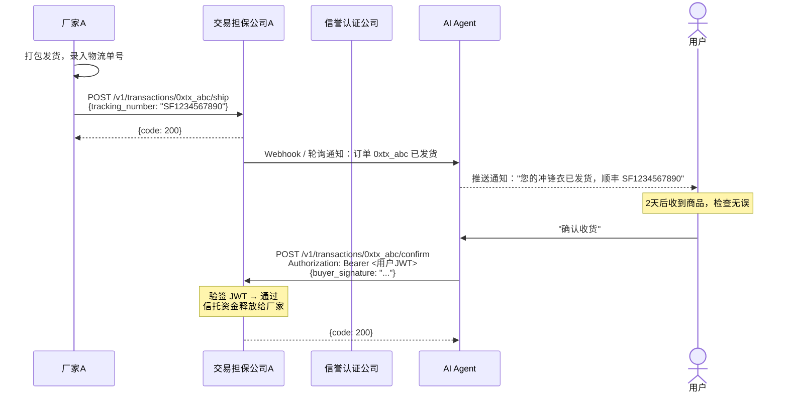
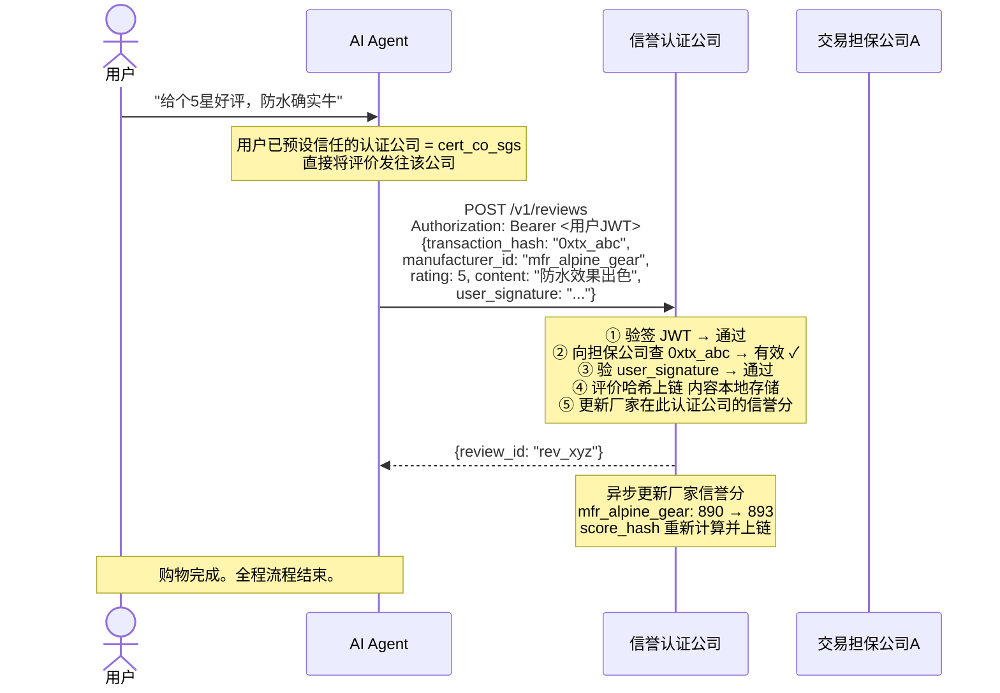
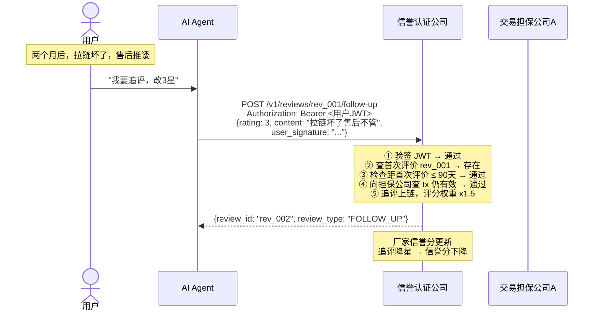

# REST API 接口定义

JSON + HTTP，无编译依赖，curl 即可调试。所有接口统一 `{code, msg, data}` 响应，所有认证基于交易担保公司签发的 JWT。每个接口的设计原则：**数据可验证，权力有边界，诚信可审计。**

---

## 完整购物流程

以下是一次完整购物的端到端流程，包含每个 API 调用、认证传递和节点间交互。

### 阶段 0：开户与认证



### 阶段 1：搜索与发现



### 阶段 2：下单与支付



### 阶段 3：履约与确认



### 阶段 4：评价与信誉更新



### 阶段 5：追评（可选）



**评价该提交到哪家信誉认证公司？**

用户不需要关心厂家在哪家认证公司做了认证。用户只需要在自己信任的信誉认证公司提交评价即可。流程：

1. 用户在 AI Agent 中提前设置自己信任的认证公司（可设多家，默认选择）
2. 提交评价时，AI Agent 将评价发送到用户指定的认证公司
3. 该认证公司收到评价后，向担保公司验证 `transaction_hash` 有效
4. 验证通过 → 评价内容本地存储，评价哈希上链
5. 该认证公司据此更新厂家的信誉评分

**搜索和认证是两条独立链路**：

用户搜索商品时走 DNS——DNS 不管厂家在哪儿认证，所有厂家都能被搜到。用户只信任 B 时，AI Agent 向 B 查询该厂家的评分。若 B 还没有这个厂家的数据，显示"暂无评分"——用户依然能看到商品、可以购买、可以在 B 提交评价。厂家不会因为没在 B 做认证就"搜不到"。

**认证共享，评分独立**：

认证（验厂）是对厂家资质的客观审核——SGS 验了就是验了，这个事实不应该每家认证公司重复做一遍。认证公司之间共享基础认证数据：

```
厂家在 A 做了 DEEP 验厂 → A 将验厂报告哈希写入链上
                       → B 从链上读取：该厂家已被 A 验厂，级别 DEEP
                       → B 认可这个验厂事实，标记"已认证"
                       → B 不需要重新派人去厂家验一次
```

但评分是独立的：

```
A 的评价集：800 条评价 → 评分 4.8
B 的评价集：200 条评价 → 评分 4.2  （用户更少，但对评价更严格）
两家各自独立计算，同一厂家在不同认证公司评分不同。
```

这意味着厂家只需在一家认证公司做一次验厂，全网认证公司都认这个验厂结果。但各家的评分完全独立——验厂是共享基础设施，评分是竞争性服务。

### 流程中的认证传递

```
用户 JWT（由担保公司A签发）
  │
  ├─→ AI Agent 持有，代用户调用所有接口
  │     ├─→ 信誉认证公司：认证公司向担保公司A拉取 JWKS 验签
  │     ├─→ 交易担保公司A：本地验签（自己签发的）
  │     └─→ 商家DNS：DNS 向担保公司A拉取 JWKS 验签
  │
  └─→ 担保公司A 自有的服务间令牌
        └─→ 信誉认证公司：ConfirmTransaction（防刷评交叉验证）
```

### 接口调用时序总览

| 步骤 | 调用方 | 目标 | 接口 | 认证 | 说明 |
|------|--------|------|------|------|------|
| 0.1 | 用户 | 担保A | `POST /v1/accounts` | 无 | 开户，获得 JWT |
| 1.1 | AI Agent | DNS | `GET /v1/manufacturers/search` | 无 | 搜索匹配厂家 |
| 1.2 | AI Agent | 厂家API | `GET /v1/products` | 无 | 并行拉取商品数据 |
| 1.3 | AI Agent | 信誉认证 | `POST /v1/reputation/batch` | 用户JWT | 批量查信誉分 |
| 1.3a | 信誉认证 | 担保A | `GET /.well-known/jwks.json` | 无 | 拉公钥验签 JWT |
| 1.4 | AI Agent | 担保A | `GET /v1/guarantee-rate` | 无 | 查担保费率 |
| 2.1 | AI Agent | 担保A | `POST /v1/transactions` | 用户JWT | 下单，锁快照，划款至信托 |
| 2.2 | 担保A | 厂家 | `POST /orders/notify` | 担保A签名 | 通知厂家发货 |
| 3.1 | 厂家 | 担保A | `POST /v1/transactions/{hash}/ship` | 厂家令牌 | 录入物流单号 |
| 3.2 | AI Agent | 担保A | `POST /v1/transactions/{hash}/confirm` | 用户JWT | 确认收货，释放资金 |
| 4.1 | AI Agent | 信誉认证 | `POST /v1/reviews` | 用户JWT | 认证公司收到评价后自行向担保公司验证交易 |
| 5.1 | AI Agent | 信誉认证 | `POST /v1/reviews/{id}/follow-up` | 用户JWT | 90天内追评，评分权重 x1.5，同样需担保公司验证 |

---

## 通用约定

### 统一响应格式

所有接口返回以下三字段结构：

```json
{
  "code": 200,
  "msg": "success",
  "data": { ... }
}
```

| code | 含义 |
|------|------|
| 200 | 成功 |
| 400 | 请求参数错误 |
| 401 | 未认证（令牌缺失、失效或签名无效） |
| 403 | 无权限（令牌有效但无权访问该资源） |
| 404 | 资源不存在 |
| 409 | 冲突（如重复注册） |
| 422 | 业务逻辑错误（如余额不足） |
| 429 | 频率限制 |
| 500 | 服务端错误 |

业务错误通过 `code` 和 `msg` 区分，不在 HTTP 状态码层面做文章——所有响应 HTTP 200，`code` 承载实际结果。

`data` 在成功时包含业务数据，在失败时为空或包含调试信息。

### 分页

列表接口统一响应：

```json
{
  "code": 200,
  "msg": "success",
  "data": {
    "page": 1,
    "page_size": 20,
    "total": 156,
    "total_pages": 8,
    "items": [...]
  }
}
```

请求方式：`?page=1&page_size=20`，`page_size` 默认 20，最大 100。

---

## JWT 认证体系

整个生态的身份锚点是**交易担保公司**。用户在一家担保公司完成 KYC 开户后，担保公司签发 JWT 令牌。用户持此令牌访问生态内所有节点。

### 2.1 担保公司签发令牌

**用户开户后**，担保公司返回 JWT：

```http
POST /v1/accounts
```

响应 `data.access_token` 中包含签发的 JWT。用户将此令牌交给 AI Agent，AI Agent 在后续请求中携带。

### 2.2 JWT 结构

```json
// Header
{
  "alg": "ES256",
  "typ": "JWT",
  "kid": "guarantee_co_a_2024"
}

// Payload
{
  "sub": "user_7xk3a",            // 用户化名（不可逆，全网唯一）
  "iss": "guarantee_co_a",        // 签发方：担保公司ID
  "iat": 1700000000,              // 签发时间
  "exp": 1700086400,              // 过期时间（建议 24 小时）
  "scope": "shopping",            // 权限范围
  "aud": ["dns", "cert", "guarantee"]  // 允许访问的节点类型
}
```

签名算法使用 ES256（ECDSA P-256），也可使用 EdDSA（Ed25519）。不使用 HS256——共享密钥模式在分布式多节点场景下无法安全分发。

### 2.3 担保公司公钥发布（JWKS）

每个担保公司对外暴露公钥端点，供其他节点验证 JWT 签名：

```http
GET /.well-known/jwks.json
```

无需认证。

响应：

```json
{
  "code": 200,
  "msg": "success",
  "data": {
    "keys": [
      {
        "kty": "EC",
        "crv": "P-256",
        "kid": "guarantee_co_a_2024",
        "x": "base64url_encoded_x",
        "y": "base64url_encoded_y",
        "use": "sig",
        "alg": "ES256"
      }
    ]
  }
}
```

### 2.4 各节点如何验证 JWT

每个节点（AI Agent、信誉认证公司、商家DNS）在收到请求时执行以下验证流程：

```
1. 从 Authorization: Bearer <token> 提取 JWT
2. 解析 JWT Header，获取 iss（签发担保公司ID）和 kid（密钥ID）
3. 向 https://<iss对应的担保公司域名>/.well-known/jwks.json 请求公钥
4. 用公钥验证 JWT 签名
5. 检查 exp 是否过期
6. 检查 aud 是否包含本节点的类型
7. 提取 sub（用户化名）用于后续业务逻辑
```

**公钥缓存**：各节点应缓存担保公司的 JWKS，缓存时间建议 1 小时。首次遇到未知 `iss` 或 `kid` 时拉取并缓存。

**吊销检查**：担保公司提供吊销列表端点。节点可定期拉取，也可在敏感操作（支付、迁移）时实时查询。

### 2.5 担保公司吊销令牌

当用户账户异常（冻结、注销）时，担保公司需吊销已签发的令牌：

```http
GET /.well-known/jwt-revoked?since=1700000000
```

无需认证。增量返回自 `since` 时间戳以来被吊销的 `jti` 列表。

响应：

```json
{
  "code": 200,
  "msg": "success",
  "data": {
    "revoked_jtis": ["jti_abc123", "jti_def456"],
    "updated_at": 1700100000
  }
}
```

节点在处理支付等敏感操作时，应实时查询此端点确认令牌未被吊销。

### 2.6 令牌刷新

令牌即将过期时，AI Agent 代用户向签发担保公司刷新：

```http
POST /v1/auth/refresh
Authorization: Bearer <即将过期的令牌>
```

响应：

```json
{
  "code": 200,
  "msg": "success",
  "data": {
    "access_token": "<新的JWT>",
    "expires_in": 86400
  }
}
```

若令牌已被吊销，返回 `code: 401`。

### 2.7 跨担保公司场景

用户可能在担保公司 A 开户，但想通过担保公司 B 支付（因为商家只在 B 有接收账户）。此时：

1. 用户出示担保公司 A 签发的 JWT（已经过 KYC）
2. 担保公司 B 验证 A 的签名（通过 A 的 JWKS 端点）
3. 担保公司 B 信任 A 的 KYC 结果，为用户在 B 创建关联账户
4. 担保公司 B 签发自己的 JWT 给用户
5. 用户用 B 的令牌完成支付

这比跨担保清算简单得多——只共享 KYC 信任，不共享资金。

---

## 数据格式约定

- **金额**：统一使用 `int64`，单位为**分**（如 `89900` = 899.00 元），避免浮点精度
- **时间**：统一使用 `int64`，单位为**秒**的 Unix 时间戳
- **哈希**：统一使用 `0x` 开头的十六进制字符串
- **签名**：统一使用 Base64URL 编码
- **化名**：用户对外标识 `user_pseudonym` 由担保公司使用 `HMAC-SHA256(user_id, secret)` 生成，不可逆

---

## 1. 生产厂家 — 商品 API

厂家自行部署，AI Agent 和商家DNS 调用。公开数据，无需认证。

```
厂家 API 根地址：https://api.<厂家域名>/v1
```

### 1.1 获取单个商品

```http
GET /v1/products/{product_id}
```

使用场景：AI Agent 在商品详情页获取完整信息。

```json
// Response data
{
  "product_id": "prod_001",
  "name": "超轻防水冲锋衣",
  "description": "GORE-TEX面料，适合高海拔徒步",
  "image_urls": ["https://img.example.com/001_1.jpg"],
  "price": 89900,
  "stock": 23,
  "category": "户外装备",
  "specs": { "面料": "GORE-TEX 3L", "重量": "380g" },
  "shipping": [
    { "method": "顺丰标快", "fee": 0, "days_min": 1, "days_max": 3 }
  ],
  "after_sales": "7天无理由退换，1年质保",
  "created_at": 1700000000,
  "updated_at": 1700086400
}
```

### 1.2 批量获取商品

```http
POST /v1/products/batch
Content-Type: application/json

{ "product_ids": ["prod_001", "prod_002", "prod_003"] }
```

使用场景：AI Agent 搜索结果页一次性拉取多个商品摘要。单次最多 50 个。

```json
// Response data
{
  "products": [
    { "product_id": "prod_001", "name": "...", "price": 89900 },
    { "product_id": "prod_002", "name": "...", "price": 45000 }
  ]
}
```

不存在的 ID 静默忽略。

### 1.3 分页列出商品

```http
GET /v1/products?page=1&page_size=20&category=户外装备&price_min=10000&price_max=200000&keyword=冲锋衣
```

使用场景：商家DNS 定时同步；AI Agent 品类浏览。所有 query 参数可选。

### 1.4 按品类统计

```http
GET /v1/products/counts
```

使用场景：AI Agent 展示各品类商品数量。

```json
// Response data
{
  "counts": { "冲锋衣": 45, "徒步鞋": 32, "帐篷": 18 }
}
```

---

## 2. 商家DNS — 注册与搜索

供 AI Agent、厂家和其他 DNS 调用。公开查询无需认证，注册/注销需厂家令牌。

```
DNS 根地址：https://dns.<提供商域名>/v1
```

### 2.1 注册厂家

```http
POST /v1/manufacturers
Authorization: Bearer <厂家令牌（由担保公司签发）>
Content-Type: application/json

{
  "manufacturer_id": "mfr_alpine_gear",
  "name": "高山户外装备有限公司",
  "api_root_url": "https://api.alpine-gear.example.com/v1",
  "categories": ["户外装备", "运动服饰"],
  "region": "浙江杭州"
}
```

使用场景：厂家首次接入生态，或从其他 DNS 迁移至此。
约束：同一厂家只能在一个 DNS 注册。若已在其他 DNS 注册，需先申请注销。

```json
// Response data (code: 200)
{ "success": true }
// Response (code: 409)
{ "success": false, "conflict_dns_id": "dns_provider_b" }
```

### 2.2 申请注销

```http
POST /v1/manufacturers/{manufacturer_id}/deregister
Authorization: Bearer <厂家令牌>
Content-Type: application/json

{
  "reason": "更换DNS服务商",
  "target_dns_id": "dns_provider_b"
}
```

流程：提交申请 → DNS 审核 → 批准后 Sync 广播 → 厂家方可向新 DNS 注册。

```json
// Response data
{
  "status": "APPROVED",
  "message": "注销已批准，Sync 协议已广播"
}
```

### 2.3 获取厂家信息

```http
GET /v1/manufacturers/{manufacturer_id}
```

使用场景：AI Agent 查看厂家详情。

### 2.4 搜索厂家

```http
GET /v1/manufacturers/search?keyword=冲锋衣&categories=户外装备&region=浙江&page=1&page_size=20
```

使用场景：AI Agent 根据用户需求搜索匹配品类的厂家。

### 2.5 DNS 间增量同步

```http
GET /v1/sync?since=1700000000&page=1&page_size=100
Authorization: Bearer <DNS节点令牌>
```

使用场景：其他 DNS 节点拉取增量变更。`since=0` 获取全量。

```json
// Response data
{
  "page": 1, "page_size": 100, "total": 12, "total_pages": 1,
  "items": [
    { "action": "register", "entry": { "manufacturer_id": "mfr_new", ... } },
    { "action": "deregister", "entry": { "manufacturer_id": "mfr_old", ... } }
  ],
  "has_more": false
}
```

---

## 3. 信誉认证公司 — 评价与认证

供 AI Agent、交易担保公司调用。**评价的不碰钱。**
查询信誉的接口对消费者和 AI Agent 免费；担保公司查询需按次付费（极低定价，含在担保公司的运营成本中）。

```
认证公司根地址：https://cert.<提供商域名>/v1
```

### 3.1 查询单个厂家信誉分

```http
GET /v1/reputation/{manufacturer_id}
Authorization: Bearer <用户令牌 或 担保公司令牌>
```

使用场景：AI Agent 在商品详情页展示信誉（免费）；担保公司在仲裁时参考（付费）。
费用：消费者/AI Agent 的令牌免费；担保公司令牌查询时在响应中附带扣费信息。

```json
// Response data
{
  "manufacturer_id": "mfr_alpine_gear",
  "score": 892,
  "return_rate": 0.023,
  "avg_delivery_days": 1.8,
  "total_reviews": 1203,
  "updated_at": 1700086400,
  "score_hash": "0xabc123..."
}
```

### 3.2 批量查询信誉分

```http
POST /v1/reputation/batch
Authorization: Bearer <用户令牌>
Content-Type: application/json

{ "manufacturer_ids": ["mfr_001", "mfr_002", "mfr_003"] }
```

使用场景：AI Agent 在搜索结果页一次性拉取所有候选厂家信誉分用于排序。单次最多 50 个。
调用方：AI Agent（免费）。

### 3.3 查询产品信誉分

```http
GET /v1/reputation/product/{product_id}
```

无需认证。使用场景：AI Agent 在商品详情页展示该产品的评分。

```json
// Response data
{
  "product_id": "prod_001",
  "score": 4.6,
  "total_reviews": 87,
  "score_hash": "0xprod_abc..."
}
```

产品级评分按 `content_hash` 分版本独立计算——厂家换了实际商品，新版本评分从零开始，老版本好评带不到新版本。AI Agent 展示当前版本和历史版本评分对比，防止"用老好评卖烂货"。

查询时可指定版本：
```
GET /v1/reputation/product/{product_id}?content_hash=abc123
```
不传则返回当前最新版本的评分。

### 3.4 查询厂家认证

```http
GET /v1/certifications/{manufacturer_id}
```

无需认证。使用场景：展示认证级别和有效期。

```json
// Response data
{
  "certification_id": "cert_deep_2024_001",
  "manufacturer_id": "mfr_alpine_gear",
  "level": "DEEP",
  "auditor": "SGS 通标",
  "issued_at": 1700000000,
  "expires_at": 1731536000,
  "report_hash": "0xdef456..."
}
```

### 3.5 分页查询评价

```http
GET /v1/reviews?manufacturer_id=mfr_alpine_gear&rating_min=4&page=1&page_size=20
```

无需认证。使用场景：商品详情页展示评价列表。返回结果中 `review_type = FOLLOW_UP` 的为追评。

```json
// Response data item
{
  "review_id": "rev_001",
  "transaction_hash": "0xtx_abc",
  "manufacturer_id": "mfr_alpine_gear",
  "user_pseudonym": "user_7xk3a",
  "rating": 5,
  "content": "质量很好，防水效果出色",
  "review_type": "INITIAL",
  "parent_review_id": "",
  "product_content_hash": "0xabc123",
  "created_at": 1700086400
}
```

`review_type` 值：`INITIAL`（首次评价）、`FOLLOW_UP`（追评）。追评通过 `parent_review_id` 关联到首次评价。

### 3.6 提交评价

```http
POST /v1/reviews
Authorization: Bearer <消费者令牌>
Content-Type: application/json

{
  "transaction_hash": "0xtx_abc",
  "manufacturer_id": "mfr_alpine_gear",
  "rating": 5,
  "content": "质量很好，防水效果出色",
  "user_signature": "base64url_encoded_signature"
}
```

使用场景：消费者确认收货后评价。认证公司收到评价后，自行向担保公司查询交易哈希是否有效——有效则接受评价并上链，无效则拒绝。无需担保公司提前"通知解锁"。

```json
// Response data (code: 200)
{ "review_id": "rev_001" }
```

### 3.7 提交追评

```http
POST /v1/reviews/{review_id}/follow-up
Authorization: Bearer <消费者令牌>
Content-Type: application/json

{
  "rating": 3,
  "content": "穿了两个月后拉链坏了，售后推诿不处理",
  "user_signature": "base64url_encoded"
}
```

使用场景：消费者在首次评价后，对商品长期使用体验或售后服务进行补充评价。约束：

- 只能在首次评价后的 **90 天内** 提交追评
- 追评绑定同一个 `transaction_hash`，认证公司仍需向担保公司验证交易有效性
- 追评可以修改评分（如从 5 星降为 3 星）——追评的评分权重为首次的 1.5 倍
- 追评内容同样上链存证，不可篡改
- 每条交易仅可追评 **1 次**

```json
// Response data
{
  "review_id": "rev_002",
  "review_type": "FOLLOW_UP",
  "parent_review_id": "rev_001"
}
```

追评展示在首次评价下方，标注"追加评价"。信誉评分计算时追评权重更高——长期体验比开箱第一印象更有参考价值。

### 3.7 厂家迁移信誉

```http
POST /v1/reputation/migrate
Authorization: Bearer <厂家令牌>
Content-Type: application/json

{
  "manufacturer_id": "mfr_alpine_gear",
  "target_certifier_id": "cert_company_b",
  "manufacturer_signature": "base64url_encoded"
}
```

使用场景：厂家更换认证公司，信誉档案跟随迁移。迁移费由接收方或厂家支付。

---

## 4. 交易担保公司 — 资金与认证

供 AI Agent 调用。消费者通过 AI Agent 间接操作。**碰钱的不评价。**
同时承担 JWT 签发和吊销职责——是整个生态的身份锚点。

```
担保公司根地址：https://guarantee.<提供商域名>/v1
```

### 4.0 公钥端点

```http
GET /.well-known/jwks.json
```

无需认证。返回当前有效的签名公钥列表。

```http
GET /.well-known/jwt-revoked?since=1700000000
```

无需认证。返回自 `since` 以来被吊销的 JWT 的 `jti` 列表。

### 4.1 开立账户（签发首个 JWT）

```http
POST /v1/accounts
Content-Type: application/json

{
  "real_name": "<端到端加密>",
  "id_number": "<端到端加密>"
}
```

使用场景：消费者首次使用此担保公司，完成 KYC 并开户。

```json
// Response data (code: 200)
{
  "account_id": "acct_abc123",
  "user_pseudonym": "user_7xk3a",
  "access_token": "eyJhbGciOiJFUzI1NiIs...",
  "expires_in": 86400
}
```

`access_token` 是首次签发的 JWT，`sub` = `user_pseudonym`。用户将此令牌交给 AI Agent。

### 4.2 刷新令牌

```http
POST /v1/auth/refresh
Authorization: Bearer <即将过期的令牌>
```

使用场景：令牌即将过期，AI Agent 代为刷新。

```json
// Response data (code: 200)
{
  "access_token": "eyJhbGciOiJFUzI1NiIs...",
  "expires_in": 86400
}
```

### 4.3 创建交易（下单）

```http
POST /v1/transactions
Authorization: Bearer <买家令牌（sub = user_pseudonym）>
Content-Type: application/json

{
  "manufacturer_id": "mfr_alpine_gear",
  "product_id": "prod_001",
  "product_name": "超轻防水冲锋衣",
  "price": 89900,
  "shipping_fee": 0,
  "shipping_method": "顺丰标快，1-3天",
  "guarantee_company_id": "guarantee_co_a",
  "buyer_signature": "base64url_encoded"
}
```

使用场景：用户确认下单。流程：校验 JWT → 锁定快照 → 校验余额 → 划款至信托 → 返回交易哈希。

```json
// Response data (code: 200, 支付成功)
{
  "transaction_hash": "0xtx_abc",
  "snapshot": {
    "transaction_hash": "0xtx_abc",
    "buyer_pseudonym": "user_7xk3a",
    "manufacturer_id": "mfr_alpine_gear",
    "product_id": "prod_001",
    "product_name": "超轻防水冲锋衣",
    "price": 89900,
    "shipping_fee": 0,
    "shipping_method": "顺丰标快，1-3天",
    "guarantee_fee": 899,
    "guarantee_company_id": "guarantee_co_a",
    "status": "PAID",
    "created_at": 1700000000,
    "updated_at": 1700000000,
    "snapshot_hash": "0xsnap_abc"
  }
}
```

```json
// Response (code: 422, 支付失败)
{
  "code": 422,
  "msg": "余额不足，当前余额 5000 分，需支付 90799 分（含担保费 899 分）",
  "data": {
    "error_code": "INSUFFICIENT_BALANCE",
    "current_balance": 5000,
    "required": 90799
  }
}
```

### 4.4 确认收货

```http
POST /v1/transactions/{transaction_hash}/confirm
Authorization: Bearer <买家令牌>
Content-Type: application/json

{
  "buyer_signature": "base64url_encoded"
}
```

使用场景：买家收货无误后确认，资金从信托释放给厂家。超时未确认则自动释放。

### 4.5 发起申诉

```http
POST /v1/transactions/{transaction_hash}/dispute
Authorization: Bearer <买家或厂家令牌>
Content-Type: application/json

{
  "complainant_id": "user_7xk3a",
  "reason": "面料与描述不符，宣传为GORE-TEX实际为普通尼龙",
  "evidence_urls": ["https://img.example.com/evidence_1.jpg"]
}
```

使用场景：商品与描述不符、质量问题等纠纷。担保公司基于交易快照裁定，参考信誉认证公司的双方评分。

### 4.6 查询担保费率

```http
GET /v1/guarantee-rate?manufacturer_id=mfr_alpine_gear&amount=89900
```

无需认证。使用场景：AI Agent 下单前展示费用明细。

```json
// Response data
{
  "rate": 0.01,
  "fee": 899,
  "avg_payout_hours": 4.2
}
```

### 4.7 查询交易快照

```http
GET /v1/transactions/{transaction_hash}
Authorization: Bearer <用户或担保公司令牌>
```

使用场景：查看订单详情；信誉认证公司在仲裁时获取下单时的原始承诺。

### 4.8 分页查询交易记录

```http
GET /v1/transactions?page=1&page_size=20&status=CONFIRMED&start_time=1700000000&end_time=1710000000
Authorization: Bearer <买家令牌>
```

使用场景：用户查看历史订单。约束：只能查令牌持有者本人的交易（`sub` = `user_pseudonym`）。

---

## 认证流程全景

```
1. 用户 → 担保公司A：POST /v1/accounts（KYC）→ 获得 JWT
2. 用户将 JWT 交给 AI Agent
3. AI Agent → 商家DNS：GET /v1/manufacturers/search（携带 JWT）
   DNS 如何验证：
   a. 解析 JWT header → 获取 iss=guarantee_co_a, kid=xxx
   b. GET https://guarantee_co_a/.well-known/jwks.json → 获取公钥
   c. 验证签名 → 通过
   d. 检查 aud 包含 "dns" → 通过
   e. 提取 sub=user_7xk3a 用于日志和频率限制
4. AI Agent → 信誉认证：GET /v1/reputation/xxx（携带同一 JWT）
   认证公司验证流程同上，检查 aud 包含 "cert"
5. AI Agent → 担保公司A：POST /v1/transactions（携带同一 JWT）
   担保公司A 用自己的私钥签发过这个 JWT，本地验证，无需拉取 JWKS
6. 用户提交评价时，信誉认证公司自行向担保公司查询交易哈希是否有效——无需担保公司提前通知。
```

**关键规则**：
- 用户永远只持有一家担保公司的 JWT（开户的那家）
- AI Agent 用同一个 JWT 访问所有节点
- 各节点验证 JWT 时，若缓存中没有该 `iss` 的公钥，则向 `https://<iss>/.well-known/jwks.json` 拉取
- 支付操作必须在签发 JWT 的担保公司完成——用户在哪开户就在哪支付
- 商家需要在主流担保公司开户，否则买家可能无法下单（买家担保公司 ≠ 商家接收担保公司时）

---

## 接口全景

| 角色 | 端点 | 方法 | 认证 | 分页 |
|------|------|------|------|------|
| **厂家** | `/v1/products/{id}` | GET | 无 | — |
| | `/v1/products/batch` | POST | 无 | — |
| | `/v1/products` | GET | 无 | ✓ |
| | `/v1/products/counts` | GET | 无 | — |
| **DNS** | `/v1/manufacturers` | POST | 厂家令牌 | — |
| | `/v1/manufacturers/{id}/deregister` | POST | 厂家令牌 | — |
| | `/v1/manufacturers/{id}` | GET | 无 | — |
| | `/v1/manufacturers/search` | GET | 无 | ✓ |
| | `/v1/sync` | GET | DNS令牌 | ✓ |
| **信誉认证** | `/v1/reputation/{id}` | GET | Bearer | — |
| | `/v1/reputation/batch` | POST | Bearer | — |
| | `/v1/reputation/product/{id}` | GET | 无 | — |
| | `/v1/certifications/{id}` | GET | 无 | — |
| | `/v1/reviews` | GET | 无 | ✓ |
| | `/v1/reviews` | POST | 消费者令牌 | — |
| | `/v1/reviews/{id}/follow-up` | POST | 消费者令牌 | — |
| | `/v1/reputation/migrate` | POST | 厂家令牌 | — |
| **担保公司** | `/.well-known/jwks.json` | GET | 无 | — |
| | `/.well-known/jwt-revoked` | GET | 无 | — |
| | `/v1/accounts` | POST | 无（首次） | — |
| | `/v1/auth/refresh` | POST | Bearer（即将过期） | — |
| | `/v1/transactions` | POST | 买家令牌 | — |
| | `/v1/transactions` | GET | 买家令牌 | ✓ |
| | `/v1/transactions/{hash}` | GET | Bearer | — |
| | `/v1/transactions/{hash}/confirm` | POST | 买家令牌 | — |
| | `/v1/transactions/{hash}/dispute` | POST | Bearer | — |
| | `/v1/guarantee-rate` | GET | 无 | — |

---

> 不需要编译，不需要代码生成。统一 `{ code, msg, data }` 响应。一个 JWT 走遍全网。curl 即调试。
