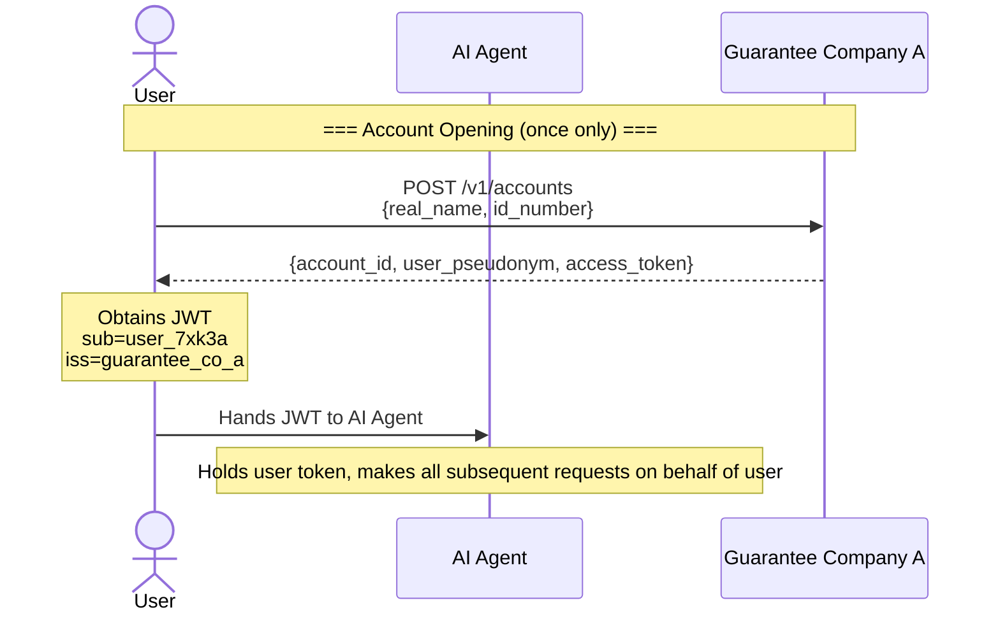
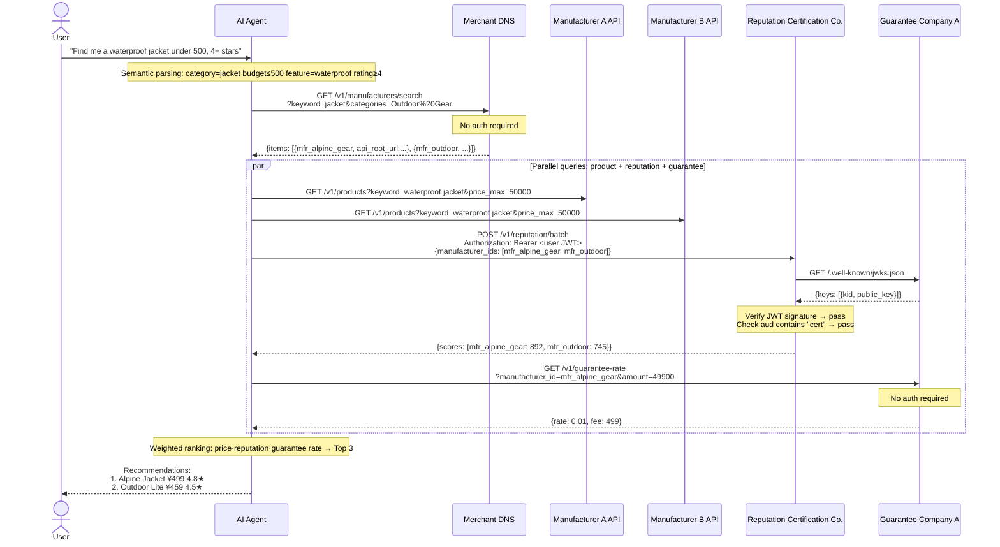
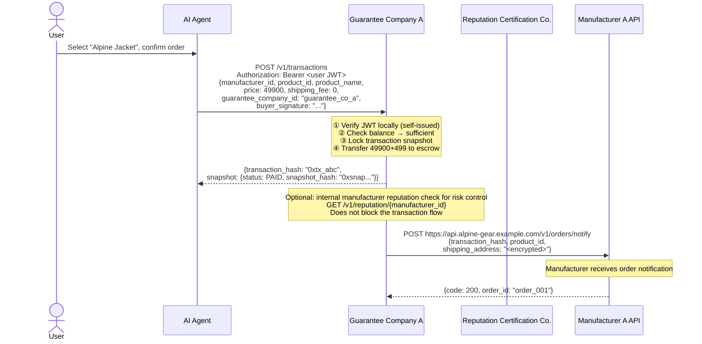
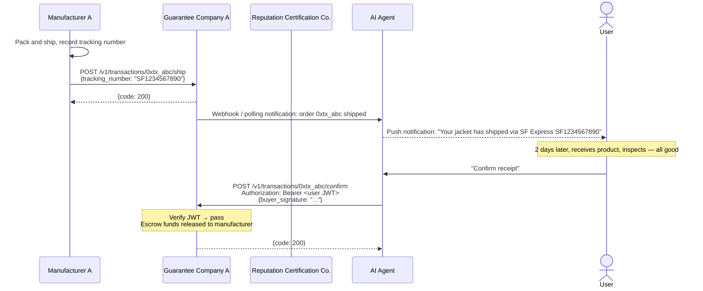
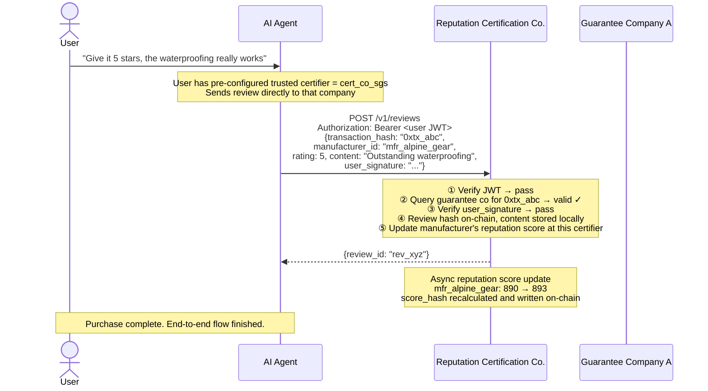
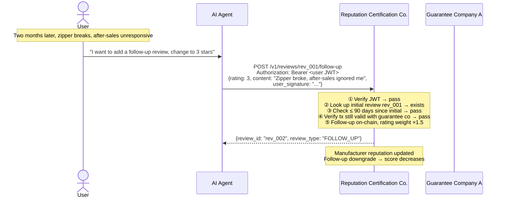

# REST API Reference

JSON + HTTP, no compile dependencies — debug with curl. All endpoints use a unified `{code, msg, data}` response format. All authentication is based on JWTs issued by Transaction Guarantee Companies. Design principle for every endpoint: **verifiable data, bounded authority, auditable integrity.**

---

## Complete Shopping Flow

The following is an end-to-end flow for a complete purchase, covering every API call, auth token propagation, and inter-node interaction.

### Stage 0: Account Opening & Authentication



### Stage 1: Search & Discovery



### Stage 2: Order & Payment



### Stage 3: Fulfillment & Confirmation



### Stage 4: Review & Reputation Update



### Stage 5: Follow-Up Review (Optional)



**Which reputation certification company should the review be submitted to?**

Users don't need to care which certification company the manufacturer is registered with. Users simply submit reviews to the certification company they trust. The process:

1. The user pre-configures trusted certification companies in their AI Agent (multiple allowed, with a default)
2. When submitting a review, the AI Agent sends it to the user's designated certification company
3. The certification company verifies the `transaction_hash` with the guarantee company
4. Verification passed → review content stored locally, review hash recorded on-chain
5. The certification company updates the manufacturer's reputation score accordingly

**Search and certification are two independent paths**:

When searching for products, users go through DNS — DNS doesn't care where a manufacturer is certified; all manufacturers are discoverable. If a user only trusts Certifier B, the AI Agent queries B for the manufacturer's score. If B has no data on that manufacturer yet, it shows "No rating yet" — the user can still see the product, purchase it, and submit a review to B. A manufacturer won't become "unsearchable" just because they aren't certified with B.

**Shared certification, independent scoring**:

Certification (factory audit) is an objective assessment of a manufacturer's qualifications — if SGS has audited them, that fact shouldn't need to be re-verified by every certification company. Certification companies share basic certification data:

```
Manufacturer completes DEEP audit with A → A writes audit report hash on-chain
                                         → B reads from chain: manufacturer audited by A, level DEEP
                                         → B recognizes this audit fact, marks as "Certified"
                                         → B doesn't need to send someone to re-audit the factory
```

But scoring is independent:

```
A's review set: 800 reviews → score 4.8
B's review set: 200 reviews → score 4.2  (fewer users, stricter reviewers)
Each calculates independently — the same manufacturer may have different scores at different certifiers.
```

This means a manufacturer only needs to undergo one factory audit at one certification company, and all certifiers in the network recognize that audit result. But each certifier's scoring is completely independent — auditing is shared infrastructure, scoring is a competitive service.

### Auth Token Propagation

```
User JWT (issued by Guarantee Company A)
  │
  ├─→ Held by AI Agent, used for all user-facing API calls
  │     ├─→ Reputation Certification Co.: fetches JWKS from Guarantee Co. A to verify
  │     ├─→ Guarantee Company A: verifies locally (self-issued)
  │     └─→ Merchant DNS: fetches JWKS from Guarantee Co. A to verify
  │
  └─→ Guarantee Co. A internal service-to-service tokens
        └─→ Reputation Certification Co.: ConfirmTransaction (cross-verification to prevent fake reviews)
```

### API Call Sequence Overview

| Step | Caller | Target | Endpoint | Auth | Description |
|------|--------|--------|----------|------|-------------|
| 0.1 | User | Guarantee A | `POST /v1/accounts` | None | Open account, obtain JWT |
| 1.1 | AI Agent | DNS | `GET /v1/manufacturers/search` | None | Search matching manufacturers |
| 1.2 | AI Agent | Manufacturer API | `GET /v1/products` | None | Fetch product data in parallel |
| 1.3 | AI Agent | Reputation Cert | `POST /v1/reputation/batch` | User JWT | Batch query reputation scores |
| 1.3a | Reputation Cert | Guarantee A | `GET /.well-known/jwks.json` | None | Fetch public key to verify JWT |
| 1.4 | AI Agent | Guarantee A | `GET /v1/guarantee-rate` | None | Query guarantee fee rate |
| 2.1 | AI Agent | Guarantee A | `POST /v1/transactions` | User JWT | Place order, lock snapshot, transfer to escrow |
| 2.2 | Guarantee A | Manufacturer | `POST /v1/orders/notify` | Guarantee A signature | Notify manufacturer to ship |
| 3.1 | Manufacturer | Guarantee A | `POST /v1/transactions/{hash}/ship` | Manufacturer token | Record tracking number |
| 3.2 | AI Agent | Guarantee A | `POST /v1/transactions/{hash}/confirm` | User JWT | Confirm receipt, release funds |
| 4.1 | AI Agent | Reputation Cert | `POST /v1/reviews` | User JWT | Certifier verifies transaction with guarantee co. independently |
| 5.1 | AI Agent | Reputation Cert | `POST /v1/reviews/{id}/follow-up` | User JWT | Follow-up within 90 days, 1.5× rating weight; also requires guarantee co. verification |

---

## Common Conventions

### Unified Response Format

All endpoints return the following three-field structure:

```json
{
  "code": 200,
  "msg": "success",
  "data": { ... }
}
```

| code | Meaning |
|------|---------|
| 200 | Success |
| 400 | Invalid request parameters |
| 401 | Unauthenticated (token missing, expired, or signature invalid) |
| 403 | Forbidden (token valid but insufficient permissions for this resource) |
| 404 | Resource not found |
| 409 | Conflict (e.g., duplicate registration) |
| 422 | Business logic error (e.g., insufficient balance) |
| 429 | Rate limited |
| 500 | Server error |

Business errors are distinguished by `code` and `msg`, not by HTTP status codes — all responses use HTTP 200, with `code` carrying the actual result.

On success, `data` contains the business payload; on failure, it is empty or contains debug information.

### Pagination

List endpoints use a unified response format:

```json
{
  "code": 200,
  "msg": "success",
  "data": {
    "page": 1,
    "page_size": 20,
    "total": 156,
    "total_pages": 8,
    "items": [...]
  }
}
```

Request format: `?page=1&page_size=20`. `page_size` defaults to 20, max 100.

---

## JWT Authentication System

The identity anchor of the entire ecosystem is the **Transaction Guarantee Company**. After a user completes KYC and opens an account with a guarantee company, the guarantee company issues a JWT token. The user holds this token to access all nodes in the ecosystem.

### 2.1 Guarantee Company Issues Tokens

**After account opening**, the guarantee company returns a JWT:

```http
POST /v1/accounts
```

The response `data.access_token` contains the issued JWT. The user hands this token to the AI Agent, which includes it in all subsequent requests.

### 2.2 JWT Structure

```json
// Header
{
  "alg": "ES256",
  "typ": "JWT",
  "kid": "guarantee_co_a_2024"
}

// Payload
{
  "sub": "user_7xk3a",            // User pseudonym (irreversible, globally unique)
  "iss": "guarantee_co_a",        // Issuer: guarantee company ID
  "iat": 1700000000,              // Issued at
  "exp": 1700086400,              // Expiration (recommended 24 hours)
  "scope": "shopping",            // Permission scope
  "aud": ["dns", "cert", "guarantee"]  // Allowed node types
}
```

The signing algorithm is ES256 (ECDSA P-256); EdDSA (Ed25519) may also be used. HS256 is not used — shared-secret mode cannot be securely distributed in a multi-node decentralized scenario.

### 2.3 Guarantee Company Public Key Distribution (JWKS)

Each guarantee company exposes a public key endpoint (`GET /.well-known/jwks.json`) for other nodes to verify JWT signatures. See [04-guarantee.md](./04-guarantee.md) section 4.0 for the detailed endpoint definition.

### 2.4 How Each Node Verifies JWT

Each node (AI Agent, Reputation Certification Company, Merchant DNS) performs the following verification flow upon receiving a request:

```
1. Extract JWT from Authorization: Bearer <token>
2. Parse JWT Header to obtain iss (issuing guarantee company ID) and kid (key ID)
3. Request public key from https://<guarantee-company-domain>/.well-known/jwks.json
4. Verify JWT signature with the public key
5. Check whether exp has passed
6. Check whether aud includes this node's type
7. Extract sub (user pseudonym) for subsequent business logic
```

**Public key caching**: Nodes should cache guarantee company JWKS, with a recommended TTL of 1 hour. Fetch and cache on first encounter of an unknown `iss` or `kid`.

**Revocation check**: Guarantee companies provide a revocation list endpoint. Nodes may pull it periodically, or query in real time for sensitive operations (payment, migration).

### 2.5 Guarantee Company Token Revocation

When a user account is abnormal (frozen, closed), the guarantee company must revoke issued tokens. The revocation list is available via the `GET /.well-known/jwt-revoked` endpoint (see [04-guarantee.md](./04-guarantee.md) section 4.0 for details). Nodes should query this endpoint in real time for sensitive operations such as payments to confirm the token has not been revoked.

### 2.6 Token Refresh

When a token is about to expire, the AI Agent refreshes it with the issuing guarantee company (`POST /v1/auth/refresh`). See [04-guarantee.md](./04-guarantee.md) section 4.2 for the detailed endpoint definition. If the token has already been revoked, the response will be `code: 401`.

### 2.7 Cross-Guarantee-Company Scenarios

A user may have opened an account with Guarantee Company A but wish to pay through Guarantee Company B (because the merchant only has a receiving account with B). In this case:

1. The user presents the JWT issued by Guarantee Company A (already KYC-verified)
2. Guarantee Company B verifies A's signature (via A's JWKS endpoint)
3. Guarantee Company B trusts A's KYC result and creates a linked account for the user at B
4. Guarantee Company B issues its own JWT to the user
5. The user completes payment with B's token

This is much simpler than cross-guarantor settlement — only KYC trust is shared, not funds.

---

## Data Format Conventions

- **Amounts**: Always `int64`, unit is **cents** (e.g., `89900` = 899.00 yuan), avoiding floating-point precision issues
- **Timestamps**: Always `int64`, unit is **seconds** in Unix timestamp
- **Hashes**: Always hex strings prefixed with `0x`
- **Signatures**: Always Base64URL-encoded
- **Pseudonyms**: The user-facing identifier `user_pseudonym` is generated by the guarantee company using `HMAC-SHA256(user_id, secret)` and is irreversible

---

---

## Role-Specific API Docs

| Role | Document |
|------|----------|
| Manufacturer | [01-manufacturer-api.md](./01-manufacturer-api.md) |
| Merchant DNS | [02-merchant-dns.md](./02-merchant-dns.md) |
| Reputation Certification Company | [03-reputation.md](./03-reputation.md) |
| Transaction Guarantee Company | [04-guarantee.md](./04-guarantee.md) |
