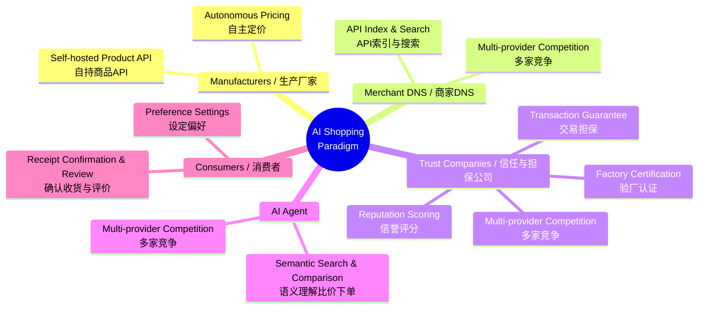
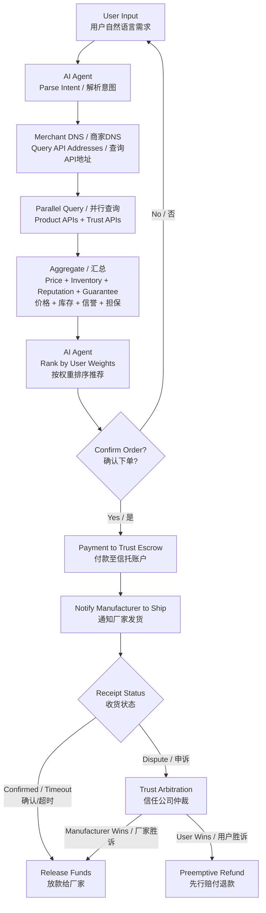
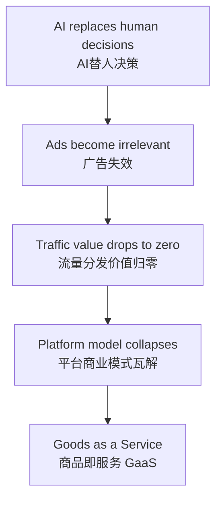

# AI Shopping Paradigm / AI购物新范式

> A **transaction revolution** that rebuilds global commerce from the **protocol layer** up — dismantling platform monopolies with AI Agents, liberating supply with open APIs, and ending trust monopolies through market-based competition.
>
> 从 **底层协议** 重构全球商业的 **交易革命** —— 用 AI Agent 瓦解平台霸权，用开放 API 解放供给端，用市场化信任竞争终结评价垄断。

---

## Mind Map / 思维导图

---

## Transaction Flow / 交易流程

---

## Core Roles / 核心角色

| Role / 角色                      | Description / 说明                                                                                                             |
| -------------------------------- | ------------------------------------------------------------------------------------------------------------------------------ |
| **Manufacturer** / 生产厂家      | Self-hosted Product API, autonomous pricing, free from platform control / 自持商品API，自主定价，摆脱平台绑架                  |
| **Merchant DNS** / 商家DNS       | API-only index, no product data stored, multi-provider competition / 仅做API索引，不碰商品数据，多家竞争                       |
| **Trust Company** / 信任担保公司 | Factory certification + reputation scoring + trust escrow, market-based competition / 验厂+信誉分+信托担保，市场化竞争         |
| **AI Agent**                     | Semantic comparison, weighted ranking, one-click ordering, multi-provider competition / 语义比价、权重排序、一键下单，多家竞争 |
| **Consumer** / 消费者            | Set preferences, confirm receipt, review & feedback / 设定偏好，确认收货，评价反馈                                             |

---

## Core Logic / 核心逻辑

---

## Document Navigation / 文档导航

| Chapter / 章节                     | English                                                                                | 中文简体                                                   |
| ---------------------------------- | -------------------------------------------------------------------------------------- | ---------------------------------------------------------- |
| Main File / 主文件                 | [AI-Shopping-Paradigm](English/AI-Shopping-Paradigm.md)                                | [AI购物新范式](中文简体/AI购物新范式.md)                   |
| Overview / 概述与愿景              | [01-overview-and-vision](English/01-overview-and-vision.md)                            | [01-概述与愿景](中文简体/01-概述与愿景.md)                 |
| Core Architecture / 核心架构       | [02-core-architecture](English/02-core-architecture-and-roles.md)                      | [02-核心架构与角色](中文简体/02-核心架构与角色.md)         |
| Business Value / 商业价值          | [03-business-value](English/03-business-value-and-model.md)                            | [03-商业价值与商业模式](中文简体/03-商业价值与商业模式.md) |
| Commerce Transformation / 商业变革 | [04-commerce-transformation](English/04-commerce-transformation-and-new-industries.md) | [04-商业变革与新产业](中文简体/04-商业变革与新产业.md)     |
| Disruption Path / 颠覆路径         | [05-disruption-path](English/05-disruption-path-and-cold-start.md)                     | [05-颠覆路径与冷启动](中文简体/05-颠覆路径与冷启动.md)     |
| Future Evolution / 未来演进        | [06-future-evolution](English/06-future-evolution.md)                                  | [06-未来演进方向](中文简体/06-未来演进方向.md)             |
