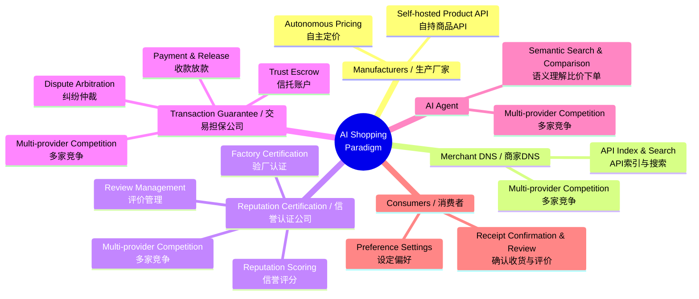
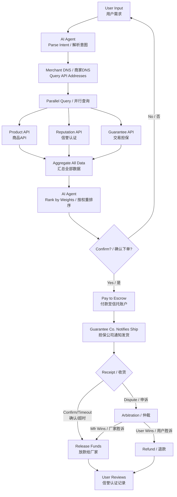
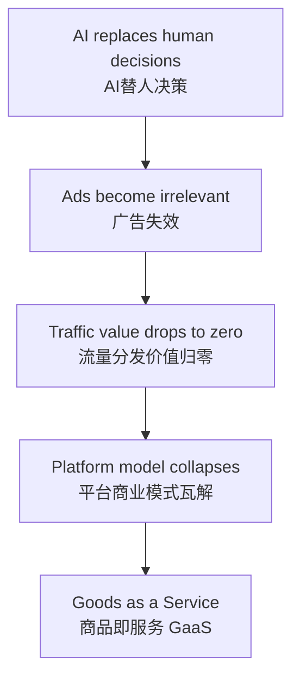

# AI Shopping Paradigm / AI购物新范式

> **Integrity and quality run through every link.** A **transaction revolution** that rebuilds commercial trust from the **protocol layer** up — five powers separated, every action verifiable on-chain, trust as a competitive market service.
>
> **诚信与品质贯穿全流程。** 从 **底层协议** 重构商业信任的 **交易革命** —— 五权分立，链上可验证，诚信成为可竞争的市场化服务。

---

## Mind Map / 思维导图

---

## Transaction Flow / 交易流程

---

## Core Roles / 核心角色

| Role / 角色 | Layer / 层级 | Description / 说明 |
|-------------|-------------|-------------------|
| **Manufacturer** / 生产厂家 | Supply / 供给 | Self-hosted Product API, autonomous pricing / 自持商品API，自主定价 |
| **Merchant DNS** / 商家DNS | Index / 索引 | API-only index, no product data, multi-provider / 仅做API索引，不碰商品数据 |
| **Reputation Certification** / 信誉认证公司 | Reputation / 评价 | Certification + scoring + review mgmt, on-chain, never touches funds / 验厂+评分+评价管理，链上存证，绝不碰资金 |
| **Transaction Guarantee** / 交易担保公司 | Payment / 资金 | Escrow + payment + arbitration, never evaluates reputation / 信托+收款+仲裁，绝不参与评价 |
| **AI Agent** | Decision / 决策 | Semantic comparison, weighted ranking, multi-provider / 语义比价、权重排序，多家竞争 |
| **Consumer** / 消费者 | Demand / 需求 | Set preferences, confirm receipt, review / 设定偏好，确认收货，评价反馈 |

> Evaluation never touches money. Money never evaluates. Supply doesn't index. Index doesn't advertise. Decision doesn't take a cut. — **Five-Power Separation**.
>
> 评价不碰钱，资金不评价，供给不索引，索引不广告，决策不抽成 —— **五权分立**。

---

## Core Logic / 核心逻辑

---

## Document Navigation / 文档导航

| Chapter / 章节 | English | 中文简体 |
|---------------|---------|----------|
| Main File / 主文件 | [AI-Shopping-Paradigm](English/README.md) | [README](中文简体/README.md) |
| Overview / 概述与愿景 | [01-overview-and-vision](English/01-overview-and-vision.md) | [01-概述与愿景](中文简体/01-概述与愿景.md) |
| Core Architecture / 核心架构 | [02-core-architecture](English/02-core-architecture-and-roles.md) | [02-核心架构与角色](中文简体/02-核心架构与角色.md) |
| Business Value / 商业价值 | [03-business-value](English/03-business-value-and-model.md) | [03-商业价值与商业模式](中文简体/03-商业价值与商业模式.md) |
| Commerce Transformation / 商业变革 | [04-commerce-transformation](English/04-commerce-transformation-and-new-industries.md) | [04-商业变革与新产业](中文简体/04-商业变革与新产业.md) |
| Disruption Path / 颠覆路径 | [05-disruption-path](English/05-disruption-path-and-cold-start.md) | [05-颠覆路径与冷启动](中文简体/05-颠覆路径与冷启动.md) |
| Future Evolution / 未来演进 | [06-future-evolution](English/06-future-evolution.md) | [06-未来演进方向](中文简体/06-未来演进方向.md) |
| REST API / 接口定义 | [API Definitions](English/api/API-definitions.md) | [API接口定义](中文简体/api/API接口定义.md) |
