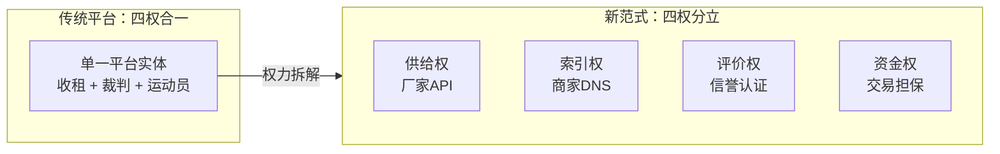
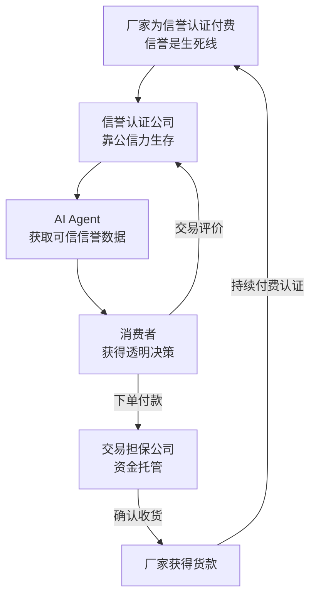
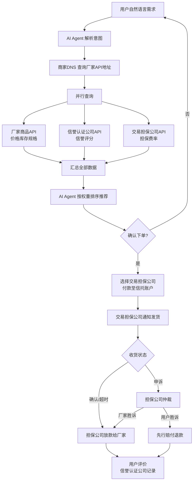

# 02 — 核心架构与角色定义

## 架构总览

| 生产厂家（供给层） | 商家DNS（索引层） | 信誉认证公司（评价层） | 交易担保公司（资金层） | AI Agent（决策层） | 消费者（需求层） |
| ------------------ | ----------------- | ---------------------- | ---------------------- | ------------------ | ---------------- |
| 自持API            | 元数据索引        | 验厂认证               | 信托账户               | 语义解析           | 偏好设定         |
| 实时库存           | 统一搜索          | 信誉评分               | 收款放款               | 并行比价           | 确认下单         |
| 自主定价           | 不碰商品          | 评价管理               | 纠纷仲裁               | 权重排序           | 收货评价         |
|                    | 不参与交易        | 数据链上存证           | 先行赔付               | 订单追踪           |                  |

> 四权分立：供给、索引、评价、资金各为独立竞争层，互相制衡。每一层均允许多家并存竞争。

---

## 权力分离架构

| 权力类型     | 传统平台（权力合一）             | 新范式（四权分立）                 |
| ------------ | -------------------------------- | ---------------------------------- |
| **供给权**   | 厂家被平台规则绑架，定价受裹挟   | 厂家自持API，自主定价，100%自主    |
| **索引权**   | 平台内嵌搜索，竞价排名决定曝光   | 商家DNS，仅做黄页索引，不卖广告    |
| **评价权**   | 平台自评，刷单泛滥，不可迁移     | 信誉认证公司，链上存证，可迁移     |
| **资金权**   | 平台自管资金，既是裁判又是运动员 | 交易担保公司，独立托管，不参与评价 |
| **权力关系** | 四权合一：地主 + 裁判 + 运动员   | 四权分立：互相制衡，闭环驱动       |

**本质区别**：传统平台是"收租的地主 + 裁判 + 运动员"，本架构是**开放基础设施**——每一层都是可竞争的市场化服务，没有任何实体同时掌握两种权力。

---

## 闭环逻辑

---

## 2.1 生产厂家 — 商品列表API

### 定义

厂家部署一个轻量级、标准化的HTTP API，对外暴露商品数据。API完全由厂家自主控制。

### 技术规范

| 要素     | 规范                                                             |
| -------- | ---------------------------------------------------------------- |
| 数据格式 | JSON Schema 标准化                                               |
| 必含字段 | 商品ID、名称、规格参数、价格、库存、多张图片、物流选项、售后条款 |
| 可选字段 | 视频、3D模型、VR展示、生产资质证书、原材料溯源                   |
| 接口能力 | 按需查询、分页、库存实时同步                                     |
| 安全认证 | OAuth2授权，AI Agent必须携带用户身份令牌                         |
| 频率限制 | 厂家可自主设置API调用频率上限                                    |

### 部署方式

- **开源SDK**：提供开源插件，厂家一键安装即可生成标准API
- **SaaS托管**：非技术型厂家可使用第三方SaaS服务，零代码搭建
- **自主开发**：头部品牌按协议规范自建，完全自主

### 核心原则

- 归属权完全属于厂家
- 价格、库存、上下架均由厂家自主决定，无需经过任何第三方审批
- 厂家拥有自己的API调用数据，不共享给任何未经授权的第三方

---

## 2.2 商家DNS — 商品API注册中心

### 为什么叫"商家DNS"

如同互联网DNS将域名解析为IP地址，商家DNS将 **商品搜索词** 解析为 **厂家API地址列表**。它只做索引解析，不存储商品数据，不参与交易。

### 功能清单

| 功能       | 说明                                      |
| ---------- | ----------------------------------------- |
| API注册    | 收录已认证厂家的API根地址                 |
| 元数据索引 | 存储厂家类别、主营品类、地理位置等元数据  |
| 统一搜索   | 提供商品搜索/过滤/聚合接口供AI Agent调用  |
| 实时透传   | 查询时实时转发至厂家API，不持久化商品数据 |
| 短时缓存   | 允许短时间缓存高频查询结果以降低延迟      |

### 不做什么

- ❌ 不存储商品详细数据
- ❌ 不参与搜索排序
- ❌ 不接受广告投放
- ❌ 不参与交易担保或纠纷仲裁
- ❌ 不向消费者直接展示

### 竞争与治理

- 允许多家商家DNS并存竞争，AI Agent可同时查询多个DNS
- 同步协议保证不同DNS之间的厂家索引保持一致
- 初期由开源社区或行业联盟维护，成熟后可交由DAO治理

### 运营成本

极低：仅需维护API元数据索引和搜索服务，无需存储海量商品数据、图片或交易记录。单个DNS服务商的运营成本仅为传统电商平台的千分之一。

---

## 2.3 信誉认证公司 — 评价层

### 定义

独立于厂家、AI Agent、交易担保公司的**第四方中立评价机构**。只负责与"信誉"相关的一切：验厂认证、动态信誉评分、评价数据管理。**绝不接触资金**。

### 核心原则：权力分离

信誉认证公司与交易担保公司**必须分离**——评价的不碰钱，碰钱的不评价。这是整个架构中权力制衡的基石。

### 核心服务

#### 验厂认证

- 实地或远程审核厂家资质、生产能力、质量体系
- 分级认证：基础认证 / 深度认证 / 实时监控认证
- 认证结果写入信誉档案，不可篡改

#### 动态信誉评分

- 输入：历史交易数据、退货率、物流时效、消费者加密签名评价
- 算法透明公开，接受审计
- 厂家违规行为（虚假描述、延迟发货、材质不符）触发扣分
- 消费者恶意退货/差评行为也会被标记，保护厂家

#### 评价管理

- 收集并验证消费者的加密签名评价
- 防止刷单、虚假评价——每次评价绑定唯一交易的哈希
- 为AI Agent提供实时信誉查询接口

#### 数据存储架构

- **原始数据链上存储**：信誉评分哈希、认证记录、交易评价哈希——不可篡改
- **详细数据本地存储**：具体评价内容、验厂报告详情——保护隐私，降低成本
- **厂家数据迁移支持**：厂家可随时将其信誉档案迁移至另一家信誉认证公司，**迁移收费**
- 迁移费由接收方（新认证公司）或厂家支付，形成竞争性定价

### 收入模型

| 收入来源          | 说明                                       |
| ----------------- | ------------------------------------------ |
| 厂家认证年费      | 按认证级别阶梯定价                         |
| 信誉查询API调用费 | AI Agent或交易担保公司每次查询收费         |
| 数据迁移费        | 厂家迁出信誉档案时收取（接收方或厂家支付） |

### 竞争机制

- 允许多家信誉认证公司并存竞争
- AI Agent可对比多家公司的信誉评分
- 公信力是核心资产——一次造假，永久失去市场
- 厂家可以带着信誉数据迁移，倒逼认证公司持续提升服务质量

---

## 2.4 交易担保公司 — 资金层

### 定义

独立于厂家、AI Agent、信誉认证公司的**第四方资金托管机构**。**只碰与资金有关的操作**：信托账户、收款放款、纠纷仲裁、先行赔付。**绝不参与评价**。

### 核心原则：权力分离

交易担保公司只能查看信誉认证公司提供的信誉分数，无权修改。纠纷仲裁基于交易事实（物流记录、聊天记录）和信誉参考，而非交易担保公司自己的主观判断。

### 核心服务

#### 信托账户

- 用户付款进入信托账户（而非直接打入厂家）
- 用户确认收货后释放资金给厂家
- 逾期未确认则自动释放（保护厂家不被恶意拖延）
- 交易担保公司承担资金托管的法律责任

#### 纠纷仲裁与先行赔付

- 用户或厂家向交易担保公司发起申诉
- 基于交易事实裁定（物流签收记录、商品描述匹配度）
- 参考信誉认证公司提供的双方信誉分
- 用户胜诉：先行赔付，再向厂家追偿
- 厂家胜诉：驳回申诉，释放资金

#### 质量保险

- 为高价值商品提供正品保险、质量保险
- 保费由厂家支付，赔付由保险公司执行

### 收入模型

| 收入来源     | 费率                           |
| ------------ | ------------------------------ |
| 交易担保费   | 交易额的 0.5% - 2%             |
| 纠纷处理费   | 申诉方预缴，败诉方承担         |
| 资金托管利息 | 信托账户资金沉淀产生的利息收入 |

### 竞争机制

- 允许多家交易担保公司并存竞争
- AI Agent根据担保费率、赔付速度、纠纷处理公正率推荐
- 交易担保公司本身不评价厂家——避免利益冲突

---

## 2.5 客户端AI Agent — 决策层

### 形态

- 手机App（iOS / Android）
- 桌面软件（Windows / macOS / Linux）
- 浏览器插件
- 智能音箱技能
- 即时通讯机器人（接入主流即时通讯工具）

### 核心能力

#### 语义理解

用户输入自然语言："帮我找3000以内、适合户外徒步、防水透气的冲锋衣，只要评价4星以上的"——AI Agent解析出品类、预算、功能要求、信誉阈值。

#### 并行查询

- 调用商家DNS获取匹配品类的厂家API列表
- 并行请求所有符合条件的厂家商品API
- 同时调用信誉认证公司API获取信誉分
- 同时调用交易担保公司API获取担保费率和担保资格
- 在秒级内完成全网比价

#### 权重排序

消费者预设偏好权重：

- 价格优先：最低价格排最前
- 性能优先：关键参数最强者排最前
- 信誉优先：信誉评分最高者排最前
- 担保优先：赔付速度最快、费率最低者排最前
- 综合推荐：AI自动学习用户历史偏好

#### 一键下单

- 确认商品后生成订单
- 用户选择交易担保公司，付款至信托账户
- 通知厂家备货发货
- 自动跟踪物流状态
- 记录购物偏好用于未来优化

### 商业模式

| 方案          | 说明                                                     |
| ------------- | -------------------------------------------------------- |
| 消费者免费    | 基础功能免费，高级功能（多担保公司比价、自动下单）可订阅 |
| 厂家API调用费 | 每次通过Agent成交后收取极低调用费（远低于传统广告费）    |
| 导购分成      | 按成交量向厂家收取小额导购费                             |

### 竞争格局

多家AI Agent开发商并存竞争，用户可自由切换。竞争壁垒不再是烧钱买流量，而是推荐算法的精准度、交互体验的流畅度、对用户偏好的学习能力。

---

## 交易流程（端到端）

### 流程要点

1. **用户不直接面对任何厂家**，AI Agent作为唯一交互界面
2. **商品、信誉、担保三项数据并行获取**，互不依赖，保证查询速度
3. **评价与资金彻底分离**：信誉认证公司管评价，交易担保公司管资金
4. **资金全程在信托账户中**，确认收货前厂家不接触款项
5. **纠纷由独立的交易担保公司裁定**，参考信誉认证公司的评分
6. **评价反馈加密签名**，绑定信誉认证公司，链上存证、不可篡改

---

[← 返回主文件](./AI购物新范式.md)
