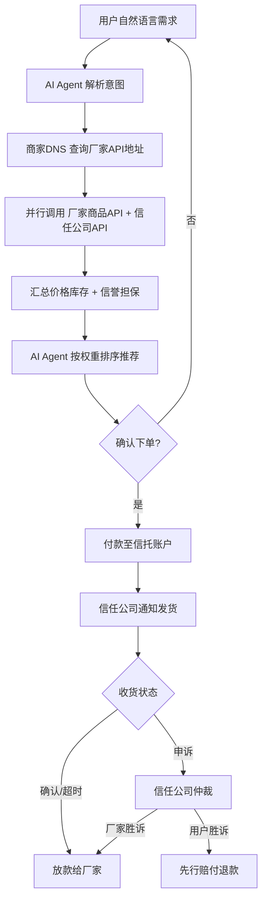

# 02 — 核心架构与角色定义

## 架构总览

| 生产厂家（供给层） | 商家DNS（索引层） | 信任担保公司（担保层） | AI Agent（决策层） | 消费者（需求层） |
|-----------------|-----------------|---------------------|------------------|----------------|
| 自持API | 元数据索引 | 验厂认证 | 语义解析 | 偏好设定 |
| 实时库存 | 统一搜索 | 信誉评分 | 并行比价 | 确认下单 |
| 自主定价 | 不碰商品 | 信托担保 | 权重排序 | 收货评价 |
| | 不参与交易 | 纠纷仲裁 | 订单追踪 | |

> 每一层均允许多家并存竞争

## 2.1 生产厂家 — 商品列表API

### 定义

厂家部署一个轻量级、标准化的HTTP API，对外暴露商品数据。API完全由厂家自主控制。

### 技术规范

| 要素 | 规范 |
|------|------|
| 数据格式 | JSON Schema 标准化 |
| 必含字段 | 商品ID、名称、规格参数、价格、库存、多张图片、物流选项、售后条款 |
| 可选字段 | 视频、3D模型、VR展示、生产资质证书、原材料溯源 |
| 接口能力 | 按需查询、分页、库存实时同步 |
| 安全认证 | OAuth2授权，AI Agent必须携带用户身份令牌 |
| 频率限制 | 厂家可自主设置API调用频率上限 |

### 部署方式

- **开源SDK**：提供开源插件，厂家一键安装即可生成标准API
- **SaaS托管**：非技术型厂家可使用第三方SaaS服务，零代码搭建
- **自主开发**：头部品牌按协议规范自建，完全自主

### 核心原则

- 归属权完全属于厂家
- 价格、库存、上下架均由厂家自主决定，无需经过任何第三方审批
- 厂家拥有自己的API调用数据，不共享给任何未经授权的第三方

---

## 2.2 商家DNS — 商品API注册中心

### 为什么叫"商家DNS"

如同互联网DNS将域名解析为IP地址，商家DNS将 **商品搜索词** 解析为 **厂家API地址列表**。它只做索引解析，不存储商品数据，不参与交易。

### 功能清单

| 功能 | 说明 |
|------|------|
| API注册 | 收录已认证厂家的API根地址 |
| 元数据索引 | 存储厂家类别、主营品类、地理位置等元数据 |
| 统一搜索 | 提供商品搜索/过滤/聚合接口供AI Agent调用 |
| 实时透传 | 查询时实时转发至厂家API，不持久化商品数据 |
| 短时缓存 | 允许短时间缓存高频查询结果以降低延迟 |

### 不做什么

- ❌ 不存储商品详细数据
- ❌ 不参与搜索排序
- ❌ 不接受广告投放
- ❌ 不参与交易担保或纠纷仲裁
- ❌ 不向消费者直接展示

### 竞争与治理

- 允许多家商家DNS并存竞争，AI Agent可同时查询多个DNS
- 同步协议保证不同DNS之间的厂家索引保持一致
- 初期由开源社区或行业联盟维护，成熟后可交由DAO治理

### 运营成本

极低：仅需维护API元数据索引和搜索服务，无需存储海量商品数据、图片或交易记录。单个DNS服务商的运营成本仅为传统电商平台的千分之一。

---

## 2.3 信任与担保公司 — Trust Provider

### 定义

独立于厂家、AI Agent、商家DNS的 **第四方中立机构**，提供验厂、信誉评分、交易担保、纠纷仲裁等服务。

### 核心服务

#### 验厂认证
- 实地或远程审核厂家资质、生产能力、质量体系
- 分级认证：基础认证 / 深度认证 / 实时监控认证
- 认证结果写入信誉档案，不可篡改

#### 动态信誉评分
- 输入：历史交易数据、退货率、物流时效、消费者加密签名评价
- 算法透明公开，接受审计
- 厂家违规行为（虚假描述、延迟发货、材质不符）触发扣分
- 消费者恶意退货/差评行为也会被标记，保护厂家

#### 信托账户担保
- 用户付款进入信托账户（而非直接打入厂家）
- 用户确认收货后释放资金给厂家
- 逾期未确认则自动释放（保护厂家不被恶意拖延）
- 信任公司承担资金托管的法律责任

#### 纠纷仲裁与先行赔付
- 用户或厂家向信任公司发起申诉
- 信任公司裁定责任归属
- 用户胜诉：先行赔付，再向厂家追偿
- 厂家胜诉：驳回申诉，释放资金

#### 质量保险
- 为高价值商品提供正品保险、质量保险
- 保费由厂家支付，赔付由保险公司执行

### 竞争机制

- 允许多家信任公司并存，用户或AI Agent可选择
- AI Agent可根据信任公司的历史裁定公正率、赔付速度等指标评价信任公司
- 信任公司之间存在 **信誉竞争** ——偏袒厂家的公司会失去消费者，偏袒消费者的公司会失去厂家
- 市场化的竞争压力倒逼信任公司保持中立

### 收入模型

| 收入来源 | 费率 |
|---------|------|
| 厂家认证年费 | 按认证级别阶梯定价 |
| 交易担保费 | 交易额的 0.5% - 2% |
| 纠纷处理费 | 申诉方预缴，败诉方承担 |
| 质量保险佣金 | 保费分成 |

---

## 2.4 客户端AI Agent

### 形态

- 手机App（iOS / Android）
- 桌面软件（Windows / macOS / Linux）
- 浏览器插件
- 智能音箱技能
- 即时通讯机器人（接入主流即时通讯工具）

### 核心能力

#### 语义理解
用户输入自然语言："帮我找3000以内、适合户外徒步、防水透气的冲锋衣，只要评价4星以上的"——AI Agent解析出品类、预算、功能要求、信誉阈值。

#### 并行比价
- 调用商家DNS获取匹配品类的厂家API列表
- 并行请求所有符合条件的厂家商品API
- 同时调用信任公司API获取信誉分和担保资格
- 在秒级内完成全网比价

#### 权重排序
消费者预设偏好权重：
- 价格优先：最低价格排最前
- 性能优先：关键参数最强者排最前
- 信誉优先：信任评分最高者排最前
- 综合推荐：AI自动学习用户历史偏好

#### 一键下单
- 确认商品后生成订单
- 用户付款至信任公司信托账户
- 通知厂家备货发货
- 自动跟踪物流状态
- 记录购物偏好用于未来优化

### 商业模式

| 方案 | 说明 |
|------|------|
| 消费者免费 | 基础功能免费，高级功能（多信任公司比价、自动下单）可订阅 |
| 厂家API调用费 | 每次通过Agent成交后收取极低调用费（远低于传统广告费） |
| 导购分成 | 按成交量向厂家收取小额导购费 |

### 竞争格局

多家AI Agent开发商并存竞争，用户可自由切换。竞争壁垒不再是烧钱买流量，而是推荐算法的精准度、交互体验的流畅度、对用户偏好的学习能力。

---

## 交易流程（端到端）

### 流程要点

1. **用户不直接面对任何厂家**，AI Agent作为唯一交互界面
2. **商品数据和信誉数据并行获取**，互不依赖，保证查询速度
3. **资金全程在信托账户中**，确认收货前厂家不接触款项
4. **纠纷由独立第三方裁定**，平台本身不兼具裁判角色
5. **评价反馈加密签名**，绑定信任公司，不可篡改、可溯源

---

[← 返回主文件](./AI购物新范式.md)
