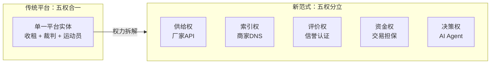
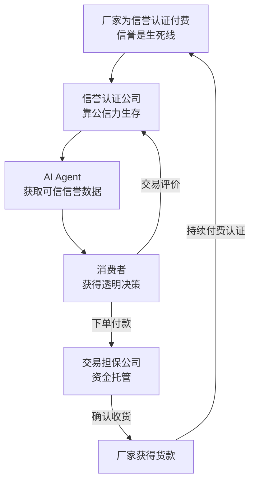
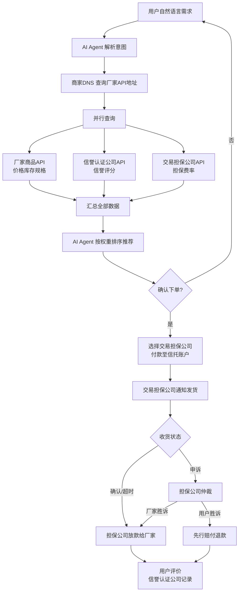
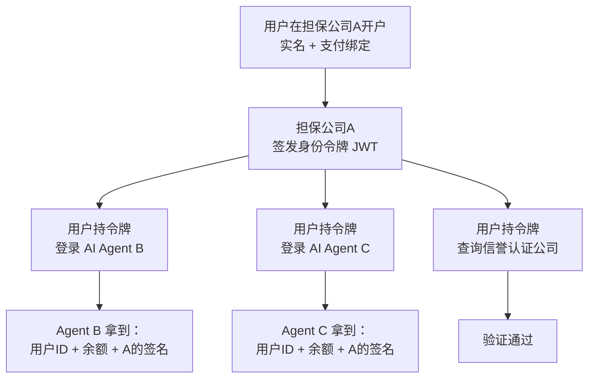

# 02 — 核心架构与角色定义

## 架构总览

| 生产厂家（供给层） | 商家DNS（索引层） | 信誉认证公司（评价层） | 交易担保公司（资金层） | AI Agent（决策层） | 消费者（需求层） |
| ------------------ | ----------------- | ---------------------- | ---------------------- | ------------------ | ---------------- |
| 自持API            | 元数据索引        | 验厂认证               | 信托账户               | 语义解析           | 偏好设定         |
| 实时库存           | 统一搜索          | 信誉评分               | 收款放款               | 并行比价           | 确认下单         |
| 自主定价           | 不碰商品          | 评价管理               | 纠纷仲裁               | 权重排序           | 收货评价         |
|                    | 不参与交易        | 数据链上存证           | 先行赔付               | 订单追踪           |                  |

> 五权分立：供给、索引、评价、资金、决策各为独立竞争层，互相制衡。每一层均允许多家并存竞争。

---

## 权力分离架构

| 权力类型     | 传统平台（权力合一）             | 新范式（五权分立）                 |
| ------------ | -------------------------------- | ---------------------------------- |
| **供给权**   | 厂家被平台规则绑架，定价受裹挟   | 厂家自持API，自主定价，100%自主    |
| **索引权**   | 平台内嵌搜索，竞价排名决定曝光   | 商家DNS，仅做黄页索引，不卖广告    |
| **评价权**   | 平台自评，刷单泛滥，不可迁移     | 信誉认证公司，链上存证，可迁移     |
| **资金权**   | 平台自管资金，既是裁判又是运动员 | 交易担保公司，独立托管，不参与评价 |
| **决策权**   | 平台垄断购物入口和推荐算法 | AI Agent，纯算法推荐，多家竞争，不向交易抽成 |
| **权力关系** | 五权合一：地主 + 裁判 + 运动员（平台全揽）   | 五权分立：互相制衡，闭环驱动       |



**本质区别**：传统平台靠**出卖信任**赚钱（竞价排名、付费推广、黑盒评价），本架构靠**验证信任**运转（五权分立、链上存证、公开竞争）。没有任何实体能同时掌握两种权力——因为只要权力合一，诚信就会被利益腐蚀。**诚信不是口号，是架构设计出来的。**

---

## 闭环逻辑



---

## 2.1 生产厂家 — 商品列表API

### 定义

厂家部署一个轻量级、标准化的HTTP API，对外暴露商品数据。API完全由厂家自主控制。

### 技术规范

| 要素     | 规范                                                             |
| -------- | ---------------------------------------------------------------- |
| 数据格式 | JSON Schema 标准化                                               |
| 必含字段 | 商品ID、名称、规格参数、价格、库存、多张图片、物流选项、售后条款 |
| 可选字段 | 视频、3D模型、VR展示、生产资质证书、原材料溯源                   |
| 接口能力 | 按需查询、分页、库存实时同步                                     |
| 安全认证 | OAuth2授权，AI Agent必须携带用户身份令牌                         |
| 频率限制 | 厂家可自主设置API调用频率上限                                    |

### 部署方式

- **开源SDK**：提供开源插件，厂家一键安装即可生成标准API
- **SaaS托管**：非技术型厂家可使用第三方SaaS服务，零代码搭建
- **自主开发**：头部品牌按协议规范自建，完全自主

### 核心原则

- 归属权完全属于厂家
- 价格、库存、上下架均由厂家自主决定，无需经过任何第三方审批
- 厂家拥有自己的API调用数据，不共享给任何未经授权的第三方

---

## 2.2 商家DNS — 商品API注册中心

### 为什么叫"商家DNS"

如同互联网DNS将域名解析为IP地址，商家DNS将 **商品搜索词** 解析为 **厂家API地址列表**。它只做索引解析，不存储商品数据，不参与交易。

### 功能清单

| 功能       | 说明                                      |
| ---------- | ----------------------------------------- |
| API注册    | 收录已认证厂家的API根地址                 |
| 元数据索引 | 存储厂家类别、主营品类、地理位置等元数据  |
| 统一搜索   | 提供商品搜索/过滤/聚合接口供AI Agent调用  |
| 实时透传   | 查询时实时转发至厂家API，不持久化商品数据 |
| 短时缓存   | 允许短时间缓存高频查询结果以降低延迟      |

### 不做什么

- ❌ 不存储商品详细数据
- ❌ 不参与搜索排序
- ❌ 不接受广告投放
- ❌ 不参与交易担保或纠纷仲裁
- ❌ 不向消费者直接展示

### 注册规则：一厂家一注册

每个厂家**只能在一个DNS中心注册一个API**。注册时厂家提交两项核心信息：

1. **API服务器地址**：商品API的根URL，相当于暴露服务器地址给DNS，DNS据此实时查询商品数据
2. **销售品类声明**：厂家声明自己主营的商品品类（如"户外装备""母婴用品"），DNS据此建立品类索引

注册后，该DNS将厂家信息通过**同步协议**广播给其他DNS中心。厂家若需更换DNS（如迁至服务更好的DNS），须先在当前DNS注销，再向新DNS注册。更换期间API地址和品类声明保持不变，AI Agent不受影响。

### 竞争与治理

- 允许多家商家DNS并存竞争，AI Agent可同时查询多个DNS
- 同步协议保证不同DNS之间的厂家索引保持一致——一个厂家注册后，全网DNS均可查询
- 厂家可随时更换DNS注册方（注销→重新注册），倒逼DNS提升服务质量
- 初期由开源社区或行业联盟维护，成熟后可交由DAO治理

### 运营成本

极低：仅需维护API元数据索引和搜索服务，无需存储海量商品数据、图片或交易记录。单个DNS服务商的运营成本仅为传统电商平台的千分之一。

---

## 2.3 信誉认证公司 — 评价层

### 定义

独立于厂家、AI Agent、交易担保公司的**第四方中立评价机构**。只负责与"信誉"相关的一切：验厂认证、动态信誉评分、评价数据管理。**绝不接触资金**。

### 核心原则：权力分离

信誉认证公司与交易担保公司**必须分离**——评价的不碰钱，碰钱的不评价。这是整个架构中权力制衡的基石。

### 核心服务

#### 验厂认证

- 实地或远程审核厂家资质、生产能力、质量体系
- 分级认证：基础认证 / 深度认证 / 实时监控认证
- 认证结果写入信誉档案，不可篡改

#### 动态信誉评分

- 输入：历史交易数据、退货率、物流时效、消费者加密签名评价
- 算法透明公开，接受审计
- 厂家违规行为（虚假描述、延迟发货、材质不符）触发扣分
- 消费者恶意退货/差评行为也会被标记，保护厂家

#### 评价管理

- 收集并验证消费者的加密签名评价
- 支持追评：消费者可在首次评价后 90 天内提交追评，绑定同一交易哈希，评分权重为首次的 1.5 倍
- 防止刷单、虚假评价——每次评价绑定唯一交易的哈希；追评需验证首次评价存在且未超期
- 为消费者和AI Agent提供实时信誉查询接口（对二者免费）

#### 产品快照版本链：防"换品不换ID"

厂家可能对同一 `product_id` 更换实际商品（如用好评积累后换成劣质品）。通过产品内容哈希解决：

- 厂家的商品 API 每次更新商品核心字段（名称、规格、图片、材质）时，必须更新 `content_hash`
- 交易快照中记录下单时的 `product_content_hash`，评价中同样记录
- 同一 `product_id` 的不同 `content_hash` 视为不同版本，评分独立计算
- AI Agent 展示时标注"当前版本评分 4.8（基于 320 条评价），上一版本评分 2.1（基于 45 条评价）"

> 厂家换品 → content_hash 变化 → 新版评分从零开始。老版好评留在老版，带不到新版。历史全部透明可查。

#### 数据存储架构

- **原始数据链上存储**：信誉评分哈希、认证记录、交易评价哈希——不可篡改
- **详细数据本地存储**：具体评价内容、验厂报告详情——保护隐私，降低成本
- **厂家数据迁移支持**：厂家可随时将其信誉档案迁移至另一家信誉认证公司，**迁移收费**
- 迁移费由接收方（新认证公司）或厂家支付，形成竞争性定价

#### 认证共享，评分独立

认证（验厂）是对厂家资质的客观审核——这个事实不应该每家认证公司重复做。认证公司之间共享基础认证数据，但各家的评分和评价集完全独立。

```
厂家在 A 做 DEEP 验厂 → 验厂报告哈希写入链上
                     → B 从链上读取并认可验厂事实
                     → B 标记该厂家"已认证（由 A 验厂）"
                     → B 无需重新派人验厂
```

- **验厂共享**：链上的认证记录全网可见，任何认证公司都可引用。厂家只需在一家做一次验厂。
- **信赖撤销**：若 A 信誉崩塌（如被证实伪造验厂），所有引用 A 的验厂结果的认证公司必须将受影响厂家的认证状态更新为"未认证"。B 不能继续标"已认证"——B 信任的是 A 的验厂，A 不可信则认证标记自动失效。厂家需向其他认证公司重新申请验厂。
- **评分独立**：每家认证公司基于自己收到的评价独立计算评分。同一厂家在 A 评分 4.8，在 B 评分 4.2——完全正常。
- **用户自由选择**：用户在 AI Agent 中预设自己信任的认证公司，评价和评分查询都走该公司。
- **搜索不依赖认证**：DNS 搜索不按认证公司过滤。即使厂家只在 A 认证、用户只信任 B，厂家照样能被搜到——B 那边显示"暂无评分"而已。

#### 防刷评机制

信誉认证公司自身可能作恶——批量生成虚假好评或恶意差评写入链上。多层防线堵死这个漏洞：

| 防线 | 机制 | 为什么有效 |
|------|------|-----------|
| **① 评价绑定交易哈希** | 每条评价必须关联唯一的交易哈希，该哈希由担保公司生成，认证公司无法伪造 | 没有真实交易，就生成不了有效评价 |
| **② 担保公司交叉验证** | 用户提交评价时，认证公司向担保公司查询该交易哈希——订单真实存在且已完成才接受评价 | 担保公司持有交易快照，认证公司无法绕过它单方面写链 |
| **③ 消费者私钥签名** | 评价内容由消费者私钥签名，认证公司只是上链的中转方 | 认证公司无法伪造消费者签名，篡改即失效 |
| **④ 链上公开可审计** | 所有评价哈希公开，任何人都可以对比担保公司的交易记录和认证公司的评价记录 | 数据不一致会瞬间暴露，作假成本为零的公开审计 |
| **⑤ 多家竞争 + 公信力生死线** | 一家认证公司被证实造假 → AI Agent 将其标记为不可信 → 所有厂家迁出 → 公司死亡 | 一次造假，永久出局。经济激励比技术防线更根本 |
| **⑥ 异常检测** | AI Agent 自动监控各认证公司的评分分布——某家突然异常高分/低分，触发警报 | 批量刷评在统计上藏不住 |

> 六层防线的关系：①②③让"制造虚假评价"在技术上几乎不可能；④⑤⑥让"万一成功"的代价是立即死亡。防的不是技术，是人性——只要作恶的收益远低于代价，就不会有人作恶。

### 收入模型

| 收入来源          | 说明                                       |
| ----------------- | ------------------------------------------ |
| 厂家认证年费      | 按认证级别阶梯定价                         |
| 信誉查询调用费    | 仅向交易担保公司收取，极低定价；消费者和AI Agent免费 |
| 数据迁移费        | 厂家迁出信誉档案时收取（接收方或厂家支付） |

### 竞争机制

- 允许多家信誉认证公司并存竞争
- AI Agent可对比多家公司的信誉评分
- 公信力是核心资产——一次造假，永久失去市场
- 厂家可以带着信誉数据迁移，倒逼认证公司持续提升服务质量

---

## 2.4 交易担保公司 — 资金层

### 定义

独立于厂家、AI Agent、信誉认证公司的**第四方资金托管机构**。**只碰与资金有关的操作**：用户账户管理、信托账户、收款放款、纠纷仲裁、先行赔付。**绝不参与评价**。

### 核心原则：权力分离

交易担保公司只能查看信誉认证公司提供的信誉分数，无权修改。纠纷仲裁基于交易事实（物流记录、聊天记录）和信誉参考，而非交易担保公司自己的主观判断。

### 为什么用户账户放在这里

用户的资金全部存放在交易担保公司的信托账户中，因此用户账户（身份认证、支付方式、账户余额）天然应由交易担保公司管理。这是最务实的方案：

- 交易担保公司本身就需要做 KYC/AML 合规，用户身份验证是其法定义务
- 用户可以在多家交易担保公司开立账户，自由切换
- 账户仅管理资金相关信息，不绑定购物偏好和历史

### 核心服务

#### 用户账户管理

- 用户在交易担保公司开立账户（实名认证 + 支付方式绑定）
- 账户记录：余额、交易流水、退款记录
- 用户可在多家担保公司开户，AI Agent 下单时由用户选择用哪家
- 账户数据属于用户，支持导出和迁移

#### 信托账户

- 用户下单后资金从用户账户划入信托账户（冻结，而非直接打给厂家）
- 用户确认收货后释放资金给厂家
- 逾期未确认则自动释放（保护厂家不被恶意拖延）
- 交易担保公司承担资金托管的法律责任

#### 纠纷仲裁与先行赔付

- 用户或厂家向交易担保公司发起申诉
- 基于交易事实裁定（物流签收记录、商品描述匹配度）
- 参考信誉认证公司提供的双方信誉分
- 用户胜诉：先行赔付，再向厂家追偿
- 厂家胜诉：驳回申诉，释放资金

#### 质量保险

- 为高价值商品提供正品保险、质量保险
- 保费由厂家支付，赔付由保险公司执行

### 收入模型

| 收入来源     | 费率                           |
| ------------ | ------------------------------ |
| 交易担保费   | 交易额的 0.5% - 2%（含纠纷仲裁） |
| 资金托管利息 | 信托账户资金沉淀产生的利息收入 |

### 商家多开户

不建复杂的跨担保清算系统。**商家在主流担保公司都开户**即可——买家在哪家付款，货款就打入商家在那家的账户。开户成本极低（在线申请，无费用），商家有动力全覆盖。

```
买家在担保公司A付款 → 货款打入商家在A的账户
买家在担保公司B付款 → 货款打入商家在B的账户
```

AI Agent 下单时检查商家是否在买家选择的担保公司有账户——没有则不可下单，用户换一家担保公司即可。

> 不建清算层 = 更简单、更安全、更符合"去中心化"精神。担保公司各自独立，买家选哪家就哪家全权处理——不需要对手方信任，也不需要轧差协议。

### 竞争机制

- 允许多家交易担保公司并存竞争
- AI Agent根据担保费率、赔付速度、纠纷处理公正率推荐
- 商家需要在主流担保公司开户才能触达所有买家——担保公司靠服务质量吸引买卖双方，而非清算壁垒

---

## 2.5 客户端AI Agent — 决策层

### 形态

- 手机App（iOS / Android）
- 桌面软件（Windows / macOS / Linux）
- 浏览器插件
- 智能音箱技能
- 即时通讯机器人（接入主流即时通讯工具）

### 核心能力

#### 语义理解

用户输入自然语言："帮我找3000以内、适合户外徒步、防水透气的冲锋衣，只要评价4星以上的"——AI Agent解析出品类、预算、功能要求、信誉阈值。

#### 并行查询

- 调用商家DNS获取匹配品类的厂家API列表
- 并行请求所有符合条件的厂家商品API
- 同时调用信誉认证公司API获取信誉分
- 同时调用交易担保公司API获取担保费率和担保资格
- 在秒级内完成全网比价

#### 权重排序

消费者预设偏好权重：

- 价格优先：最低价格排最前
- 性能优先：关键参数最强者排最前
- 信誉优先：信誉评分最高者排最前
- 担保优先：赔付速度最快、费率最低者排最前
- 综合推荐：AI自动学习用户历史偏好

#### 一键下单

- 确认商品后生成订单
- 用户选择交易担保公司，付款至信托账户
- 通知厂家备货发货
- 自动跟踪物流状态
- 记录购物偏好用于未来优化
- 订单摘要云端存储，支持多设备同步，遵守统一导入导出接口

### 商业模式

| 方案          | 说明                                                     |
| ------------- | -------------------------------------------------------- |
| 消费者免费    | 基础功能免费 |
| 高级订阅    | 个性化推荐、多担保公司比价、自动下单等高级功能可订阅 |

### 竞争格局

多家AI Agent开发商并存竞争，用户可自由切换。竞争壁垒不再是烧钱买流量，而是推荐算法的精准度、交互体验的流畅度、对用户偏好的学习能力。

---

## 交易流程（端到端）



### 流程要点

1. **用户不直接面对任何厂家**，AI Agent作为唯一交互界面
2. **商品、信誉、担保三项数据并行获取**，互不依赖，保证查询速度
3. **评价与资金彻底分离**：信誉认证公司管评价，交易担保公司管资金
4. **资金全程在信托账户中**，确认收货前厂家不接触款项
5. **纠纷由独立的交易担保公司裁定**，参考信誉认证公司的评分
6. **评价反馈加密签名**，绑定信誉认证公司，链上存证、不可篡改

---

## 订单记录与用户数据归属

| 数据 | 持有一方 | 内容 | 目的 |
|------|---------|------|------|
| **用户账户** | 交易担保公司 | 实名信息、支付方式、余额、交易流水 | KYC合规，资金管理；用户可在多家开户，自由切换 |
| **交易快照** | 交易担保公司 | 下单时锁定的商品描述、规格、价格、物流承诺、双方ID | 纠纷裁定的唯一事实依据——下单那一刻的承诺，不可篡改 |
| **支付流水** | 交易担保公司 | 支付金额、信托流水、放款/退款状态 | 资金对账 |
| **履约记录** | 生产厂家 | 商品明细、收货地址、物流单号 | 发货履约 |
| **订单摘要** | AI Agent（用户本地） | 商品名称、价格、时间、状态 | 用户查询历史订单、偏好学习 |
| **交易哈希 + 评价** | 信誉认证公司（链上） | 订单哈希、评价内容哈希 | 不可篡改，信誉评分依据 |

> 不设中央订单数据库。每方只持有履行自己职责所需的最小字段。订单哈希上链保证可验证性，详细数据谁用谁存。

---

## 联邦身份与数据可移植性

### 身份锚点：交易担保公司

用户在交易担保公司完成 KYC 实名认证，担保公司即为用户的**身份提供方（IdP）**。用户使用担保公司账户登录任意 AI Agent、信誉认证公司或商家DNS，无需重复注册。



### 互认认证体系

| 机制 | 说明 |
|------|------|
| **身份令牌** | 担保公司签发的 JWT，包含用户ID、担保公司ID、有效期 |
| **跨担保互认** | 用户在担保公司A开户，也可在担保公司B开户；各担保公司各自签发令牌，AI Agent 信任任一合法担保公司 |
| **一次登录** | 用户在担保公司登录后，凭借令牌访问生态内所有服务节点，无需逐家注册 |
| **权限控制** | 每个节点获得的令牌仅包含其职责所需的最小字段；Agent 可拿到用户ID和偏好授权，但不能访问担保公司内部账务；信誉认证公司只能拿到用户ID和评价哈希，不能读购物历史 |

### 订单摘要的统一接口

AI Agent 将用户的订单摘要存储在云端（方便多设备同步），但必须遵守统一的导入导出标准：

| 规范 | 内容 |
|------|------|
| **数据格式** | 标准 JSON Schema：商品ID、名称、价格、时间戳、担保公司ID、交易哈希 |
| **导出接口** | `GET /orders/export` — 用户随时导出全部订单摘要 |
| **导入接口** | `POST /orders/import` — 换 Agent 时一键迁移 |
| **删除接口** | `DELETE /orders` — 用户有权彻底删除 |
| **隐私红线** | 任何节点未经用户显式授权，不得访问用户在另一个节点的数据；用户切换 Agent 后，旧 Agent 必须删除或匿名化用户数据 |

> 用户一次在担保公司开户，即可畅游整个生态。数据跟着人走，权限由用户控制——联邦身份 + 标准接口 = 便捷又不被锁定。

---

## 角色收支分析

| 角色 | 收入来源 | 支出去向 | 说明 |
|------|---------|---------|------|
| **消费者** | — | 商品货款 + 担保费（含在交易中） | 仅有支出，享受免费比价和透明决策 |
| **AI Agent** | 高级订阅（个性化推荐、自动下单等） | 研发运营成本 | 不向交易任何一方抽成，仅在个性化服务上盈利 |
| **信誉认证公司** | 厂家认证年费 + 信誉查询调用费（向担保公司收取）+ 数据迁移费 | 验厂成本 + 数据存证成本 | 绝不接触交易链路上的资金；查询向消费者和AI Agent免费 |
| **交易担保公司** | 交易担保费（含纠纷仲裁）+ 资金托管利息 | 赔付准备金 + 合规成本 | 只处理交易链路上的资金，其他不碰 |
| **商家（生产厂家）** | 商品销售利润 | DNS注册费 + 认证费 + 担保费 | 支出占比 < GMV 的 3% |
| **商家DNS** | 厂家API注册费 + 高级功能费 | 索引服务器运维成本 | 轻资产运营，成本极低 |

> 每一层均允许多家并存竞争。角色之间的资金流向清晰可追溯：消费者 → 交易担保公司（信托） → 商家；商家 → 商家DNS（注册） + 信誉认证公司（认证） + 交易担保公司（担保费）；消费者 → AI Agent（订阅，可选）。

---

[← 返回主文件](./README.md)
