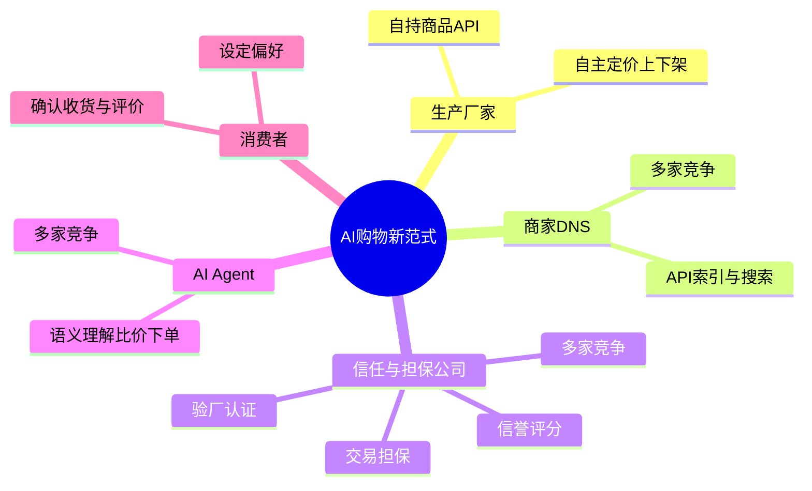
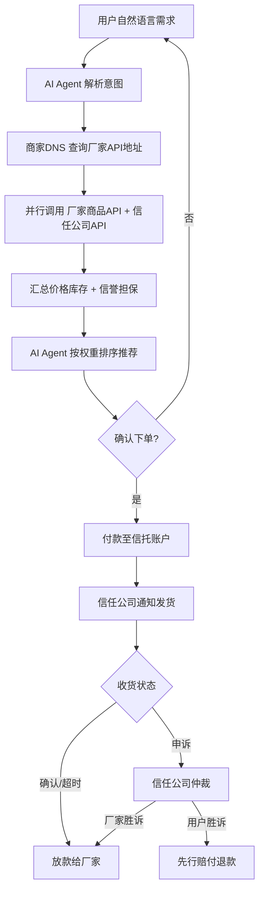
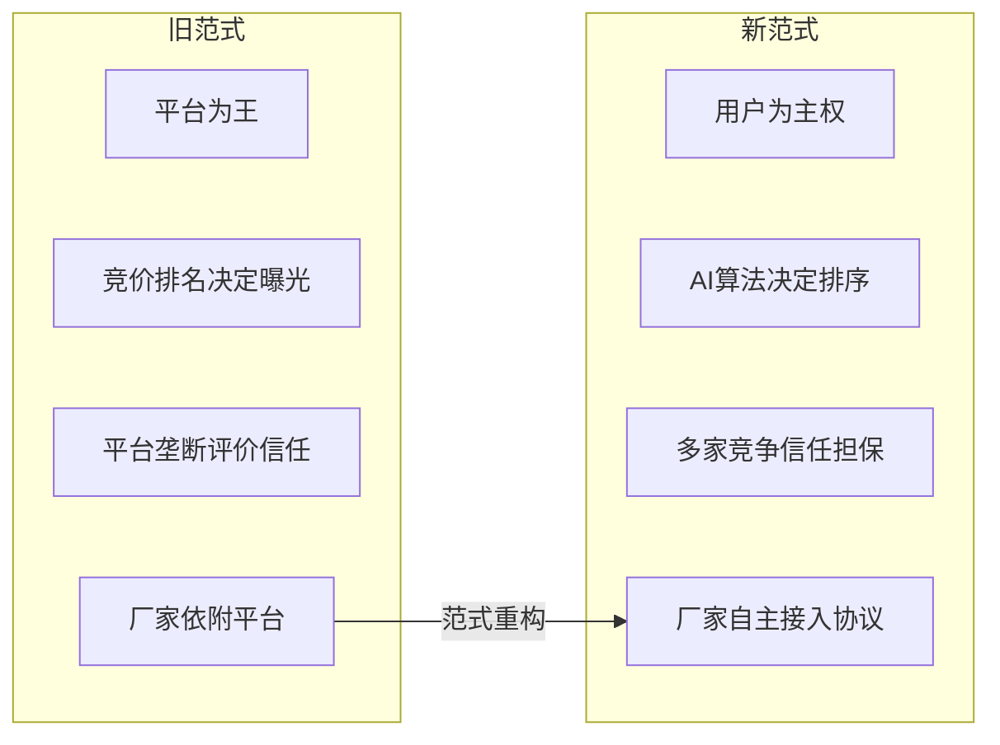
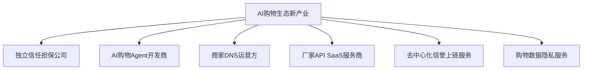
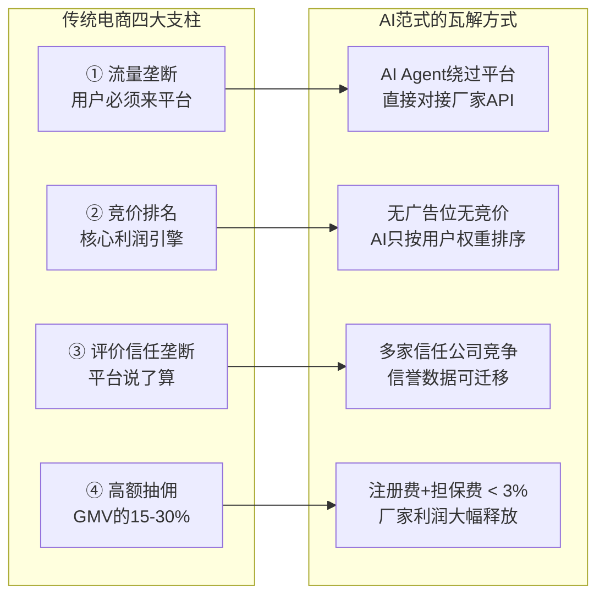
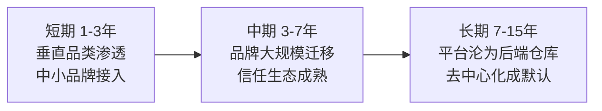
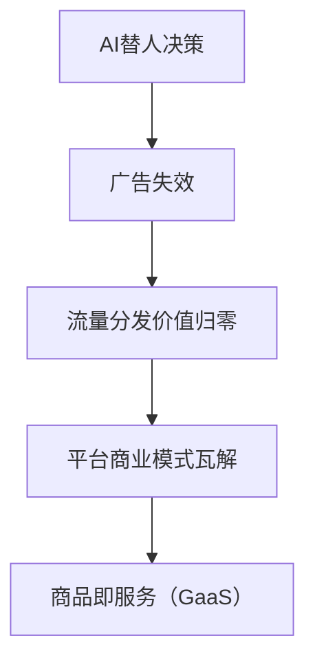

# AI购物新范式

## 概述

这是一场从 **底层协议** 重构全球商业的 **交易革命**。我们用 **AI Agent** 瓦解平台霸权，用 **开放API** 解放被绑架的供给端，用 **市场化信任竞争** 终结平台对评价体系的垄断——让购物从"谁出价高谁曝光、谁控制评价谁定义信任"的 **流量黑箱**，彻底转向"谁产品最优、谁信誉最硬谁胜出"的 **透明市场**。这不是对旧电商的修补，而是重塑 **人类商业文明的底层操作系统**。

> 📄 [详细规划 →](./01-概述与愿景.md)

---

## 思维导图

> 📄 [核心架构详解 →](./02-核心架构与角色.md)

---

## 交易流程图

---

## 关键节点

| 节点 | 角色 | 核心价值 |
| --------------- | ------ | ------------------------------------------------ |
| **厂家自持API** | 供应端 | 摆脱平台定价绑架，库存/价格100%自主 |
| **商家DNS** | 中间层 | 仅做"黄页"索引，多家竞争，不碰商品数据，不卖广告 |
| **信任公司** | 担保层 | 验厂+信誉分+资金托管，多家竞争打破垄断 |
| **AI Agent** | 用户端 | 纯算法推荐，零广告干扰，多家竞争让用户自由选择 |
| **信托账户** | 资金流 | 先收款→确认收货→放款，信任公司兜底 |

> 📄 [核心架构详解 →](./02-核心架构与角色.md)

---

## 商业价值提炼

### 对消费者

- **真比价**：AI并行查询全网厂商，无竞价排名污染
- **低价格**：厂家省下的佣金和广告费（GMV的15-30%）→ 商品降价空间
- **真评价**：信誉分由竞争性信任公司背书，不可刷单篡改

### 对厂家

- **成本断崖式下降**：从平台佣金15%+广告费20-40% → 注册费+担保费 < 3%
- **自主权**：定价不被人为限制，库存不被人为干预
- **可迁移信誉**：信任评分不绑定任何平台，换AI Agent照样生效

### 对信任公司

- **全新蓝海**：独立于平台的第三方交易担保市场，目前完全空白
- **高利润低风险**：担保费+认证费+保险佣金，无需建平台、买流量

### 对AI Agent开发者

- **新入口红利**：购物流量从"打开App搜"变为"对AI说需求"，AI Agent成为新流量分发层
- **充分竞争**：用户可自由切换Agent，赢家由服务质量（推荐精准度、体验流畅度）决定，而非烧钱获客

### 对商家DNS运营方

- **轻资产基础设施**：不碰商品、不碰钱、不碰物流，仅做API索引解析
- **多家并存**：如同互联网DNS有多个根服务器和递归解析器，商家DNS天然支持多运营方互备互竞

> 📄 [商业价值与商业模式详解 →](./03-商业价值与商业模式.md)

---

## 对世界商业形式的改变

| 维度 | 旧世界 | 新世界 |
| -------- | ------------------------ | ------------------------------ |
| 权力中心 | 大型综合购物平台 | 用户 + AI Agent |
| 信任来源 | 平台自评（刷单泛滥） | 多家独立信任公司竞争 |
| DNS/索引 | 平台内嵌搜索引擎 | 多家商家DNS竞争，按协议互备 |
| 购物入口 | 必须打开平台App/网站 | 多家AI Agent竞争，用户自由选择 |
| 定价权 | 平台施加限制/裹挟 | 厂家自主定价 |
| 流量分配 | 竞价排名（付费即曝光） | 算法按用户偏好排序 |
| 数据归属 | 平台拥有全部数据 | 用户私有，厂家自有 |
| 竞争壁垒 | 网络效应+数据垄断 | 协议开源，服务竞争 |

> 📄 [商业变革与新产业详解 →](./04-商业变革与新产业.md)

---

## 催生的新产业

### 新产业详解

| 新产业 | 规模预估 | 说明 |
| -------------------- | -------- | ------------------------------------------- |
| **独立信任担保** | 千亿级 | 类比早期担保支付工具的创新，但更中立、可竞争 |
| **厂家API SaaS** | 百亿级 | 帮中小工厂一键建API，类似独立建站工具但面向协议 |
| **AI购物Agent** | 百亿级 | 新入口，先入局者可抢占用户习惯 |
| **去中心化信誉链** | 数十亿级 | 区块链存证信誉分，跨平台可迁移 |
| **购物数据隐私服务** | 数十亿级 | 用户私有数据托管+AI训练，GDPR天然合规 |

> 📄 [商业变革与新产业详解 →](./04-商业变革与新产业.md)

---

## 对传统电商的颠覆

### 颠覆路径

### 不可逆转的驱动力

1. **AI能力提升**：AI越聪明，用户越不需要打开App自己逛——"帮我买"替代"我去逛"
2. **厂家觉醒**：20-40%的广告费占比不可持续，利润回归生产端是必然
3. **三层皆可竞争**：商家DNS、AI Agent、信任公司每一层都允许多家并存竞争，无人能重演平台垄断
4. **协议开源**：一旦API标准+注册协议成熟，网络效应将不可逆地向去中心化倾斜

> 📄 [颠覆路径与冷启动策略 →](./05-颠覆路径与冷启动.md)

---

---

## 下一步

📄 [未来演进方向 →](./06-未来演进方向.md) — 智能合约化、去中心化DNS、AI Agent间自主交易、个人数据主权
