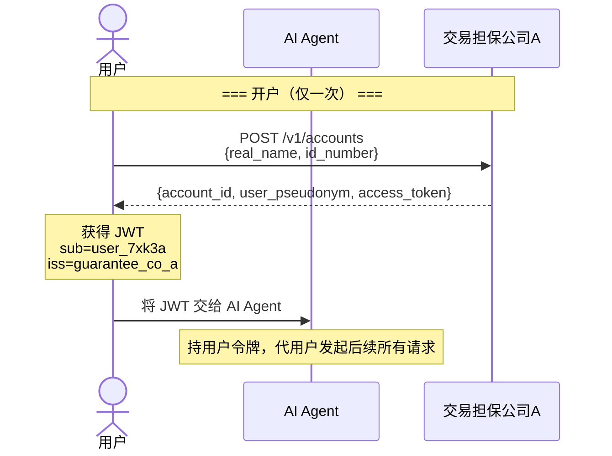
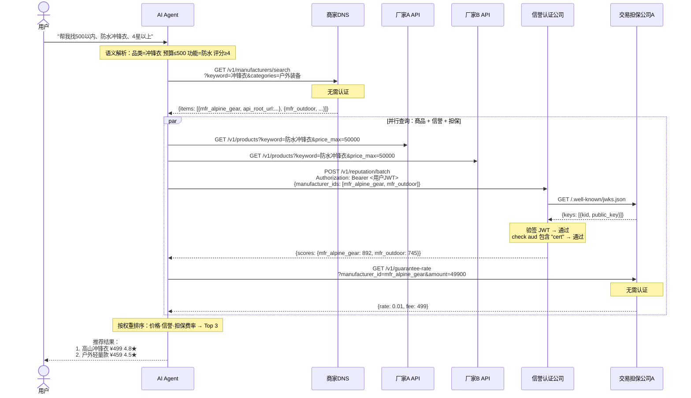
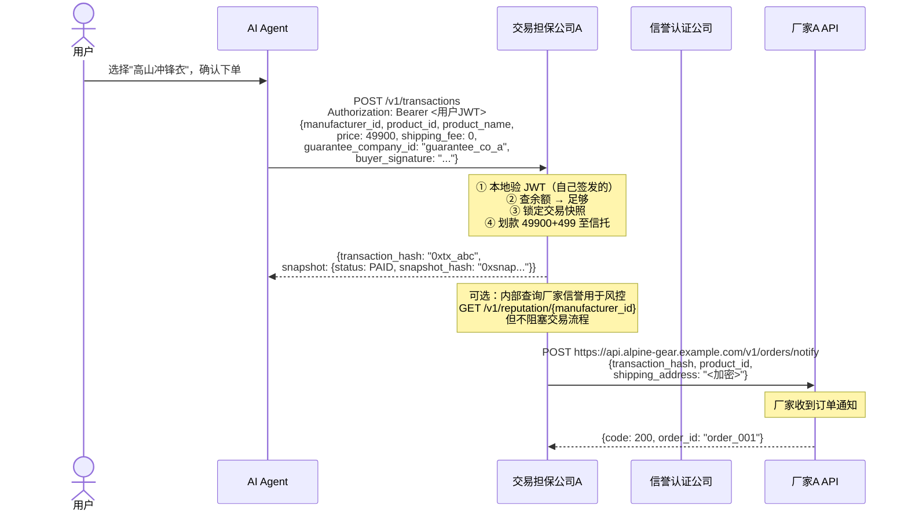
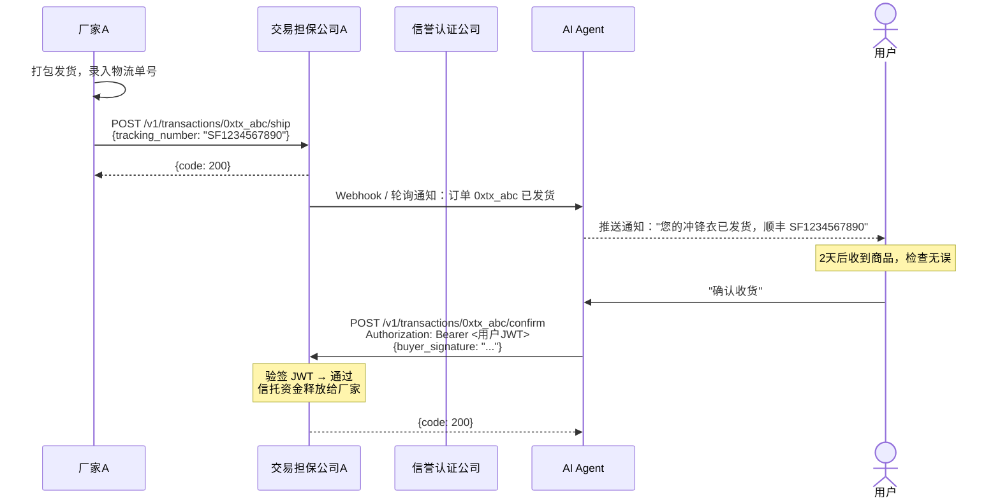
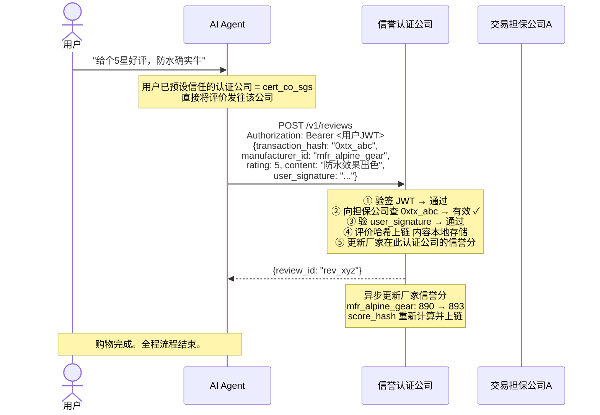
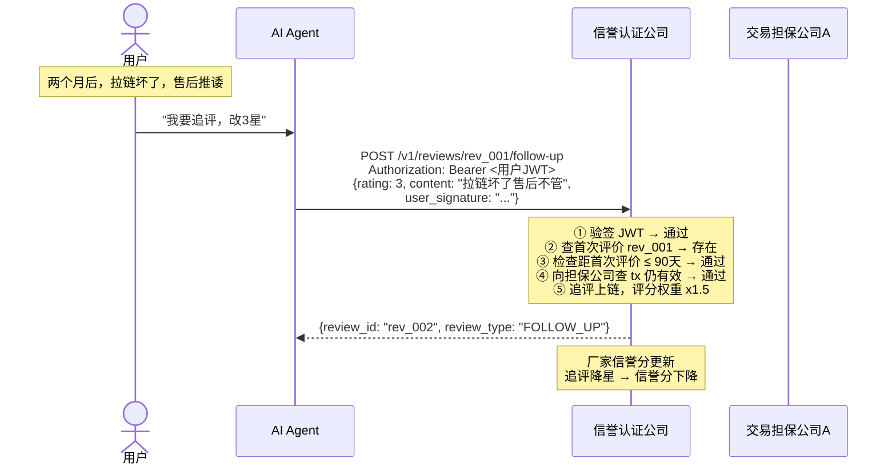

# REST API 接口定义

JSON + HTTP，无编译依赖，curl 即可调试。所有接口统一 `{code, msg, data}` 响应，所有认证基于交易担保公司签发的 JWT。每个接口的设计原则：**数据可验证，权力有边界，诚信可审计。**

---

## 完整购物流程

以下是一次完整购物的端到端流程，包含每个 API 调用、认证传递和节点间交互。

### 阶段 0：开户与认证



### 阶段 1：搜索与发现



### 阶段 2：下单与支付



### 阶段 3：履约与确认



### 阶段 4：评价与信誉更新



### 阶段 5：追评（可选）



**评价该提交到哪家信誉认证公司？**

用户不需要关心厂家在哪家认证公司做了认证。用户只需要在自己信任的信誉认证公司提交评价即可。流程：

1. 用户在 AI Agent 中提前设置自己信任的认证公司（可设多家，默认选择）
2. 提交评价时，AI Agent 将评价发送到用户指定的认证公司
3. 该认证公司收到评价后，向担保公司验证 `transaction_hash` 有效
4. 验证通过 → 评价内容本地存储，评价哈希上链
5. 该认证公司据此更新厂家的信誉评分

**搜索和认证是两条独立链路**：

用户搜索商品时走 DNS——DNS 不管厂家在哪儿认证，所有厂家都能被搜到。用户只信任 B 时，AI Agent 向 B 查询该厂家的评分。若 B 还没有这个厂家的数据，显示"暂无评分"——用户依然能看到商品、可以购买、可以在 B 提交评价。厂家不会因为没在 B 做认证就"搜不到"。

**认证共享，评分独立**：

认证（验厂）是对厂家资质的客观审核——SGS 验了就是验了，这个事实不应该每家认证公司重复做一遍。认证公司之间共享基础认证数据：

```
厂家在 A 做了 DEEP 验厂 → A 将验厂报告哈希写入链上
                       → B 从链上读取：该厂家已被 A 验厂，级别 DEEP
                       → B 认可这个验厂事实，标记"已认证"
                       → B 不需要重新派人去厂家验一次
```

但评分是独立的：

```
A 的评价集：800 条评价 → 评分 4.8
B 的评价集：200 条评价 → 评分 4.2  （用户更少，但对评价更严格）
两家各自独立计算，同一厂家在不同认证公司评分不同。
```

这意味着厂家只需在一家认证公司做一次验厂，全网认证公司都认这个验厂结果。但各家的评分完全独立——验厂是共享基础设施，评分是竞争性服务。

### 流程中的认证传递

```
用户 JWT（由担保公司A签发）
  │
  ├─→ AI Agent 持有，代用户调用所有接口
  │     ├─→ 信誉认证公司：认证公司向担保公司A拉取 JWKS 验签
  │     ├─→ 交易担保公司A：本地验签（自己签发的）
  │     └─→ 商家DNS：DNS 向担保公司A拉取 JWKS 验签
  │
  └─→ 担保公司A 自有的服务间令牌
        └─→ 信誉认证公司：ConfirmTransaction（防刷评交叉验证）
```

### 接口调用时序总览

| 步骤 | 调用方 | 目标 | 接口 | 认证 | 说明 |
|------|--------|------|------|------|------|
| 0.1 | 用户 | 担保A | `POST /v1/accounts` | 无 | 开户，获得 JWT |
| 1.1 | AI Agent | DNS | `GET /v1/manufacturers/search` | 无 | 搜索匹配厂家 |
| 1.2 | AI Agent | 厂家API | `GET /v1/products` | 无 | 并行拉取商品数据 |
| 1.3 | AI Agent | 信誉认证 | `POST /v1/reputation/batch` | 用户JWT | 批量查信誉分 |
| 1.3a | 信誉认证 | 担保A | `GET /.well-known/jwks.json` | 无 | 拉公钥验签 JWT |
| 1.4 | AI Agent | 担保A | `GET /v1/guarantee-rate` | 无 | 查担保费率 |
| 2.1 | AI Agent | 担保A | `POST /v1/transactions` | 用户JWT | 下单，锁快照，划款至信托 |
| 2.2 | 担保A | 厂家 | `POST /v1/orders/notify` | 担保A签名 | 通知厂家发货 |
| 3.1 | 厂家 | 担保A | `POST /v1/transactions/{hash}/ship` | 厂家令牌 | 录入物流单号 |
| 3.2 | AI Agent | 担保A | `POST /v1/transactions/{hash}/confirm` | 用户JWT | 确认收货，释放资金 |
| 4.1 | AI Agent | 信誉认证 | `POST /v1/reviews` | 用户JWT | 认证公司收到评价后自行向担保公司验证交易 |
| 5.1 | AI Agent | 信誉认证 | `POST /v1/reviews/{id}/follow-up` | 用户JWT | 90天内追评，评分权重 x1.5，同样需担保公司验证 |

---

## 通用约定

### 统一响应格式

所有接口返回以下三字段结构：

```json
{
  "code": 200,
  "msg": "success",
  "data": { ... }
}
```

| code | 含义 |
|------|------|
| 200 | 成功 |
| 400 | 请求参数错误 |
| 401 | 未认证（令牌缺失、失效或签名无效） |
| 403 | 无权限（令牌有效但无权访问该资源） |
| 404 | 资源不存在 |
| 409 | 冲突（如重复注册） |
| 422 | 业务逻辑错误（如余额不足） |
| 429 | 频率限制 |
| 500 | 服务端错误 |

业务错误通过 `code` 和 `msg` 区分，不在 HTTP 状态码层面做文章——所有响应 HTTP 200，`code` 承载实际结果。

`data` 在成功时包含业务数据，在失败时为空或包含调试信息。

### 分页

列表接口统一响应：

```json
{
  "code": 200,
  "msg": "success",
  "data": {
    "page": 1,
    "page_size": 20,
    "total": 156,
    "total_pages": 8,
    "items": [...]
  }
}
```

请求方式：`?page=1&page_size=20`，`page_size` 默认 20，最大 100。

---

## JWT 认证体系

整个生态的身份锚点是**交易担保公司**。用户在一家担保公司完成 KYC 开户后，担保公司签发 JWT 令牌。用户持此令牌访问生态内所有节点。

### 2.1 担保公司签发令牌

**用户开户后**，担保公司返回 JWT：

```http
POST /v1/accounts
```

响应 `data.access_token` 中包含签发的 JWT。用户将此令牌交给 AI Agent，AI Agent 在后续请求中携带。

### 2.2 JWT 结构

```json
// Header
{
  "alg": "ES256",
  "typ": "JWT",
  "kid": "guarantee_co_a_2024"
}

// Payload
{
  "sub": "user_7xk3a",            // 用户化名（不可逆，全网唯一）
  "iss": "guarantee_co_a",        // 签发方：担保公司ID
  "iat": 1700000000,              // 签发时间
  "exp": 1700086400,              // 过期时间（建议 24 小时）
  "scope": "shopping",            // 权限范围
  "aud": ["dns", "cert", "guarantee"]  // 允许访问的节点类型
}
```

签名算法使用 ES256（ECDSA P-256），也可使用 EdDSA（Ed25519）。不使用 HS256——共享密钥模式在分布式多节点场景下无法安全分发。

### 2.3 担保公司公钥发布（JWKS）

每个担保公司对外暴露公钥端点（`GET /.well-known/jwks.json`），供其他节点验证 JWT 签名。接口详细定义见 [04-交易担保.md](./04-交易担保.md) 4.0 节。

### 2.4 各节点如何验证 JWT

每个节点（AI Agent、信誉认证公司、商家DNS）在收到请求时执行以下验证流程：

```
1. 从 Authorization: Bearer <token> 提取 JWT
2. 解析 JWT Header，获取 iss（签发担保公司ID）和 kid（密钥ID）
3. 向 https://<iss对应的担保公司域名>/.well-known/jwks.json 请求公钥
4. 用公钥验证 JWT 签名
5. 检查 exp 是否过期
6. 检查 aud 是否包含本节点的类型
7. 提取 sub（用户化名）用于后续业务逻辑
```

**公钥缓存**：各节点应缓存担保公司的 JWKS，缓存时间建议 1 小时。首次遇到未知 `iss` 或 `kid` 时拉取并缓存。

**吊销检查**：担保公司提供吊销列表端点。节点可定期拉取，也可在敏感操作（支付、迁移）时实时查询。

### 2.5 担保公司吊销令牌

当用户账户异常（冻结、注销）时，担保公司需吊销已签发的令牌。吊销列表通过 `GET /.well-known/jwt-revoked` 端点获取（接口详细定义见 [04-交易担保.md](./04-交易担保.md) 4.0 节）。节点在处理支付等敏感操作时，应实时查询此端点确认令牌未被吊销。

### 2.6 令牌刷新

令牌即将过期时，AI Agent 代用户向签发担保公司刷新（`POST /v1/auth/refresh`）。接口详细定义见 [04-交易担保.md](./04-交易担保.md) 4.2 节。若令牌已被吊销，返回 `code: 401`。

### 2.7 跨担保公司场景

用户可能在担保公司 A 开户，但想通过担保公司 B 支付（因为商家只在 B 有接收账户）。此时：

1. 用户出示担保公司 A 签发的 JWT（已经过 KYC）
2. 担保公司 B 验证 A 的签名（通过 A 的 JWKS 端点）
3. 担保公司 B 信任 A 的 KYC 结果，为用户在 B 创建关联账户
4. 担保公司 B 签发自己的 JWT 给用户
5. 用户用 B 的令牌完成支付

这比跨担保清算简单得多——只共享 KYC 信任，不共享资金。

---

## 数据格式约定

- **金额**：统一使用 `int64`，单位为**分**（如 `89900` = 899.00 元），避免浮点精度
- **时间**：统一使用 `int64`，单位为**秒**的 Unix 时间戳
- **哈希**：统一使用 `0x` 开头的十六进制字符串
- **签名**：统一使用 Base64URL 编码
- **化名**：用户对外标识 `user_pseudonym` 由担保公司使用 `HMAC-SHA256(user_id, secret)` 生成，不可逆

---

---

## 各角色接口文档

| 角色 | 文档 |
|------|------|
| 生产厂家 | [01-厂家API.md](./01-厂家API.md) |
| 商家DNS | [02-商家DNS.md](./02-商家DNS.md) |
| 信誉认证公司 | [03-信誉认证.md](./03-信誉认证.md) |
| 交易担保公司 | [04-交易担保.md](./04-交易担保.md) |
